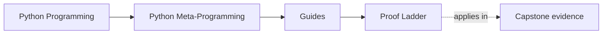
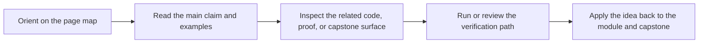

# Proof Ladder

<!-- page-maps:start -->
## Page Maps

<!-- page-maps:end -->

Read the first diagram as a timing map: this guide is for a named proof question, not
for wandering the whole course-book. Read the second diagram as the proof loop: start
small, inspect the evidence, and escalate only when the earlier route no longer settles
the claim.

Use this page when you know what you want to verify but do not yet know which command is
the smallest honest one. The point of the ladder is to keep proof proportional to the
question instead of defaulting to the largest route every time.

## Two kinds of proof pressure

- Human-review pressure: use levels 1 to 6 when the question is what you can honestly inspect or review.
- Executable-confidence pressure: use level 7 when the question is whether the runnable capstone still passes its strongest local confirmation route.

## Proof ladder

| Level | Use this when you need to prove... | Command | Evidence you get |
| --- | --- | --- | --- |
| 1. Public shape | what the runtime claims about plugins, fields, or actions without execution | `make manifest`, `make registry`, `make plugin`, `make field`, `make action`, `make signatures` | direct CLI output for metadata, registration, and generated signatures |
| 2. One concrete behavior | how one plugin behaves at invocation time | `make demo` or `make trace` | one concrete action result plus traceable configuration and history |
| 3. Saved inspection route | how the public runtime surface hangs together as a review bundle | `make inspect` | manifest, registry, one plugin, one field, one action, signatures, and route notes in `artifacts/inspect/...` |
| 4. Guided walkthrough route | how the repository, public surface, and one invocation connect end to end | `make tour` | saved walkthrough bundle with runtime files, test files, and guided reading order |
| 5. Executable verification route | whether the code and its public evidence still agree | `make verify-report` | pytest output plus saved public evidence in `artifacts/review/...` |
| 6. Full public proof route | whether the capstone remains coherent across inspection, walkthrough, and verification | `make proof` | the full saved review surface |
| 7. Strongest local confirmation | whether the runnable capstone test suite still passes | `make confirm` | direct executable confirmation through pytest |

## Choose the smallest honest route

### Start at level 1 when the question is about structure

Use the public-shape commands when the question sounds like:

- Which plugins are registered?
- What fields does this plugin expose?
- Did the wrapper preserve the public signature?
- Can I inspect this runtime fact without executing the action?

### Start at level 2 when the question is about one behavior

Use `demo` or `trace` when the question sounds like:

- What does one action invocation look like?
- What configuration and action history remain visible afterward?
- Is this runtime behavior still inspectable after execution?

### Start at level 3 or 4 when the question is about pedagogy or code reading

Use `inspect` or `tour` when the question sounds like:

- What should I read first?
- Which saved files prove the public runtime story?
- How do the CLI outputs connect to the source layout?

### Start at level 5 to 7 when the question is about confidence

Use `verify-report`, `proof`, or `confirm` when the question sounds like:

- Did we break a contract?
- Do the tests still agree with the public runtime surfaces?
- Do I need the strongest local route before merging or publishing?

## Escalation rules

- Do not jump to `proof` when `manifest` or `registry` would settle the question.
- Do not jump to `confirm` when you need a guided review bundle rather than test output.
- Escalate from `inspect` to `tour` when you need source ownership, not just public runtime shape.
- Escalate from `tour` to `verify-report` when you need executable confirmation instead of reading guidance.
- Treat `confirm` as a different kind of pressure from the bundle routes: stronger confidence, but weaker guided explanation.

## Success signal

You are using the ladder well if you can say:

- which claim you were trying to prove
- why the chosen command was the smallest honest route
- which saved file or output actually settled the question
- what stronger route you deliberately chose not to run
