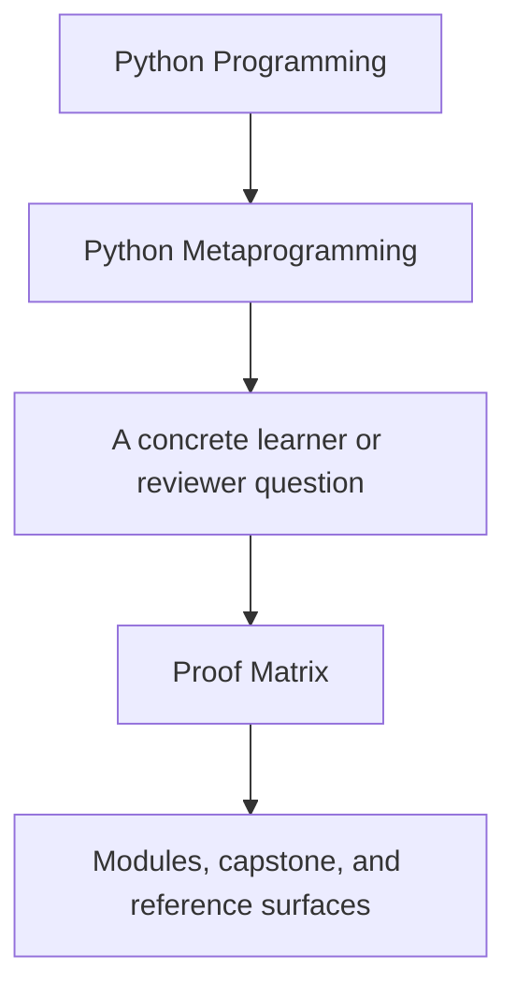
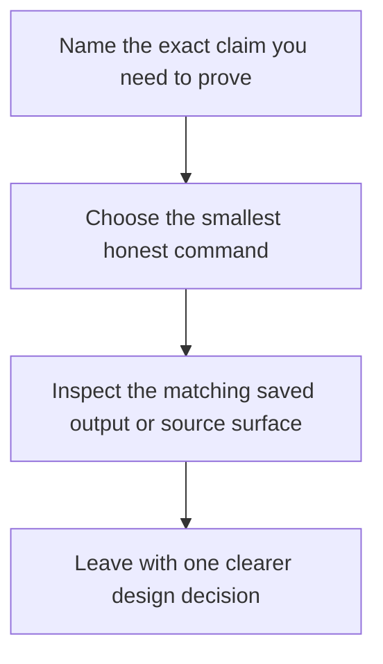

# Proof Matrix

<!-- page-maps:start -->
## Guide Fit

<!-- page-maps:end -->

Read the first diagram as a timing map: this guide exists for claim-to-evidence routing,
not for general reading. Read the second diagram as the loop: choose the smallest honest
command, inspect the matching surface, then stop once the claim is settled.

Use this page when you already know the metaprogramming claim and need the fastest honest
route to evidence.

## Core runtime claims

| Claim | Best first command | Best first surface |
| --- | --- | --- |
| public runtime shape stays observable without executing plugin work | `make PROGRAM=python-programming/python-meta-programming capstone-manifest` | `manifest.json`, `src/incident_plugins/cli.py` |
| registered plugins stay deterministic and inspectable | `make PROGRAM=python-programming/python-meta-programming capstone-registry` | `registry.json`, `src/incident_plugins/framework.py`, `tests/test_registry.py` |
| one plugin contract stays legible from the public CLI | `make PROGRAM=python-programming/python-meta-programming capstone-plugin` | `plugin.json`, `src/incident_plugins/plugins.py` |
| one field invariant stays attached to attribute ownership | `make PROGRAM=python-programming/python-meta-programming capstone-field` | `field.json`, `src/incident_plugins/fields.py`, `tests/test_fields.py` |
| action decorators preserve public callable shape while adding behavior | `make PROGRAM=python-programming/python-meta-programming capstone-action` | `action.json`, `src/incident_plugins/actions.py`, `tests/test_runtime.py` |
| generated constructor and action signatures still reflect the declared field model | `make PROGRAM=python-programming/python-meta-programming capstone-signatures` | `signatures.json`, `framework.py`, `tests/test_runtime.py` |
| one concrete runtime action remains traceable after execution | `make PROGRAM=python-programming/python-meta-programming capstone-trace` | `trace.json`, `tests/test_runtime.py` |

## Bundle and review claims

| Claim | Best first command | Best first surface |
| --- | --- | --- |
| a learner can inspect the runtime without reading source first | `make PROGRAM=python-programming/python-meta-programming inspect` | `artifacts/inspect/...`, `COMMAND_GUIDE.md`, `PROOF_GUIDE.md` |
| a learner can follow a guided repository walkthrough honestly | `make PROGRAM=python-programming/python-meta-programming capstone-walkthrough` | `artifacts/tour/...`, `WALKTHROUGH_GUIDE.md`, `TOUR.md` |
| executable tests and public review surfaces still agree | `make PROGRAM=python-programming/python-meta-programming capstone-verify-report` | `pytest.txt`, `manifest.json`, `trace.json` |
| the raw executable suite still passes | `make PROGRAM=python-programming/python-meta-programming test` | `tests/test_runtime.py`, `tests/test_registry.py`, `tests/test_fields.py`, `tests/test_cli.py` |
| the strongest local confirmation route still holds | `make PROGRAM=python-programming/python-meta-programming capstone-confirm` | executable suite plus the command-level public surfaces |
| the full public proof route still builds | `make PROGRAM=python-programming/python-meta-programming proof` | inspection, walkthrough, and verification bundles together |

## Course contract to proof surface

| Course outcome | Best first route | Best first surface |
| --- | --- | --- |
| inspect runtime structure without accidental execution | `capstone-manifest`, `capstone-registry`, or `inspect` | public CLI outputs plus `framework.py` |
| preserve callable metadata and public shape through wrappers | `capstone-action`, `capstone-signatures`, or `capstone-trace` | `actions.py`, `tests/test_runtime.py`, and saved trace output |
| choose honestly between plain code, decorators, descriptors, class decorators, and metaclasses | `capstone-field`, `capstone-registry`, or `capstone-verify-report` | `fields.py`, `framework.py`, and the matching tests |
| keep the public CLI and review bundle observational rather than magical | `inspect`, `capstone-verify-report`, or `proof` | saved bundle outputs plus `tests/test_cli.py` |

## Module-to-proof bridge

| Module range | Main learner question | Best first evidence surface |
| --- | --- | --- |
| Modules 01 to 03 | what can be observed safely without accidental execution | `manifest`, `registry`, `signatures`, `inspect` |
| Modules 04 to 05 | did a wrapper preserve signature, metadata, and traceability honestly | `action`, `trace`, `tests/test_runtime.py` |
| Modules 06 to 08 | does the chosen customization boundary really belong to fields and lookup | `field`, `plugin`, `tests/test_fields.py` |
| Module 09 | is class-definition-time behavior justified and deterministic | `registry`, `tests/test_registry.py`, `framework.py` |
| Module 10 | do the public review routes stay observational rather than magical | `inspect`, `capstone-verify-report`, `proof` |

## Review questions

| Question | Best first command | Best first surface |
| --- | --- | --- |
| which command proves the current claim with the smallest blast radius | [Proof Ladder](proof-ladder.md) | this page plus [Command Guide](../capstone/command-guide.md) |
| where should I start if the public runtime shape already feels suspicious | `capstone-manifest` or `capstone-registry` | `manifest.json` or `registry.json` |
| where should I start if the issue is one field or one action contract | `capstone-field` or `capstone-action` | `field.json` or `action.json` |
| which saved bundle is strongest for a human review | `inspect` or `capstone-verify-report` | the matching bundle under `artifacts/` |
| which route should I use before approving a larger change | `capstone-verify-report` or `proof` | `pytest.txt`, `trace.json`, and the saved docs bundle |

## Best companion pages

- [Proof Ladder](proof-ladder.md)
- [Pressure Routes](pressure-routes.md)
- [Command Guide](../capstone/command-guide.md)
- [Capstone Map](../capstone/capstone-map.md)
- [Capstone Proof Guide](../capstone/capstone-proof-guide.md)
