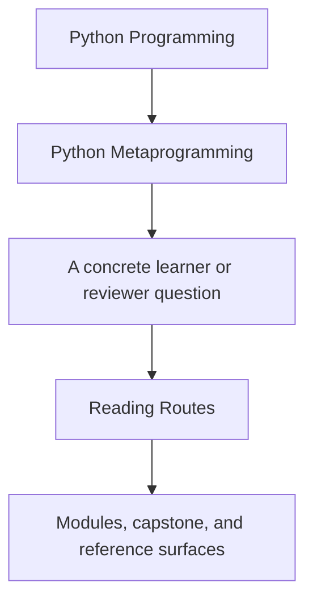
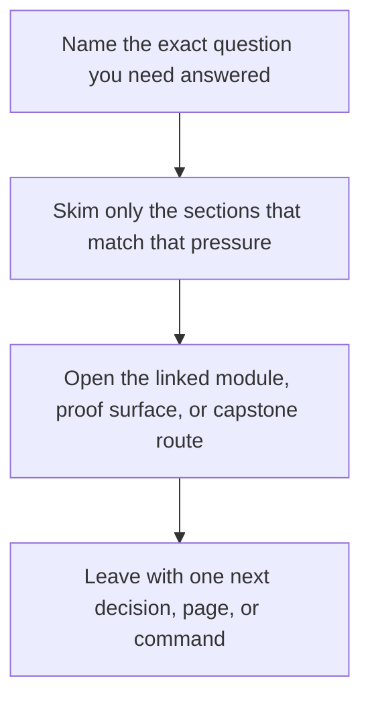

# Reading Routes

<!-- page-maps:start -->
## Guide Fit

<!-- page-maps:end -->

Read the first diagram as a timing map: this guide is for a named pressure, not for wandering the whole course-book. Read the second diagram as the guide loop: arrive with a concrete question, use only the matching sections, then leave with one smaller and more honest next move.

Use this page when the course feels dense and you need a route that matches your current
question instead of reading everything at one speed.

The goal is not to skip the hard parts. The goal is to approach them with a sequence that
keeps the power ladder visible and avoids turning later modules into a blur.

## Route 1: Foundation First

Use this when metaprogramming is still more vocabulary than mechanism.

1. Read [Module 00](../module-00-orientation/index.md) for the runtime ladder and study model.
2. Read [Module 01](../module-01-runtime-objects-object-model/index.md) through [Module 03](../module-03-signatures-provenance-runtime-evidence/index.md) in order.
3. Stop and use [Practice Map](practice-map.md) after Module 03 before you continue into wrappers.
4. Read [Module 04](../module-04-function-wrappers-transparent-decorators/index.md) through [Module 06](../module-06-class-customization-pre-metaclasses/index.md).
5. Enter [Capstone Map](../capstone/capstone-map.md) only after you can explain the lower-power alternative for each mechanism.

## Route 2: Review Hotspots

Use this when you already review Python frameworks and need the shortest honest route to
the common trouble spots.

1. Read [Runtime Power Ladder](../reference/runtime-power-ladder.md).
2. Read [Module 04](../module-04-function-wrappers-transparent-decorators/index.md) for wrapper honesty.
3. Read [Module 07](../module-07-descriptors-lookup-attribute-control/index.md) for lookup ownership.
4. Read [Module 09](../module-09-metaclass-design-class-creation/index.md) for class-creation boundaries.
5. Finish with [Module 10](../module-10-runtime-governance-mastery-review/index.md) and [Review Checklist](../reference/review-checklist.md).

## Route 3: Attribute and Validation Systems

Use this when the real question is field ownership, lookup order, or validation design.

1. Read [Module 06](../module-06-class-customization-pre-metaclasses/index.md).
2. Read [Module 07](../module-07-descriptors-lookup-attribute-control/index.md).
3. Read [Module 08](../module-08-descriptor-systems-validation-framework-design/index.md).
4. Use [Capstone Map](../capstone/capstone-map.md) to inspect the descriptor-backed field surfaces.

## Route 4: Class Creation and Governance

Use this when the design question is whether a metaclass, registry, or import-time hook is
actually justified.

1. Read [Module 09](../module-09-metaclass-design-class-creation/index.md).
2. Read [Module 10](../module-10-runtime-governance-mastery-review/index.md).
3. Keep [Runtime Power Ladder](../reference/runtime-power-ladder.md) and [Review Checklist](../reference/review-checklist.md) open while reading.
4. Use [Capstone Review Worksheet](../capstone/capstone-review-worksheet.md) to force a lower-power alternative check.

## Reading Rhythm

- Read one core block, then stop and explain it without looking at the page.
- After every module, write down one problem that should stay on a lower rung of the ladder.
- Use the capstone only after the module claim is clear enough that you know what you are trying to prove.
- Revisit Modules 07, 09, and 10 after the full course; those pages become easier once the earlier modules are internalized.

## Success Signal

You are using these routes well if you can say, after each module:

- what changed at runtime
- where the behavior now lives
- what lower-power option was rejected
- what capstone surface proves the claim
