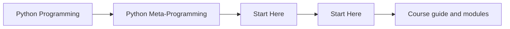
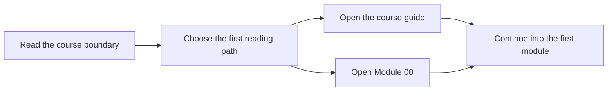

# Start Here

<!-- page-maps:start -->
## Page Maps

<!-- page-maps:end -->

Start here if you are deciding whether this course matches your current problem. Python
metaprogramming only pays for itself when the runtime behavior stays visible, testable,
and easier to justify than a simpler alternative.

## Use this course if

- you need to inspect, wrap, validate, or register Python objects without lying about runtime behavior
- you review frameworks or libraries that already rely on decorators, descriptors, or metaclasses
- you want a disciplined ladder for deciding when a higher-power hook is justified

## Do not start here if

- you still need a first introduction to classes, callables, attributes, and ordinary object design
- you want clever tricks without the debugging and maintenance costs
- the problem can still be solved honestly with plain functions, plain classes, or explicit composition

## Reading routes

### Route 1: Reviewer under pressure

1. Read [Course Guide](course-guide.md).
2. Read [Module 00](../module-00.md).
3. Read [Module 04](../module-04.md), [Module 07](../module-07.md), and [Module 09](../module-09.md).
4. Cross-check the [Capstone Guide](capstone.md).

### Route 2: Full mastery path

1. Read [Course Guide](course-guide.md).
2. Read [Learning Contract](learning-contract.md).
3. Read every module in order from [Module 00](../module-00.md) through [Module 11](../module-11.md).
4. Keep [Capstone Map](capstone-map.md) open while reading.

## What success looks like

By the end of the course, you should be able to explain:

- what happens at import time, class-definition time, and call time
- what metadata or signatures must survive wrapping
- why a descriptor owns an invariant better than a decorator in some cases
- when a metaclass is justified and when it is only hiding design confusion

## First files to keep open

- [Course Home](../index.md)
- [Course Guide](course-guide.md)
- [Module 00](../module-00.md)
- [Capstone Guide](capstone.md)
