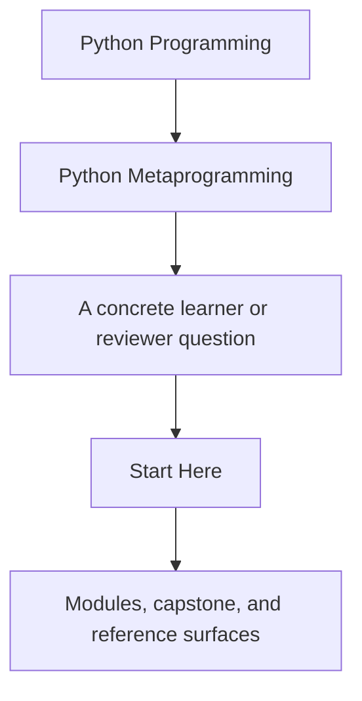
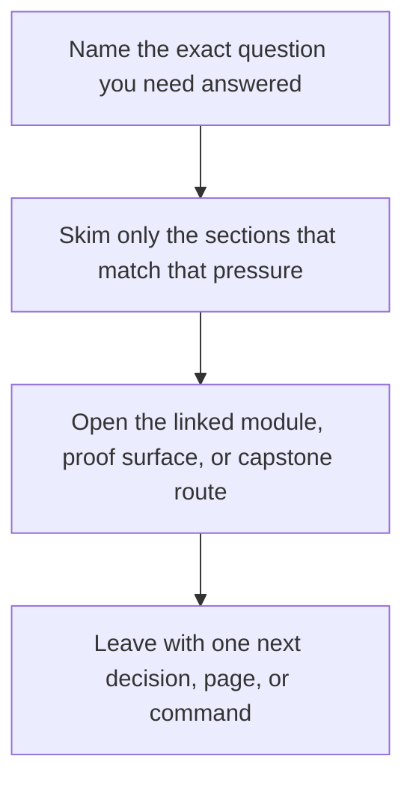

# Start Here

<!-- page-maps:start -->
## Guide Fit

<!-- page-maps:end -->

Read the first diagram as a timing map: this guide is for a named pressure, not for wandering the whole course-book. Read the second diagram as the guide loop: arrive with a concrete question, use only the matching sections, then leave with one smaller and more honest next move.

Start here if you are deciding whether this course matches your current problem. Python
metaprogramming only pays for itself when the runtime behavior stays visible, testable,
and easier to justify than a simpler alternative.

## Use This Course If

- you need to inspect, wrap, validate, or register Python objects without lying about runtime behavior
- you review frameworks or libraries that already rely on decorators, descriptors, or metaclasses
- you want a disciplined ladder for deciding when a higher-power hook is justified

## Do Not Start Here If

- you still need a first introduction to classes, callables, attributes, and ordinary object design
- you want clever tricks without the debugging and maintenance costs
- the problem can still be solved honestly with plain functions, plain classes, or explicit composition

## Stable first route

Use this route when you are new to the course and want the smallest honest sequence:

1. Read [Course Home](../index.md) for the promise, audience, and entry choices.
2. Read [Course Guide](course-guide.md) for the module arc and page roles.
3. Read [Learning Contract](learning-contract.md) so the study bar is explicit before the dense modules begin.
4. Read [Module 00](../module-00-orientation/index.md) for the power ladder and study model.
5. Read [First-Contact Map](../module-00-orientation/first-contact-map.md) if you want the shortest route through the foundations.
6. Read [Platform Setup](platform-setup.md) before the first public command or after local Python drift.
7. Start [Module 01](../module-01-runtime-objects-object-model/index.md) once you can explain what the course means by lower-power and higher-power hooks.

## Switch routes when the pressure changes

- Use [Pressure Routes](pressure-routes.md) when you are entering from a code review, framework change, or debugging problem.
- Use [Return Map](../module-00-orientation/return-map.md) when you are resuming after a break and need the last stable module boundary.
- Use [Platform Setup](platform-setup.md) when the environment or public command surface is the blocker.
- Use [Capstone Guide](../capstone/index.md) and [Capstone Map](../capstone/capstone-map.md) once the current module claim is clear enough to inspect in executable code.

## Choose a reading route when density is the blocker

Use one of these instead of trying to read every module at the same speed:

- Foundation first: read Modules 00 to 03 in order when the runtime ladder still feels denser than the actual mechanics.
- Review hotspots: jump to Modules 04, 07, 09, and 10 when you already review dynamic code and need the shortest honest inspection route.
- Attribute and validation systems: focus on Modules 06 to 08 when the real question is field ownership, lookup order, or validation design.
- Class creation and governance: focus on Modules 09 to 10 when the pressure is registries, import-time hooks, or metaclass scope.

Stop once you can explain what import time, class-definition time, and call time each
mean in the current route. If those timings are still fuzzy, move back toward the
foundation-first route instead of escalating.

## Route By Pressure

### Route 1: Reviewer under pressure

1. Read [Course Guide](course-guide.md).
2. Read [Module 00](../module-00-orientation/index.md).
3. Read [Module 04](../module-04-function-wrappers-transparent-decorators/index.md), [Module 07](../module-07-descriptors-lookup-attribute-control/index.md), and [Module 09](../module-09-metaclass-design-class-creation/index.md) as the three main review hotspots.
4. Use [Pressure Routes](pressure-routes.md) if you need the route tuned to wrappers, descriptors, or metaclasses specifically.
5. Cross-check the [Capstone Guide](../capstone/index.md).

### Route 2: Full mastery path

1. Read [Course Guide](course-guide.md).
2. Read [Learning Contract](learning-contract.md).
3. Read every module in order from [Module 00](../module-00-orientation/index.md) through [Module 10](../module-10-runtime-governance-mastery-review/index.md), then finish with [Mastery Review](../module-10-runtime-governance-mastery-review/mastery-review.md).
4. Keep [Capstone Map](../capstone/capstone-map.md) open while reading so every mechanism stays tied to one executable surface.

## Success Signal

By the end of the course, you should be able to explain:

- what happens at import time, class-definition time, and call time
- what metadata or signatures must survive wrapping
- why a descriptor owns an invariant better than a decorator in some cases
- when a metaclass is justified and when it is only hiding design confusion

## First pages to keep open

- [Course Home](../index.md)
- [Course Guide](course-guide.md)
- [Module 00](../module-00-orientation/index.md)
- [Platform Setup](platform-setup.md)
- [Review Checklist](../reference/review-checklist.md)
