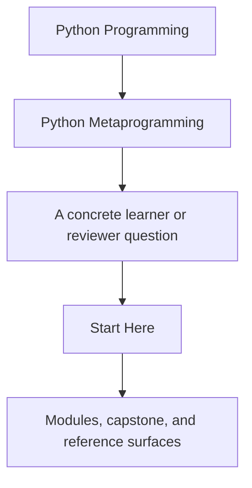
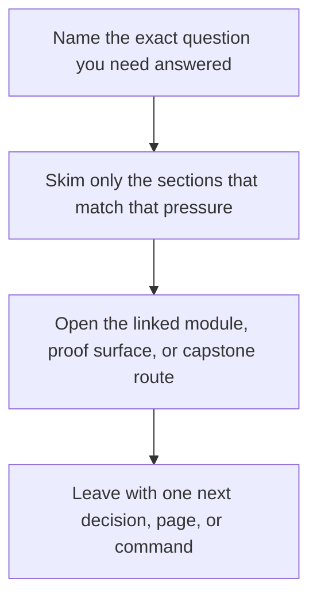

# Start Here

<!-- page-maps:start -->
## Guide Fit

<!-- page-maps:end -->

Read the first diagram as a timing map: this guide is for a named pressure, not for wandering the whole course-book. Read the second diagram as the guide loop: arrive with a concrete question, use only the matching sections, then leave with one smaller and more honest next move.

Start here if you are deciding whether this course matches your current problem. Python
metaprogramming only pays for itself when the runtime behavior stays visible, testable,
and easier to justify than a simpler alternative.

## Use This Course If

- you need to inspect, wrap, validate, or register Python objects without lying about runtime behavior
- you review frameworks or libraries that already rely on decorators, descriptors, or metaclasses
- you want a disciplined ladder for deciding when a higher-power hook is justified

## Do Not Start Here If

- you still need a first introduction to classes, callables, attributes, and ordinary object design
- you want clever tricks without the debugging and maintenance costs
- the problem can still be solved honestly with plain functions, plain classes, or explicit composition

## Best Reading Route

1. Read [Course Home](../index.md) for the course promise and support surfaces.
2. Read [Course Guide](course-guide.md) for the module arc and page roles.
3. Read [Learning Contract](learning-contract.md) before you start Module 01.
4. Read [Module 00](../module-00-orientation/index.md) for the power ladder and study model.
5. Read [Course Map](../module-00-orientation/course-map.md) so the full course arc stays visible from the start.
6. Read [First-Contact Map](../module-00-orientation/first-contact-map.md) if you want the minimum honest entry route through the foundations.
7. Use [Pressure Routes](pressure-routes.md) when you are entering from a code review or framework problem.
8. Use [Reading Routes](reading-routes.md) if you want a slower path through the denser modules.
9. Keep [Module Promise Map](module-promise-map.md) open so each module stays attached to one clear promise.
10. Use [Module Checkpoints](module-checkpoints.md) at the end of each module so you know whether the current idea actually landed.
11. Keep [Proof Ladder](proof-ladder.md) open so you can choose the smallest honest command for the current question.
12. Keep [Runtime Power Ladder](../reference/runtime-power-ladder.md) and [Mechanism Selection](mechanism-selection.md) open while reading so every stronger hook is judged against a lower-power alternative.
13. Use [Capstone Map](capstone-map.md) and [Capstone Guide](capstone.md) when you want the executable route.

## Route By Pressure

### Route 1: Reviewer under pressure

1. Read [Course Guide](course-guide.md).
2. Read [Module 00](../module-00-orientation/index.md).
3. Read [Module 04](../module-04-function-wrappers-transparent-decorators/index.md), [Module 07](../module-07-descriptors-lookup-attribute-control/index.md), and [Module 09](../module-09-metaclass-design-class-creation/index.md) as the three main review hotspots.
4. Use [Pressure Routes](pressure-routes.md) if you need the route tuned to wrappers, descriptors, or metaclasses specifically.
5. Cross-check the [Capstone Guide](capstone.md).

### Route 2: Full mastery path

1. Read [Course Guide](course-guide.md).
2. Read [Learning Contract](learning-contract.md).
3. Read every module in order from [Module 00](../module-00-orientation/index.md) through [Module 10](../module-10-runtime-governance-mastery-review/index.md), then finish with [Mastery Review](../module-10-runtime-governance-mastery-review/mastery-review.md).
4. Keep [Capstone Map](capstone-map.md) open while reading so every mechanism stays tied to one executable surface.

## Success Signal

By the end of the course, you should be able to explain:

- what happens at import time, class-definition time, and call time
- what metadata or signatures must survive wrapping
- why a descriptor owns an invariant better than a decorator in some cases
- when a metaclass is justified and when it is only hiding design confusion

## First Pages To Keep Open

- [Course Home](../index.md)
- [Course Guide](course-guide.md)
- [Pressure Routes](pressure-routes.md)
- [Module Promise Map](module-promise-map.md)
- [Module Checkpoints](module-checkpoints.md)
- [Module 00](../module-00-orientation/index.md)
- [Capstone Guide](capstone.md)
