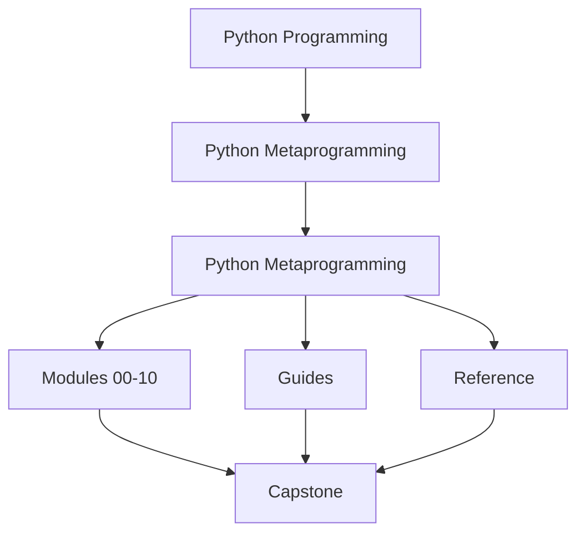
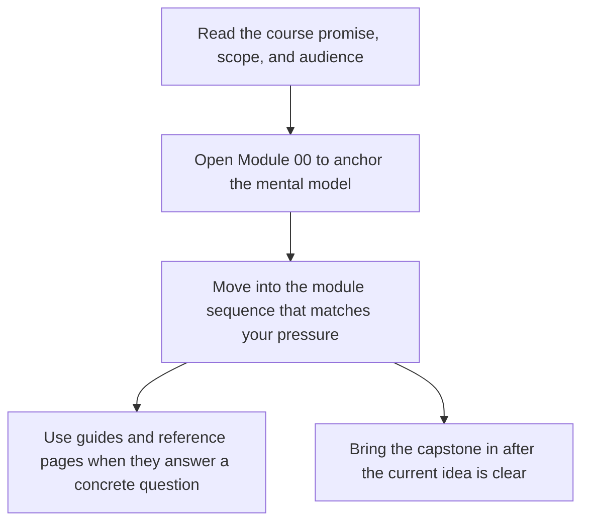

# Python Metaprogramming

<!-- page-maps:start -->
## Course Shape

<!-- page-maps:end -->

Read the first diagram as the shape of the whole book: it shows where the home page sits relative to the module sequence, the support shelf, and the capstone. Read the second diagram as the intended entry route so learners do not mistake the capstone or reference pages for the first stop.

This course teaches Python metaprogramming as a discipline of runtime honesty. The goal
is not to make code look advanced. The goal is to understand what Python is doing when
code inspects, wraps, validates, or registers other code and objects.

## Who this course is for

- experienced Python developers who already understand ordinary object design
- library and framework authors who need runtime behavior to stay observable
- reviewers inheriting dynamic codebases that feel magical but underexplained

## Who this course is not for

- first-contact Python learners
- trick collecting
- designs that still have a simpler explicit solution available

## Choose your entry route

### New learner to metaprogramming

Use this when the vocabulary is still new and you need the safest honest ramp:

1. [Start Here](guides/start-here.md)
2. [Course Guide](guides/course-guide.md)
3. [Module 00](module-00-orientation/index.md)
4. [First-Contact Map](module-00-orientation/first-contact-map.md)

### Reviewer under pressure

Use this when you are inspecting an existing dynamic codebase and need judgment fast:

1. [Start Here](guides/start-here.md)
2. [Pressure Routes](guides/pressure-routes.md)
3. [Runtime Power Ladder](reference/runtime-power-ladder.md)
4. [Review Checklist](reference/review-checklist.md)

### Library or framework builder

Use this when the question is not "what does this mechanism do?" but "which mechanism
should own this behavior?":

1. [Course Guide](guides/course-guide.md)
2. [Pressure Routes](guides/pressure-routes.md)
3. [Module Dependency Map](reference/module-dependency-map.md)
4. [Capstone Guide](capstone/index.md)

## Keep these pages nearby

- [Start Here](guides/start-here.md)
- [Guides Home](guides/index.md)
- [Course Guide](guides/course-guide.md)
- [Learning Contract](guides/learning-contract.md)
- [Mid-Course Map](module-00-orientation/mid-course-map.md)
- [Runtime Power Ladder](reference/runtime-power-ladder.md)

## What the course is organized around

### A clear ladder of power

The course moves from plain observation to invasive runtime control:

1. introspection
2. decorators
3. descriptors
4. metaclasses
5. governance boundaries around dynamic execution and global hooks

### One executable proof

The [Capstone Guide](capstone/index.md) points to a single plugin runtime that keeps the major
mechanisms visible in one place. Use [Capstone Map](capstone/capstone-map.md) and
[Capstone File Guide](capstone/capstone-file-guide.md) while reading.

## Power ladder to capstone proof

Use this table when the mechanism names feel abstract and you need one executable place
to see what each rung looks like in practice.

| Power rung | Primary modules | First capstone surface | Strongest first proof |
| --- | --- | --- | --- |
| observation and runtime evidence | [Modules 01-03](module-03-signatures-provenance-runtime-evidence/index.md) | [Capstone Guide](capstone/index.md), `make manifest`, `make registry` | `capstone/manifest.json` inside `make inspect` |
| wrappers and transparent policy | [Modules 04-05](module-04-function-wrappers-transparent-decorators/index.md) | `capstone/src/incident_plugins/actions.py`, [Capstone Map](capstone/capstone-map.md) | `make trace` and `capstone/tests/test_runtime.py` |
| lower-power class customization | [Module 06](module-06-class-customization-pre-metaclasses/index.md) | generated constructors in `capstone/src/incident_plugins/framework.py` | `make signatures` and `capstone/tests/test_runtime.py` |
| descriptors and attribute ownership | [Modules 07-08](module-07-descriptors-lookup-attribute-control/index.md) | `capstone/src/incident_plugins/fields.py`, [Capstone File Guide](capstone/capstone-file-guide.md) | `make field` and `capstone/tests/test_fields.py` |
| metaclass design and class creation | [Module 09](module-09-metaclass-design-class-creation/index.md) | registration in `capstone/src/incident_plugins/framework.py` | `make registry` and `capstone/tests/test_registry.py` |
| runtime governance and review judgment | [Module 10](module-10-runtime-governance-mastery-review/index.md) | saved bundles from `make inspect`, `make tour`, and `make verify-report` | [Capstone Proof Checklist](capstone/capstone-proof-checklist.md) and `pytest.txt` |

### Review judgment

Use [Review Checklist](reference/review-checklist.md), [Practice Map](reference/practice-map.md), and
[Capstone Proof Guide](capstone/capstone-proof-guide.md) to keep the material pedagogic
instead of ornamental.

## Best reading route

1. Start with [Start Here](guides/start-here.md) and [Course Guide](guides/course-guide.md).
2. Read [Module 00](module-00-orientation/index.md) before the mechanism-heavy modules.
3. Move through Modules 01 to 10 in order so each higher-power mechanism rests on a lower-power one.
4. Bring in the [Capstone Guide](capstone/index.md) and [Capstone Map](capstone/capstone-map.md) once the current mechanism is clear enough to inspect in code.

## Module Table of Contents

| Module | Title | Why it matters |
| --- | --- | --- |
| [Module 00](module-00-orientation/index.md) | Orientation and Study Practice | establishes the power ladder, reading order, and capstone role |
| [Module 01](module-01-runtime-objects-object-model/index.md) | Runtime Objects and the Python Object Model | explains what Python objects really are at runtime |
| [Module 02](module-02-runtime-observation-inspection/index.md) | Safe Runtime Observation and Inspection | inspects values and code without accidental execution |
| [Module 03](module-03-signatures-provenance-runtime-evidence/index.md) | Signatures, Provenance, and Runtime Evidence | turns observation into reliable runtime facts |
| [Module 04](module-04-function-wrappers-transparent-decorators/index.md) | Function Wrappers and Transparent Decorators | begins transformation without lying about behavior or metadata |
| [Module 05](module-05-decorator-design-policies-typing/index.md) | Decorator Design, Policies, and Typing | carries runtime policy without obscuring signatures and intent |
| [Module 06](module-06-class-customization-pre-metaclasses/index.md) | Class Customization Before Metaclasses | uses lower-power class tools before escalating to metaclasses |
| [Module 07](module-07-descriptors-lookup-attribute-control/index.md) | Descriptors, Lookup, and Attribute Control | explains how attribute access is actually resolved |
| [Module 08](module-08-descriptor-systems-validation-framework-design/index.md) | Descriptor Systems, Validation, and Framework Design | turns descriptor mechanics into disciplined runtime architecture |
| [Module 09](module-09-metaclass-design-class-creation/index.md) | Metaclass Design and Class Creation | justifies the highest-power class hook narrowly and visibly |
| [Module 10](module-10-runtime-governance-mastery-review/index.md) | Runtime Governance and Mastery Review | converts mechanism knowledge into review standards and exit criteria |

## Failure modes this course is designed to prevent

- using dynamic power because it feels clever
- breaking signatures, metadata, or tracebacks during wrapping
- putting class-creation behavior into code that should stay ordinary and explicit
- teaching metaclasses before the learner understands descriptors
- approving meta-heavy code without a proof route

## What success looks like

- You can say what happens at import time, class-definition time, instance time, and call time.
- You can choose a lower-power mechanism before escalating to a higher-power one.
- You can inspect a dynamic system without accidentally executing business behavior.
- You can explain why the capstone uses a descriptor, decorator, or metaclass in one place but not another.
