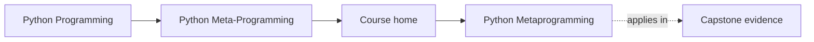
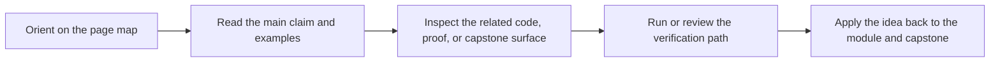

# Python Metaprogramming

<!-- page-maps:start -->
## Page Maps

<!-- page-maps:end -->

This course teaches Python metaprogramming as a discipline of runtime honesty. The goal
is not to make code look advanced. The goal is to understand what Python is doing when
code inspects, wraps, validates, or registers other code and objects.

## Start with these pages

- [Start Here](guides/start-here.md)
- [Guides Home](guides/index.md)
- [Course Guide](guides/course-guide.md)
- [Learning Contract](guides/learning-contract.md)
- [Runtime Power Ladder](reference/runtime-power-ladder.md)

## What the course is organized around

### A clear ladder of power

The course moves from plain observation to invasive runtime control:

1. introspection
2. decorators
3. descriptors
4. metaclasses
5. governance boundaries around dynamic execution and global hooks

### One executable proof

The [Capstone Guide](guides/capstone.md) points to a single plugin runtime that keeps the major
mechanisms visible in one place. Use [Capstone Map](guides/capstone-map.md) and
[Capstone File Guide](guides/capstone-file-guide.md) while reading.

### Review judgment

Use [Review Checklist](reference/review-checklist.md), [Practice Map](guides/practice-map.md), and
[Capstone Proof Checklist](guides/capstone-proof-checklist.md) to keep the material pedagogic
instead of ornamental.

## Module route

- [Module 00](module-00-orientation/index.md): orient on the power ladder, study method, and capstone role.
- [Module 01](module-01-runtime-object-model/index.md) to [Module 03](module-03-inspect-signatures-and-provenance/index.md): build the runtime observation model before any transformation happens.
- [Module 04](module-04-function-wrappers-and-decorators/index.md) to [Module 06](module-06-class-customization-before-metaclasses/index.md): learn wrappers, policy-bearing decorators, and the last honest class-level tools before descriptors.
- [Module 07](module-07-descriptor-mechanics-and-lookup/index.md) to [Module 09](module-09-metaclass-design-and-class-creation/index.md): move from attribute control to definition-time class creation with explicit justification at each step.
- [Module 10](module-10-runtime-governance-and-mastery/index.md) and [Mastery Review](module-10-runtime-governance-and-mastery/mastery-review.md): convert mechanism knowledge into review policy and exit criteria.

## Ten-module roadmap

1. Runtime object model: what Python objects really are at runtime.
2. Safe runtime observation: how to inspect without accidental execution.
3. `inspect`, signatures, and provenance: how to turn observation into usable runtime evidence.
4. Function wrappers and transparent decorators: how transformation begins without lying.
5. Decorator design, policies, and typing: where wrappers become runtime policy.
6. Class customization before metaclasses: what class-level tools can still solve honestly.
7. Descriptor mechanics and attribute lookup: the real engine behind `obj.attr`.
8. Descriptor systems and validation: where attribute machinery starts turning into framework architecture.
9. Metaclass design and class creation: the highest-power hook, justified narrowly.
10. Runtime governance and mastery: the rules that keep dynamic power reviewable.

## Failure modes this course is designed to prevent

- using dynamic power because it feels clever
- breaking signatures, metadata, or tracebacks during wrapping
- putting class-creation behavior into code that should stay ordinary and explicit
- teaching metaclasses before the learner understands descriptors
- approving meta-heavy code without a proof route
