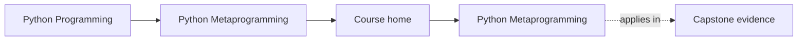
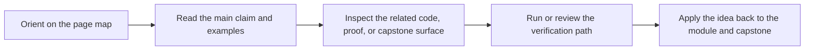

# Python Metaprogramming

<!-- page-maps:start -->
## Page Maps

<!-- page-maps:end -->

This course teaches Python metaprogramming as a discipline of runtime honesty. The goal
is not to make code look advanced. The goal is to understand what Python is doing when
code inspects, wraps, validates, or registers other code and objects.

## Start with these pages

- [Start Here](guides/start-here.md)
- [Guides Home](guides/index.md)
- [Course Guide](guides/course-guide.md)
- [Learning Contract](guides/learning-contract.md)
- [Runtime Power Ladder](reference/runtime-power-ladder.md)

## What the course is organized around

### A clear ladder of power

The course moves from plain observation to invasive runtime control:

1. introspection
2. decorators
3. descriptors
4. metaclasses
5. governance boundaries around dynamic execution and global hooks

### One executable proof

The [Capstone Guide](guides/capstone.md) points to a single plugin runtime that keeps the major
mechanisms visible in one place. Use [Capstone Map](guides/capstone-map.md) and
[Capstone File Guide](guides/capstone-file-guide.md) while reading.

### Review judgment

Use [Review Checklist](reference/review-checklist.md), [Practice Map](guides/practice-map.md), and
[Capstone Proof Checklist](guides/capstone-proof-checklist.md) to keep the material pedagogic
instead of ornamental.

## Module Table of Contents

| Module | Title | Why it matters |
| --- | --- | --- |
| [Module 00](module-00-orientation/index.md) | Orientation and Study Practice | establishes the power ladder, reading order, and capstone role |
| [Module 01](module-01-runtime-object-model/index.md) | Runtime Objects and the Python Object Model | explains what Python objects really are at runtime |
| [Module 02](module-02-safe-runtime-observation/index.md) | Safe Runtime Observation and Inspection | inspects values and code without accidental execution |
| [Module 03](module-03-inspect-signatures-and-provenance/index.md) | Signatures, Provenance, and Runtime Evidence | turns observation into reliable runtime facts |
| [Module 04](module-04-function-wrappers-and-decorators/index.md) | Function Wrappers and Transparent Decorators | begins transformation without lying about behavior or metadata |
| [Module 05](module-05-decorator-design-and-typing/index.md) | Decorator Design, Policies, and Typing | carries runtime policy without obscuring signatures and intent |
| [Module 06](module-06-class-customization-before-metaclasses/index.md) | Class Customization Before Metaclasses | uses lower-power class tools before escalating to metaclasses |
| [Module 07](module-07-descriptor-mechanics-and-lookup/index.md) | Descriptors, Lookup, and Attribute Control | explains how attribute access is actually resolved |
| [Module 08](module-08-descriptor-systems-and-validation/index.md) | Descriptor Systems, Validation, and Framework Design | turns descriptor mechanics into disciplined runtime architecture |
| [Module 09](module-09-metaclass-design-and-class-creation/index.md) | Metaclass Design and Class Creation | justifies the highest-power class hook narrowly and visibly |
| [Module 10](module-10-runtime-governance-and-mastery/index.md) | Runtime Governance and Mastery Review | converts mechanism knowledge into review standards and exit criteria |

## Failure modes this course is designed to prevent

- using dynamic power because it feels clever
- breaking signatures, metadata, or tracebacks during wrapping
- putting class-creation behavior into code that should stay ordinary and explicit
- teaching metaclasses before the learner understands descriptors
- approving meta-heavy code without a proof route
