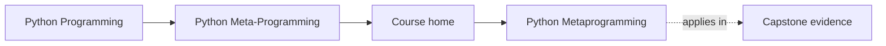
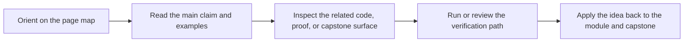

# Python Metaprogramming

<!-- page-maps:start -->
## Page Maps

<!-- page-maps:end -->

This course teaches Python metaprogramming as a discipline of runtime honesty. The goal
is not to make code look advanced. The goal is to understand what Python is doing when
code inspects, wraps, validates, or registers other code and objects.

## Start with these pages

- [Start Here](guides/start-here.md)
- [Guides Home](guides/index.md)
- [Course Guide](guides/course-guide.md)
- [Learning Contract](guides/learning-contract.md)
- [Runtime Power Ladder](reference/runtime-power-ladder.md)

## What the course is organized around

### A clear ladder of power

The course moves from plain observation to invasive runtime control:

1. introspection
2. decorators
3. descriptors
4. metaclasses
5. governance boundaries around dynamic execution and global hooks

### One executable proof

The [Capstone Guide](guides/capstone.md) points to a single plugin runtime that keeps the major
mechanisms visible in one place. Use [Capstone Map](guides/capstone-map.md) and
[Capstone File Guide](guides/capstone-file-guide.md) while reading.

### Review judgment

Use [Review Checklist](reference/review-checklist.md), [Practice Map](guides/practice-map.md), and
[Capstone Proof Checklist](guides/capstone-proof-checklist.md) to keep the material pedagogic
instead of ornamental.

## Module route

- [Module 00](module-00-orientation/index.md) defines the reading discipline.
- [Modules 01-03](module-01-runtime-object-model/index.md) through [module-03-inspect-signatures-and-provenance/index.md](module-03-inspect-signatures-and-provenance/index.md) build the object and inspection model.
- [Modules 04-06](module-04-function-wrappers-and-decorators/index.md) through [module-06-class-customization-before-metaclasses/index.md](module-06-class-customization-before-metaclasses/index.md) explain wrappers and class decorators.
- [Modules 07-09](module-07-descriptor-mechanics-and-lookup/index.md) through [module-09-metaclass-design-and-class-creation/index.md](module-09-metaclass-design-and-class-creation/index.md) explain descriptors and metaclasses.
- [Module 10](module-10-runtime-governance-and-mastery/index.md) and [Mastery Review](module-10-runtime-governance-and-mastery/mastery-review.md) convert mechanisms into governance and mastery review.

## Failure modes this course is designed to prevent

- using dynamic power because it feels clever
- breaking signatures, metadata, or tracebacks during wrapping
- putting class-creation behavior into code that should stay ordinary and explicit
- teaching metaclasses before the learner understands descriptors
- approving meta-heavy code without a proof route
