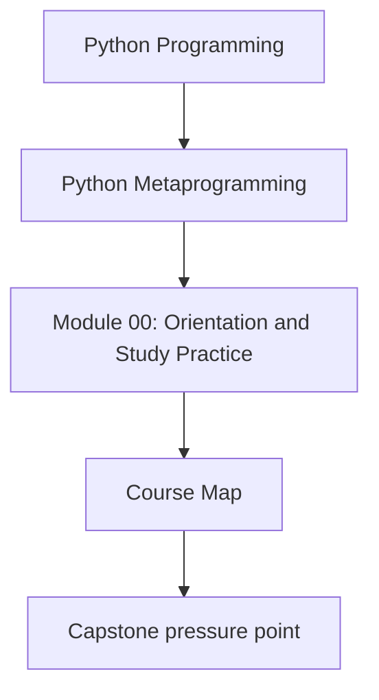
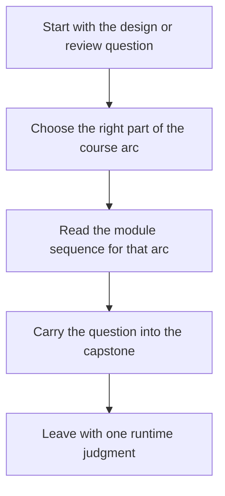

# Course Map

<!-- page-maps:start -->
## Concept Position

<!-- page-maps:end -->

Read the first diagram as a placement map: this page is one concept inside its parent
module, not a detached essay, and the capstone is the pressure test for whether the idea
holds. Read the second diagram as the working rhythm for the page: name the question,
choose the right arc, then carry one review judgment into the executable system.

This page is the orientation hub for the whole course. The progression is deliberate:
start with runtime objects and observation, move into wrappers and class customization,
then into descriptors, metaclasses, and finally runtime governance.

## How to use this map

- Use the staged maps below instead of trying to hold the whole ten-module sequence in memory at once.
- Treat each module as answering a different class of metaprogramming question.
- Keep the capstone open while reading so each mechanism stays attached to one executable surface.
- Use the course guides when you need route help and the reference shelf when you need review standards.

## Route by runtime question

| If your current question is... | Start with | Then |
| --- | --- | --- |
| What is Python actually doing at runtime here? | first-contact foundations | Modules 01 to 03 |
| Where should this behavior live: wrapper, attribute, or class boundary? | control and ownership route | Modules 04 to 08 |
| Is a metaclass or other high-power hook truly justified? | class-creation and governance route | Modules 09 to 10 |

This keeps the course tied to human questions instead of forcing the learner to remember module numbers first.

## Quick module summary

| Stage | Modules | Main runtime question |
| --- | --- | --- |
| Foundations | 01 to 03 | What exists at runtime, and what can I inspect safely and truthfully? |
| Control | 04 to 08 | Which boundary should own this behavior: callable, attribute, or class family? |
| Governance | 09 to 10 | When is higher-power runtime control justified, and when should it be rejected? |

## What to keep open while using this map

- Keep [Module Promise Map](../guides/module-promise-map.md) and [Module Checkpoints](../guides/module-checkpoints.md) open so each stage has a clear contract and exit bar.
- Keep [Proof Ladder](../guides/proof-ladder.md) open so proof stays proportional to the question.
- Keep [Capstone Map](../guides/capstone-map.md) open so the course remains attached to one executable system.
