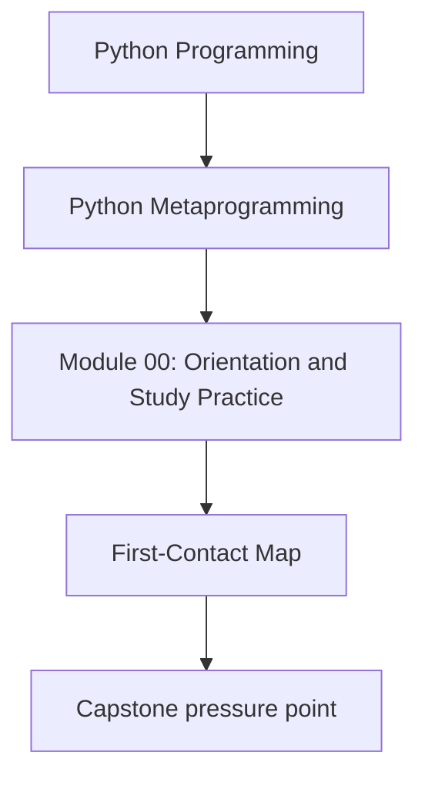
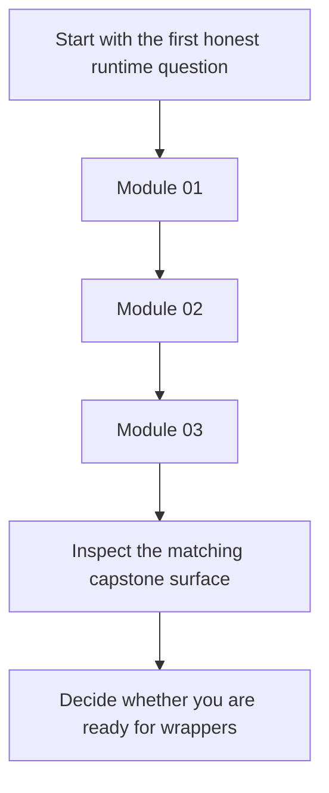

# First-Contact Map

<!-- page-maps:start -->
## Concept Position

<!-- page-maps:end -->

Read the first diagram as a placement map: this page is one concept inside its parent
module, not a detached essay, and the capstone is the pressure test for whether the idea
holds. Read the second diagram as the working rhythm for the page: move through the first
three modules in order, then check the capstone before advancing to behavior-changing hooks.

Use this map when you are starting the course or refreshing the foundations. These modules
define the vocabulary and runtime evidence standards that the rest of the course assumes.

## Module 01: Runtime Objects and the Python Object Model

**Theme:** understand what Python functions, classes, modules, and instances actually are at runtime.

- functions as runtime objects with code, globals, and closures
- classes as runtime objects with attribute lookup and method binding
- modules as runtime objects with namespace identity and reload caveats
- instances as runtime objects with `__dict__`, `__slots__`, and lookup behavior

**Capstone check:** inspect the public manifest surface and describe one runtime object in `src/incident_plugins/` without calling business logic.

## Module 02: Safe Runtime Observation and Inspection

**Theme:** learn how to inspect runtime structure without accidentally executing the thing you are trying to observe.

- visible names versus stored state versus resolved values
- attribute-access risk boundaries
- type and instance classification
- callability and why observation is not automatically passive

**Capstone check:** run `make manifest` or `make registry` and explain which facts stayed observable without invocation.

## Module 03: Signatures, Provenance, and Runtime Evidence

**Theme:** turn observation into evidence strong enough for tools, review, and wrapper design.

- `inspect.signature` and argument binding
- provenance helpers and their limits
- dynamic versus static member enumeration
- frame and stack inspection as diagnostics only

**Capstone check:** inspect action signatures and manifest data before reading wrapper code.

## How to know you are ready for Module 04

You are ready to move into wrappers when you can explain:

- what exists at runtime before any decorator or descriptor changes behavior
- which inspection tools are observational and which may execute user code
- what evidence about a callable or object is strong enough to trust in review

## What to keep open with this map

- [Module Promise Map](../guides/module-promise-map.md)
- [Module Checkpoints](../guides/module-checkpoints.md)
- [Capstone Map](../guides/capstone-map.md)
