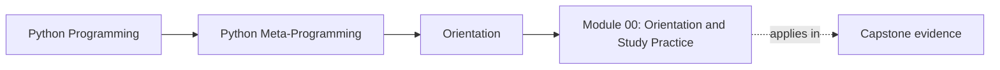
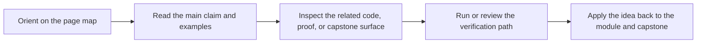

# Module 00: Orientation and Study Practice

<!-- page-maps:start -->
## Page Maps

<!-- page-maps:end -->

Read the first diagram as a placement map: this page sits between the course promise, the lesson pages listed below, and the capstone surfaces that pressure-test the module. Read the second diagram as the study route for this page, so the diagrams point you toward the `Lesson map`, `Exercises`, and `Closing criteria` instead of acting like decoration.

Python metaprogramming is where runtime power and runtime confusion meet. This course is
designed to replace vague "magic" explanations with a clear hierarchy of mechanisms,
costs, and responsibilities.

## The question this course owns

Keep one question in view while reading:

> What exactly is Python doing at runtime, and is this the lowest-power mechanism that can solve the problem honestly?

If the answer is unclear, the code will be harder to debug, review, and maintain than it needs to be.

## The power ladder

This course is organized around a strict ladder:

1. plain code
2. introspection
3. decorators
4. descriptors
5. metaclasses
6. responsibility boundaries around dynamic execution and global hooks

The rule is simple: always prefer the lowest rung that solves the problem.

## How to read the course

Read the modules in order. Each one establishes a boundary the next one depends on:

1. object model and introspection before transformation
2. decorators before descriptors
3. descriptors before metaclasses
4. mechanics before responsibility rules

This ordering matters because metaprogramming only becomes trustworthy when you can compare each tool to the simpler tool below it.

## Orientation companions

Use these pages with this module when you want the course shape to stay visible:

- [Course Map](course-map.md) for the whole ten-module arc
- [First-Contact Map](first-contact-map.md) for the minimum honest route into the foundations
- [Mid-Course Map](mid-course-map.md) for the bridge from observation into wrappers, descriptors, and class customization
- [Mid-Course Map](mid-course-map.md) again when you are resuming after a break without guessing at the right boundary
- [Mastery Map](mastery-map.md) for the late-course review and extension route

## What the capstone proves

[`capstone/`](https://github.com/bijux/bijux-masterclass/tree/master/programs/python-programming/python-meta-programming/capstone)
is the course’s executable proof. It is a plugin runtime for incident-delivery adapters
that keeps all four major mechanisms visible in one codebase:

- introspection-driven manifest export
- descriptor-backed configuration fields
- decorator-based action instrumentation
- metaclass-driven plugin registration

If a course claim cannot be connected to this runtime, treat it skeptically.

## Questions to keep asking while you read

- What work happens at definition time, and what work happens at call or instance time?
- Which metadata or signatures must remain visible after wrapping?
- Which invariant belongs on a field, on a callable, on a class, or in plain code?
- What would become harder to debug if this mechanism were made more magical?

## What not to expect

This course is not a tricks catalog and not a recommendation to make everything dynamic.
It is a correctness-first course about knowing what Python can do, what it should do, and
where the responsibility lines need to stay hard.

## Stable vocabulary

Use [Reference Glossary](../reference/glossary.md) when you want the recurring language in
this course kept stable while you move between orientation, modules, guides, and capstone
proof.
