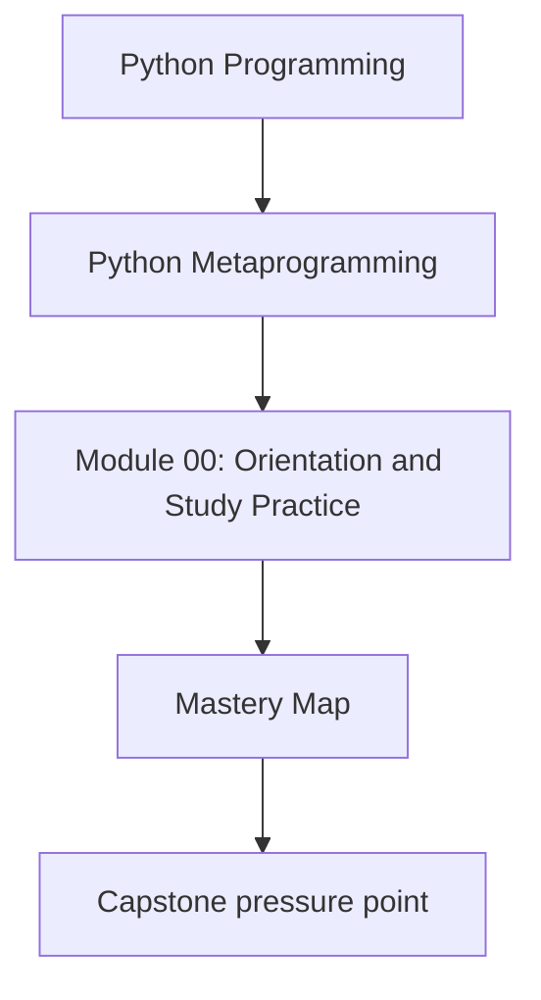
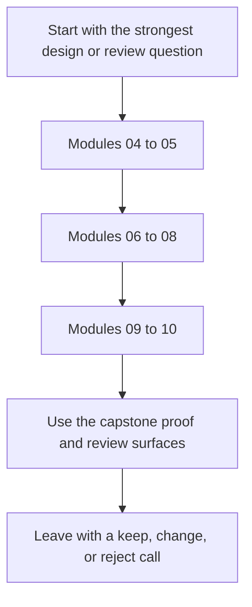

# Mastery Map

<!-- page-maps:start -->
## Concept Position

<!-- page-maps:end -->

Read the first diagram as a placement map: this page is one concept inside its parent
module, not a detached essay, and the capstone is the pressure test for whether the idea
holds. Read the second diagram as the working rhythm for the page: move from wrappers to
attributes to class creation and governance, then use the capstone to turn that knowledge
into a review judgment.

Use this map when you are studying the second half of the course, reviewing a dynamic codebase,
or deciding whether a higher-power runtime hook is truly justified.

## Modules 04 to 05: Wrapper Ownership and Policy Boundaries

**Theme:** learn where callable transformation stays honest and where hidden policy starts to sprawl.

- transparent decorators and wrapper identity
- policy-heavy decorator patterns
- annotation-aware runtime behavior and its limits

**Capstone check:** inspect `actions.py`, `make action`, `make signatures`, and `tests/test_runtime.py`.

## Modules 06 to 08: Attribute and Class Ownership

**Theme:** decide whether behavior belongs after class creation, in attribute access, or in wider field architecture.

- class decorators, properties, and lower-power class customization
- descriptor lookup, precedence, and per-instance storage
- richer descriptor systems and where they stop being one-field abstractions

**Capstone check:** inspect `fields.py`, `make field`, and `tests/test_fields.py`.

## Modules 09 to 10: Class Creation and Runtime Governance

**Theme:** justify the highest-power hooks narrowly and review them against explicit red lines.

- metaclass scope, timing, and conflicts
- registration and declaration-time enforcement
- dynamic execution, monkey-patching, import hooks, and governance boundaries

**Capstone check:** inspect `framework.py`, `make registry`, `make verify-report`, and `tests/test_registry.py`.

## How to know you are using this map well

You are using the mastery route well when you can answer:

- what lower-power tool almost solved the problem
- what exact boundary now owns the behavior
- what capstone output or test proves the design stayed observable
- what change you would still reject as making the runtime more magical than necessary

## What to keep open with this map

- [Proof Ladder](../guides/proof-ladder.md)
- [Review Checklist](../reference/review-checklist.md)
- [Anti-Pattern Atlas](../reference/anti-pattern-atlas.md)
- [Capstone Map](../guides/capstone-map.md)
