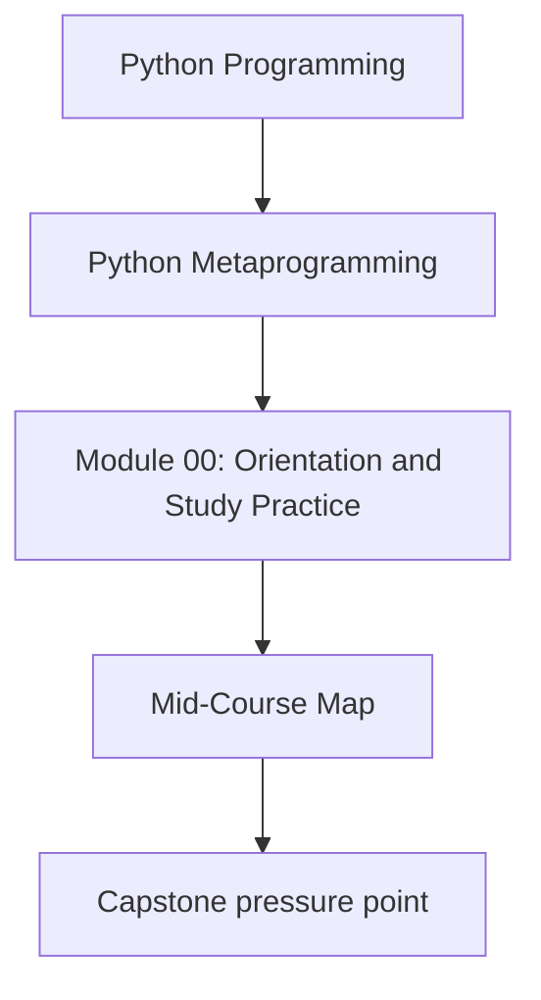
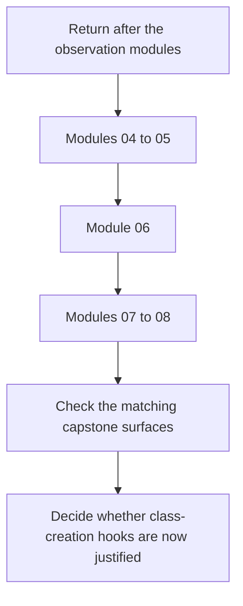

# Mid-Course Map

<!-- page-maps:start -->
## Concept Position

<!-- page-maps:end -->

Read the first diagram as a placement map: this page is one concept inside its parent
module, not a detached essay, and the capstone is the pressure test for whether the idea
holds. Read the second diagram as the working rhythm for the page: re-enter after the
observation modules, move from wrappers into attribute ownership, and only then ask
whether metaclasses are still necessary.

Use this map when Modules 01 to 03 are no longer the blocker but the second half of the
course still feels like one long stretch of "stronger magic." The point of this route is
to slow that stretch down into clearer ownership boundaries.

## Modules 04 to 05: Wrapper Honesty Before Wrapper Policy

**Theme:** learn how far callable transformation can go before it stops being a clean
function boundary.

- start with transparent decorators and preserved metadata in Module 04
- move into retries, caches, validation, and policy-heavy wrappers in Module 05
- keep asking whether the wrapper still owns a callable boundary or is starting to hide a service boundary

**Capstone check:** inspect `actions.py`, `make action`, `make signatures`, and
`make trace`.

## Module 06: Lower-Power Class Customization

**Theme:** stop before metaclasses and ask whether the problem can still be owned after
class creation.

- compare class decorators, properties, and explicit helper functions
- identify which behavior belongs to one class versus a whole class family
- keep the lower-power alternative explicit before you continue upward

**Capstone check:** inspect generated constructor behavior in `framework.py`,
`CONSTRUCTOR_GUIDE.md`, and `tests/test_runtime.py`.

## Modules 07 to 08: Attribute Ownership and Field Architecture

**Theme:** learn when behavior belongs to attribute access itself rather than to wrappers
or class-wide hooks.

- understand descriptor lookup and precedence
- place validation, coercion, and defaults on the field boundary deliberately
- distinguish one-field behavior from framework-wide behavior

**Capstone check:** inspect `fields.py`, `make field`, `FIELD_GUIDE.md`, and
`tests/test_fields.py`.

## How to know you are ready for Module 09

You are ready to move into metaclasses when you can explain:

- why a decorator would be the wrong place for the behavior
- why a descriptor or class decorator still falls short
- what must happen before the class exists at all
- which capstone surface already proves the lower-power boundaries

## What to keep open with this map

- [Module Promise Map](../guides/module-promise-map.md)
- [Module Checkpoints](../guides/module-checkpoints.md)
- [Mechanism Selection](../guides/mechanism-selection.md)
- [Capstone Map](../guides/capstone-map.md)
