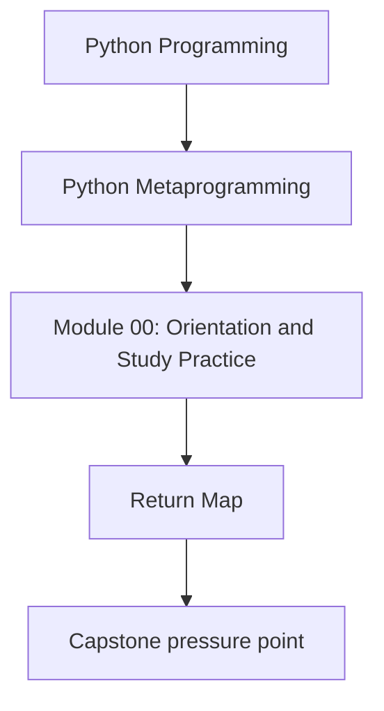
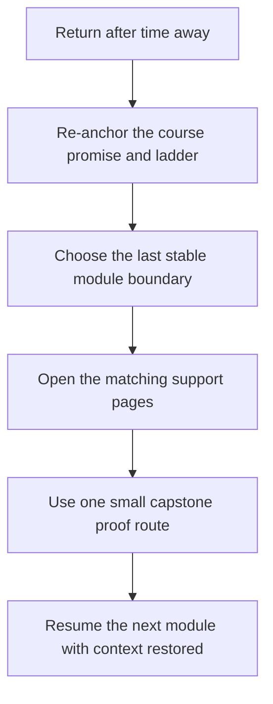

# Return Map

<!-- page-maps:start -->
## Concept Position

<!-- page-maps:end -->

Read the first diagram as a placement map: this page is one concept inside its parent
module, not a detached essay, and the capstone is the pressure test for whether the idea
holds. Read the second diagram as the working rhythm for the page: re-anchor the course
promise, find the last stable boundary you remember clearly, and use one small proof step
before resuming the next module.

Use this map when the course is not new, but no longer feels fresh. The goal is not to
reread everything. The goal is to restart from the smallest honest boundary instead of
guessing where your understanding is still solid.

## Step 1: Re-anchor the course promise

Before you reopen the last module you touched, reread:

1. [Module 00](index.md)
2. [Course Map](course-map.md)
3. [Module Promise Map](../guides/module-promise-map.md)

That puts the power ladder and the module promises back in view before details compete for
attention again.

## Step 2: Choose the last boundary you still trust

Use the last module you can still explain without rereading as your re-entry boundary.

| If you still trust yourself through... | Re-enter with... | Keep open... |
| --- | --- | --- |
| Modules 01 to 03 | [Mid-Course Map](mid-course-map.md) and Module 04 | [Proof Ladder](../guides/proof-ladder.md), [Capstone Map](../capstone/capstone-map.md) |
| Modules 04 to 06 | Module 07 and [Pressure Routes](../guides/pressure-routes.md) | [Module Checkpoints](../guides/module-checkpoints.md), [Anti-Pattern Atlas](../reference/anti-pattern-atlas.md) |
| Modules 07 to 08 | Module 09 and [Mastery Map](mastery-map.md) | [Review Checklist](../reference/review-checklist.md), [Proof Matrix](../guides/proof-matrix.md) |
| Module 09 or later | Module 10 and the capstone proof routes | [Boundary Review Prompts](../reference/boundary-review-prompts.md), [Capstone Guide](../capstone/index.md) |

## Step 3: Use one proof route before resuming

Pick one small proof route that matches the boundary you are returning to:

- `make manifest` or `make registry` if you are refreshing observation and definition-time visibility
- `make action` or `make trace` if you are refreshing wrapper behavior
- `make field` if you are refreshing descriptor ownership
- `make verify-report` if you are refreshing review judgment and governance boundaries

The proof route should restore confidence, not become a full audit.

## Signs you re-entered too late

Move backward one boundary if you cannot answer:

- what lower-power alternative is still relevant here
- what capstone file or output proves the module claim
- what kind of runtime timing is under discussion

If any of those feel fuzzy, the problem is probably not memory for terms. It is that the
last stable boundary was earlier than you thought.

## What to keep open with this map

- [Module Promise Map](../guides/module-promise-map.md)
- [Module Checkpoints](../guides/module-checkpoints.md)
- [Proof Ladder](../guides/proof-ladder.md)
- [Capstone Map](../capstone/capstone-map.md)
