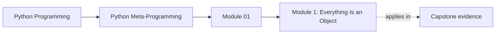
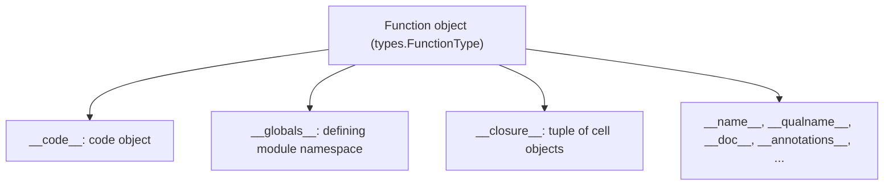
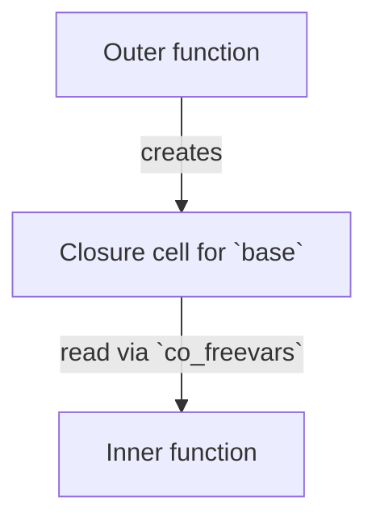
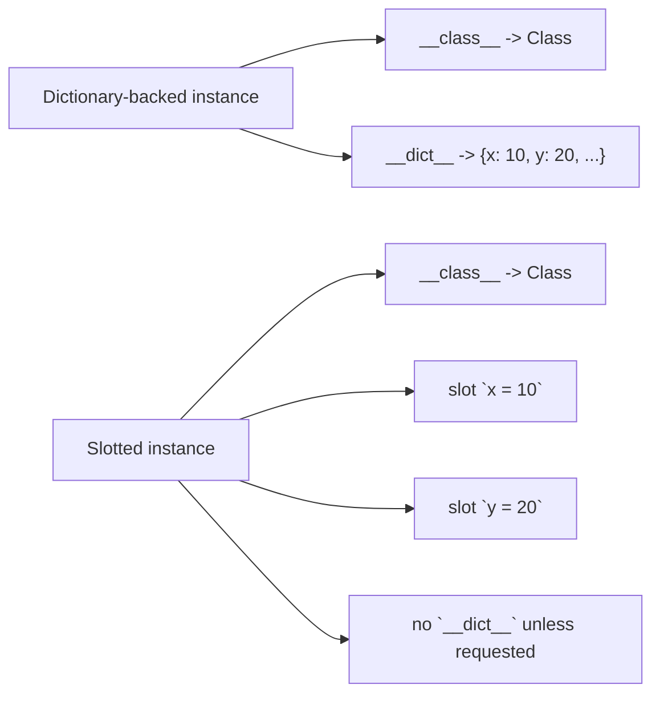

<a id="top"></a>
# Module 1: Everything Is an Object


<!-- page-maps:start -->
## Page Maps




<!-- page-maps:end -->

<a id="toc"></a>
## Table of Contents

1. [Introduction](#introduction)
2. [Core 1: Functions as Objects](#core1)
3. [Core 2: Classes as Objects](#core2)
4. [Core 3: Modules as Objects](#core3)
5. [Core 4: Instances as Objects](#core4)
6. [Synthesis: The Core Cycle](#synthesis)
7. [Capstone: `__code__`-based Source Recovery Heuristic (Intentionally Bad Engineering)](#capstone)
8. [Glossary (Module 1)](#glossary)

<span style="font-size: 1em;">[Back to top](#top)</span>

---

<a id="introduction"></a>
## Introduction

Python treats functions, classes, modules, and instances as ordinary runtime objects rather than special syntax. You can store them in data structures, pass them as arguments, and even generate them dynamically. This is the foundation on which decorators, descriptors, metaclasses, plugin systems, and most “framework magic” are built.

This power is constrained by two forces: the **Python Language Reference (PLR)**—what is formally guaranteed—and the behaviour of real interpreters (primarily **CPython**). We target mainstream **CPython 3.10+**; behaviour on other interpreters or older versions may differ in details. Some aspects are portable and stable; others are implementation details that you must treat as off-limits in production code. Misjudging that boundary is the source of many subtle bugs and profiling/debugging surprises.

In this module we build a precise mental model of the object graph, organised into four foundational cores, plus a capstone that deliberately uses “bad engineering” to make the PLR/CPython boundary painfully concrete:

* **Core 1: Functions as objects** — functions as objects, with code objects, globals, and closures.
* **Core 2: Classes as objects** — classes as objects created by `type`, exposing descriptors and method binding. (A *descriptor* is any object that defines `__get__`, `__set__`, or `__delete__` to customise attribute access; we return to this machinery in depth in Module 7.)
* **Core 3: Modules as objects** — modules as objects cached in `sys.modules`.
* **Core 4: Instances as objects** — instances, how they store state (via `__dict__` or `__slots__`), and the trade-offs of using `__slots__` to remove the per-instance `__dict__`. We introduce `__slots__` here and revisit it in later modules when we discuss dataclasses and descriptors.

The goal is to be able to explain, line by line, what happens when you write `obj.attr` or `func()` and how that ties back to modules and code objects.

When needed, we will distinguish:

* **Spec-level behaviour** – guaranteed (or at least intended) by the PLR and portable across implementations.
* **CPython behaviour** – true for mainstream CPython 3.10+ but not required by the specification.
* **Diagnostic-only behaviour** – surfaces CPython exposes for tooling and debugging (`__code__`, `__closure__`, frame objects, etc.) that must never be the basis of core program logic.

In the rest of this text, anything that goes through `inspect` or documented attributes (`__name__`, `__annotations__`, etc.) counts as spec-level or supported introspection; anything that pokes directly at `__code__`, `__closure__`, or cell objects is treated as diagnostic-only CPython behaviour.

<span style="font-size: 1em;">[Back to top](#top)</span>

---

<a id="core1"></a>
## Core 1: Functions as Objects

### Canonical Definition

In this core, **function object** refers specifically to a user-defined Python function—an instance of `types.FunctionType`. This distinguishes it from:

* **built-in functions** implemented in C (e.g., `len`, `sum`), and
* **other callables** such as class instances that define `__call__`.

All of these are *callables* in the sense that `callable(obj)` returns `True`, but only Python function objects expose the full set of introspection attributes described below.

A function object implements the callable protocol: `func(arg)` and `func.__call__(arg)` are equivalent. The same protocol applies to many other objects (classes with `__call__`, bound methods, etc.).

There are two common ways to ask “is this object callable?”:

* `callable(obj)` — a runtime predicate: “does this object *support being called*?”.
  This is **not** a guarantee that `obj(...)` will succeed for specific arguments; argument mismatch can still raise `TypeError`.

* `isinstance(obj, collections.abc.Callable)` — checks via abstract base class machinery (and virtual subclass registration). It is not defined in terms of `callable()`, and the two can differ in edge cases.

The key attributes of a function object form a metadata API for introspection and limited modification:

* `__name__`: unqualified name as a string (e.g., `"demo"`).
* `__qualname__`: qualified name incorporating nesting (e.g., `"outer.<locals>.inner"`).
* `__doc__`: docstring (`str` or `None`, mutable).
* `__module__`: defining module as a string.
* `__defaults__`: tuple of defaults for positional-or-keyword parameters (mutable).
* `__kwdefaults__`: dict of defaults for keyword-only parameters (mutable).
* `__annotations__`: dict of type hints for parameters and return (mutable).
* `__code__`: code object describing compiled implementation details.
  **Important precision:** the *code object itself* is immutable, but on CPython you can *rebind* `func.__code__` to another code object (highly fragile; treat as diagnostic-only/experimentation).
* `__globals__`: live reference to the defining module’s global namespace (a dict).
* `__closure__`: CPython diagnostic surface — tuple of cell objects for closure variables; existence/order/content are implementation details.

#### Function object structure



Caption: Code describes execution; globals and closure provide the environment.

#### Python vs built-in functions

The attributes listed above exist only for **Python-defined** functions. Built-in callables typically lack a `__code__` object.

`inspect.signature()` support for built-ins is mixed: many built-ins expose signatures (often via `__text_signature__`), but some do not and may raise `ValueError`. Treat built-ins as “callable, but not uniformly introspectable”.

#### Key fields of `__code__` (CPython diagnostic surface)

* `co_filename`, `co_firstlineno`
* `co_varnames`: argument names followed by local variable names.
* `co_argcount`: count of positional-or-keyword parameters (includes those with defaults; excludes positional-only, keyword-only, `*args`, and `**kwargs`).
* `co_posonlyargcount`: positional-only parameters (Python 3.8+).
* `co_kwonlyargcount`: keyword-only parameters.
* `co_freevars`: names this function reads from an enclosing scope.
* `co_cellvars`: local names this function provides as cells to nested functions.

Together, `co_freevars` and `co_cellvars` describe the closure relationship between nested functions.

In normal application logic, treat `__code__` and its fields as diagnostic surfaces only. For portable behaviour, rely on `inspect` and documented attributes.

---

### Deep Dive Explanation

Making functions first-class and uniformly callable enables generic infrastructure to accept “any callable” without caring about its concrete type. The metadata attributes expose just enough structure to power debuggers, serializers, and frameworks without requiring the original source code.

Some attributes are intentionally mutable (`__defaults__`, `__kwdefaults__`, `__annotations__`). Mutating them does not invalidate every cache in the ecosystem; tools that previously observed the function may retain stale snapshots indefinitely. Assume external tools may have cached your function’s metadata; never rely on mutations being noticed.

In CPython’s default pickle protocol, functions are typically reconstructed by re-importing the module named in `__module__` and retrieving the function by its module-level name. Practical consequence:

**Important limitation:** only functions defined at module top level are reliably picklable by default. If `__qualname__` contains `"<locals>"` (nested), there is no stable module-level name to recover, and default pickling fails.

---

### Examples

Invocation equivalence:

```python
def demo(x: int) -> str:
    """Doubles input as string."""
    return f"Value: {x * 2}"

assert demo(3) == "Value: 6"
assert demo.__call__(3) == "Value: 6"
```

Mutation and caching pitfalls:

```python
def api_call(version=1, debug=False):
    return f"v{version}, debug={debug}"

import inspect

sig_old = inspect.signature(api_call)
print(sig_old.parameters["version"].default)  # 1

api_call.__defaults__ = (2, True)             # mutate defaults

sig_new = inspect.signature(api_call)
print(sig_new.parameters["version"].default)  # 2

# Old Signature stays a stale snapshot.
print(sig_old.parameters["version"].default)  # still 1
```

Globals are live:

```python
CONFIG = {"debug": False}

def read_config():
    return CONFIG["debug"]

read_config.__globals__["CONFIG"]["debug"] = True
print(read_config())  # True immediately
```

---

### Closures Capture by Reference (Cells)

A closure is what lets an inner function continue to use variables from an outer function after the outer function has returned:

```python
def outer(base):
    def inner(x):
        return x + base
    return inner

add5 = outer(5)
print(add5(10))  # 15
```

Here `base` is local to `outer`, but `inner` needs it after `outer` has finished. Python keeps `base` alive by placing it in a **closure cell**.



Caption: Closures capture references via cells, not snapshots of values.

The code objects describe this relationship from both sides:

```python
print("outer.co_freevars :", outer.__code__.co_freevars)   # ()
print("outer.co_cellvars :", outer.__code__.co_cellvars)   # ('base',)

print("inner.co_freevars :", add5.__code__.co_freevars)    # ('base',)
print("inner.co_cellvars :", add5.__code__.co_cellvars)    # ()
```

Interpretation:

* `outer.co_cellvars == ('base',)` → `outer` creates a cell for `base` because an inner function captures it.
* `inner.co_freevars == ('base',)` → `inner` reads `base` from a cell provided by its enclosing scope.

In CPython you can peek at the actual cells via `add5.__closure__`, but treat this as a diagnostic surface only.

**Precision note:** closures capture *bindings* (cells). If the captured object is mutable, mutations are observed. If the outer scope *rebinds* the name, whether the inner sees that rebinding depends on `nonlocal` and how the compiler arranged cells—this is exactly why cells are an implementation detail you do not build core logic on.

---

### Advanced Notes and Pitfalls

* Lambdas, async functions, and generator functions are all plain `function` objects until called.
* Bound methods are `types.MethodType` wrappers around the original function (`__func__`) and the instance (`__self__`):

```python
import types

class C:
    def m(self): 
        return "ok"

c = C()
bm = c.m

assert isinstance(bm, types.MethodType)
assert bm.__func__ is C.m
assert bm.__self__ is c
assert bm() == "ok"
```

* Prefer the stable surface (`__name__`, `__qualname__`, `__module__`, `__annotations__`, `inspect.signature`, etc.) for any application logic or serialization format.
* Treat `__code__`, `__closure__`, and cell contents strictly as diagnostic tools.

### Exercise

Write a function that builds a readable signature string using only `__code__`, `__defaults__`, and `__kwdefaults__` (handle positional-only and keyword-only correctly). Then mutate `__defaults__` and show that a cached `inspect.Signature` object becomes permanently stale.

<span style="font-size: 1em;">[Back to top](#top)</span>

---

<a id="core2"></a>
## Core 2: Classes as Objects

At this point you only need a working intuition for descriptors: think of them as “smart attributes” on a class that participate actively in attribute access (`@property` is the most common example). The full descriptor protocol (and how functions themselves act as descriptors) is developed later, in Module 7.

### Canonical Definition

A class is an instance of its metaclass (default `type`). Creation pipeline:

1. Resolve metaclass (explicit `metaclass=`, rightmost winning base, or `type`).
2. `metaclass.__prepare__(name, bases, **kwds)` → namespace mapping
   (by default a plain dict that preserves insertion order on CPython 3.7+).
3. Execute class body in that namespace.
4. `metaclass(name, bases, namespace_after_body, **kwds)` creates the class object.
5. The class namespace is exposed via `cls.__dict__` as a read-only mapping view (a `mappingproxy` in CPython); attribute assignment still mutates the underlying namespace.

Key attributes:

* `__bases__`: tuple of direct superclasses (mutable; changing it triggers MRO recomputation)
* `__mro__`: full method resolution order (C3 linearization)
* `__class__`: reference to the metaclass

---

### Class creation pipeline (scan-first summary)

```mermaid
graph TD
  source["class C(Base1, Base2, metaclass=Meta): ..."]
  resolve["1. Resolve metaclass `M`"]
  prepare["2. `ns = M.__prepare__(...)` (optional)"]
  execute["3. Execute class body into `ns`"]
  construct["4. `cls = M(name, bases, ns, **kw)`"]
  new["`M.__new__` creates class object"]
  init["`M.__init__` finalizes class object"]
  bind["5. Bind `cls` to name `C`"]
  source --> resolve --> prepare --> execute --> construct
  construct --> new
  construct --> init
  new --> bind
  init --> bind
```

Caption: Metaclasses run before the class exists; this is definition-time work.

### Class creation pipeline (expanded, step-by-step)

```mermaid
graph TD
  step1["Step 1: Determine metaclass `M`<br/>explicit metaclass wins<br/>else derive from bases<br/>else default to `type`"]
  step2["Step 2: `ns = M.__prepare__(name, bases, **kw)`<br/>must return a mapping<br/>custom prepare can preserve order or collect declarations"]
  step3["Step 3: Execute class body into `ns`<br/>assignments populate namespace<br/>`def` creates function objects<br/>no class object exists yet"]
  step4["Step 4: `cls = M(name, bases, ns, **kw)`<br/>`M.__new__` creates class<br/>`M.__init__` finalizes class<br/>stores MRO and class dictionary view"]
  step5["Step 5: Bind `cls` into surrounding scope<br/>for example `globals()[\"C\"] = cls`"]
  step1 --> step2 --> step3 --> step4 --> step5
```

Caption: The class statement is executable code; it runs once at definition time.

---

### Attribute lookup precedence (default `object.__getattribute__`)

Effective attribute lookup order for `obj.attr` in the *default* implementation:

1. Data descriptors on the type or its bases (`__get__` + (`__set__` or `__delete__`))
2. Instance storage (`obj.__dict__` or slots)
3. Non-data descriptors (`__get__` only) or plain attributes on the type/bases
4. `__getattr__` fallback on the type
5. `AttributeError`

```text
Attribute Lookup Precedence (obj.x)

1. Data descriptor in type(obj).__mro__? (has __set__/__delete__)
   → descriptor.__get__(obj, type(obj))                     WINNER

2. Instance storage?
   → __dict__ (default) or slot field

3. Non-data descriptor or plain class attr in __mro__?
   → descriptor.__get__ (if present) or raw value

4. __getattr__ on type(obj)?
   → type(obj).__getattr__(obj, "x")

5. AttributeError

Caption: Data descriptors beat instance dict; non-data descriptors lose to it.

---

### Examples: Data vs Non-Data Descriptor Precedence

```python
class Data:
    # Data descriptor: has __get__ and __set__
    def __get__(self, obj, typ=None):
        return obj._value
    def __set__(self, obj, val):
        obj._value = val * 2

class NonData:
    # Non-data descriptor: only __get__
    def __get__(self, obj, typ=None):
        return 100

class C:
    data = Data()
    nondata = NonData()

c = C()

## Data descriptor always wins over instance __dict__
c.data = 10              # calls Data.__set__(c, 10) → c._value = 20
print(c.data)            # calls Data.__get__(c, C)  → 20

## Non-data descriptor can be shadowed by instance __dict__
c.__dict__["nondata"] = 999
print(c.nondata)         # 999
```

Key point:

* **Data descriptors** override instance attributes.
* **Non-data descriptors** can be overridden by instance attributes.

---

### Advanced Notes and Pitfalls

* Mutating `__bases__` is a sharp tool. In normal CPython, you usually get an immediate `TypeError` if the new bases yield an inconsistent MRO or incompatible layout. Treat `cls.__bases__ = ...` as experiment-only.
* Reassigning `__class__` on instances is allowed only when the new class is layout-compatible with the old one; otherwise `TypeError`. Treat `obj.__class__ = NewType` as a controlled experiment, not a production technique.
* The descriptor precedence rules are not a curiosity; they are the mechanism behind `@property`, method binding, many ORMs, and framework-level attribute tricks.

### Exercise

**Two-tier exercise (same goal; pick one):**

1. **Baseline (no metaclass yet):** implement “no redeclare” checking using `__init_subclass__` to inspect `cls.__dict__` after creation.

2. **Metaclass version (PEP 3115):** create a metaclass whose `__prepare__` returns a dict-like mapping that raises if a name is assigned twice in the class body. Then try `cls.__bases__ = ...` to force an MRO error and observe the `TypeError`.

<span style="font-size: 1em;">[Back to top](#top)</span>

---

<a id="core3"></a>
## Core 3: Modules as Objects

### Canonical Definition

A module is an instance of `types.ModuleType`, cached in `sys.modules`. There is exactly one module object per imported module name; every `import` returns another reference to the same object.

Import pipeline (PEP 451):

1. Finder → `ModuleSpec`
2. Loader creates module object (default `ModuleType(name)`)
3. `exec_module(module)` runs the code into `module.__dict__`
4. Cache in `sys.modules`

`importlib.reload(mod)` re-executes the module code into the *existing* module object; it does not replace the object itself.

When a file is executed as a script, its module name is `"__main__"`; imports see it under its real package name instead.

Modules may define `__all__` to control what `from module import *` exports; it has no effect on direct attribute access.

---

### Examples

#### One module object, many names (runnable)

```python
import sys
import types
import importlib

name = "example_synthetic"

m = types.ModuleType(name)
m.value = 123
sys.modules[name] = m

m2 = importlib.import_module(name)
print(m is m2)       # True
print(m2.value)      # 123
```

#### Reload and stale references (runnable “reload simulation”)

```python
import sys
import types

mod = types.ModuleType("mod_synthetic")
sys.modules[mod.__name__] = mod

exec('value = "old"', mod.__dict__)

imported_value = mod.value  # simulates: from mod import value
print(mod.value, imported_value)  # old old

## Simulate reload: re-exec into the same module object.
exec('value = "new"', mod.__dict__)

print(mod.value)        # new
print(imported_value)   # old (stale)
```

---

### Advanced Notes and Pitfalls

* `from module import name` creates a separate name binding that reload never updates.
* Prefer `import mod; mod.value` over `from mod import value` in reload-heavy workflows.

### Exercise

Implement a proxy object that wraps a module and refreshes attributes on each access (useful in REPL/reload-heavy workflows). Demonstrate the staleness bug with plain `from ... import`.

<span style="font-size: 1em;">[Back to top](#top)</span>

---

<a id="core4"></a>
## Core 4: Instances as Objects

### Canonical Definition

Instances are created by `cls.__new__` and then initialized by `cls.__init__`.

By default, each instance has its own attribute dictionary:

```python
class Example:
    pass

inst = Example()
print(inst.__dict__)  # {}
```

So `inst.x = 1` is, in the default model:

```python
inst.x = 1
print(inst.__dict__)  # {'x': 1}
```

Declaring `__slots__` on a class changes this storage model:

```python
class Point:
    __slots__ = ("x", "y")
```

* Python allocates a **fixed layout** for the names in `__slots__`.
* For that class, Python does **not** create a per-instance `__dict__` automatically (unless `'__dict__'` is explicitly listed in `__slots__` or inherited from a base class).
* Attributes named in `__slots__` live in slot storage instead of a dict.

So:

* **Without `__slots__`** – dynamic and tool-friendly, but heavier.
* **With `__slots__`** – fixed and lean, but less flexible and can break generic tooling.

Slots are a targeted optimization. Use them when you have measured that memory footprint or attribute access is a real bottleneck and you have many instances with a stable shape.

---

### Instance layout: `__dict__` vs `__slots__`



Caption: Slots trade flexibility for memory and speed; no dynamic attrs by default.

---

### Attribute lookup pipeline (read access)

This is the same precedence used in Core 2; the difference here is that “instance storage” may be a dict or slot fields.

```text
Attribute Lookup Precedence (obj.x) — storage detail

1. Data descriptor in type(obj).__mro__?
2. Instance storage:
   • dict-backed: obj.__dict__
   • slotted: slot field backing store
3. Non-data descriptor / class attribute in MRO
4. __getattr__ on type(obj)
5. AttributeError

Caption: Descriptors decide semantics; storage decides where instance state lives.

---

### Examples

#### Memory and behaviour

Memory difference is platform/version dependent; the code prints measured sizes on your runtime.

```python
import sys

class Regular:
    def __init__(self, a, b, c):
        self.a, self.b, self.c = a, b, c

class Slotted:
    __slots__ = ("a", "b", "c")
    def __init__(self, a, b, c):
        self.a, self.b, self.c = a, b, c

r = Regular(1, 2, 3)
s = Slotted(1, 2, 3)

# sys.getsizeof excludes referenced objects; use it for relative comparisons.
print("Regular instance:", sys.getsizeof(r), "dict:", sys.getsizeof(r.__dict__))
print("Slotted instance:", sys.getsizeof(s))
```

Behavioural difference (no dynamic attributes when only slots are present):

```python
class Point:
    __slots__ = ("x", "y")

p = Point()
p.x = 1
p.y = 2

try:
    p.z = 3
except AttributeError as e:
    print("Expected:", e)
```

If you need both fixed slots *and* dynamic attributes, explicitly reintroduce `__dict__`:

```python
class Hybrid:
    __slots__ = ("x", "y", "__dict__")

h = Hybrid()
h.x = 1          # slot
h.extra = "ok"   # dict
print(h.x, h.extra)
```

---

### Advanced Notes and Pitfalls

* Many generic tools assume instances have a `__dict__`. Pure slotted classes can break these silently unless the tool explicitly supports slots.
* Pickling slotted instances works, but default pickle records slot values; tools that walk `__dict__` may require custom state hooks.
* If you need weak references, include `'__weakref__'` in `__slots__`.
* If **any** base class has a `__dict__`, subclasses will effectively have a dict as well; slots then only cover additional fixed fields.

### Exercise

Create a deep inheritance chain of slotted classes and measure memory per instance at each level. Then introduce a base class without `__slots__` and observe that all subclasses regain a full `__dict__`, even if they still declare `__slots__`.

<span style="font-size: 1em;">[Back to top](#top)</span>

---

<a id="synthesis"></a>
## Synthesis: The Core Cycle

```python
class Processor:
    def process(self, data):
        return f"Processed {len(data)}"

import sys

mod = sys.modules[__name__]
cls = mod.Processor
func = cls.process
inst = cls()
bound = inst.process

assert bound.__func__ is func
assert func.__globals__ is mod.__dict__
assert inst.__class__ is cls

print(bound("abc"))  # Processed 3
```

```mermaid
graph TD
  module["Module object"]
  cls["Class object (from `module.__dict__`)"]
  instance["Instance (`Class()`)"]
  method["Bound method (`inst.method`)"]
  func["`__func__` -> function object"]
  globals["`__globals__` -> `module.__dict__`"]
  self["`__self__` -> instance"]
  module --> cls --> instance --> method
  method --> func --> globals
  method --> self
```

Caption: Everything loops back: module to class to instance to method to function to module.

Key mental model:

* **Module** holds names (globals dict).
* **Class** is an object stored in that dict.
* **Instance** is created by the class.
* **Bound method** binds `(function, instance)`.
* **Function** executes using module globals and (optionally) closure cells.

<span style="font-size: 1em;">[Back to top](#top)</span>

---

<a id="capstone"></a>
## Capstone: `__code__`-based Source Recovery Heuristic (Intentionally Bad Engineering)

This capstone is **intentionally bad engineering**. The goal is to show why `__code__` is a diagnostic surface and why “recover source from `__code__`” is fundamentally brittle.

### Canonical Idea

Given a function object `f`, you can:

* read `f.__code__.co_filename` and `f.__code__.co_firstlineno`,
* open that file,
* slice lines that “look like” the function definition/body based on indentation.

On tiny scripts, this appears to work. On anything realistic, it fails in subtle and misleading ways.

### Why This Is Inherently Fragile

The `__code__` object exposes:

* `co_filename`: where the code *thinks* it comes from (can be real, temp, or pseudo like `"<ipython-input-...>"`)
* `co_firstlineno`: approximate starting line (often the `def` line; not a formal contract)
* **no** stable end-line boundary.

The typical heuristic (“scan until indentation drops”) breaks for:

* decorated functions (you retrieve wrapper, not the original),
* multiline signatures and formatting tricks,
* nested functions (context lost),
* non-file environments (REPL/Jupyter/zipapps/frozen binaries).

### Example: A Fragile `print_source`

This implementation is intentionally *not* robust; it is a teaching tool.

```python
def print_source(func):
    """
    Educational demo only.
    """
    code = func.__code__
    filename = code.co_filename
    start_line = code.co_firstlineno - 1

    if not filename or "<" in filename:
        raise OSError(f"Cannot read real file for {filename!r}")

    with open(filename, "r", encoding="utf-8") as f:
        lines = f.readlines()

    if start_line < 0 or start_line >= len(lines):
        raise ValueError("co_firstlineno is out of bounds for file")

    def_line = lines[start_line]
    def_indent = len(def_line) - len(def_line.lstrip(" \t"))
    result = [def_line]

    i = start_line + 1
    while i < len(lines):
        line = lines[i]
        stripped = line.lstrip(" \t")
        cur_indent = len(line) - len(stripped)

        if stripped and cur_indent <= def_indent and not stripped.startswith(")"):
            break

        result.append(line)
        i += 1

    while result and not result[-1].strip():
        result.pop()

    print("".join(result), end="")
```

#### One harness, two behaviours: `inspect.getsource` vs `print_source`

This demo is intentionally written so it behaves sensibly both in “real file” runs and in REPL/Jupyter contexts (where failures are expected).

```python
import inspect

def demo(x, y=1):
    """Simple demo function for print_source."""
    if x > 0:
        return x + y
    return x - y

def decorated(f):
    def wrapper(*args, **kwargs):
        return f(*args, **kwargs)
    return wrapper

@decorated
def decorated_demo(x, y):
    return x * y

def multi_line_signature(
    x,
    y,
    z=1,
):
    return x + y + z

def outer():
    def inner(t):
        return t + 1
    return inner

targets = [demo, decorated_demo, multi_line_signature, outer()]

for fn in targets:
    print(f"\n=== inspect.getsource({fn.__qualname__}) ===")
    try:
        print(inspect.getsource(fn).rstrip())
    except OSError as e:
        print("Expected (non-file context):", e)

for fn in targets:
    print(f"\n=== print_source({fn.__qualname__}) ===")
    try:
        print_source(fn)
        print()
    except (OSError, ValueError) as e:
        print("Expected:", e)
```

What to observe (when run from a real `.py` file):

* `demo` may look “correct”.
* `decorated_demo` often returns wrapper code (wrong target).
* `multi_line_signature` sometimes survives; small formatting changes break it.
* the nested `inner` is context-free.

### Exercise

1. Run `print_source` on:

   * decorated functions,
   * nested functions,
   * functions defined in REPL/Jupyter,
   * code packaged as a zipapp or run by tooling that rewrites filenames.

2. Rewrite `print_source` to first try `inspect.getsource(func)` and raise a clear error if that fails. Compare behaviour across the same cases.

After you do this once, you should be permanently skeptical of any tool that claims to “reconstruct source from `__code__`” as a core capability.

You have completed Module 1.

<span style="font-size: 1em;">[Back to top](#top)</span>

---

<a id="glossary"></a>
## Glossary (Module 1)

| Term                                  | Definition                                                                                                                                        |
| ------------------------------------- | ------------------------------------------------------------------------------------------------------------------------------------------------- |
| **Everything is an object**           | Python functions, classes, modules, and instances are runtime objects that can be stored, passed, inspected, and generated dynamically.           |
| **Object graph**                      | The runtime network linking module → class → instance → bound method → function → module globals (the “core cycle”).                              |
| **Spec-level behavior (PLR)**         | Semantics intended/guaranteed by the Python Language Reference; portable across implementations.                                                  |
| **CPython behavior**                  | Behavior specific to the CPython interpreter (common and stable in practice, but not always guaranteed by the spec).                              |
| **Diagnostic-only surface**           | Introspection hooks exposed for debugging/tooling (e.g., `__code__`, `__closure__`, frames); should not be core logic dependencies.               |
| **Function object**                   | A user-defined Python function (`types.FunctionType`), distinct from built-ins and other callables.                                               |
| **Built-in function**                 | A callable implemented in C (e.g., `len`), often lacking `__code__`; signature support may be incomplete.                                         |
| **Callable**                          | Any object for which `callable(obj)` is true; includes functions, bound methods, classes, and instances implementing `__call__`.                  |
| **Callable protocol**                 | Rule that `obj(...)` invokes the object’s call mechanism (`__call__` for many user objects; interpreter slots for built-ins).                     |
| **Function metadata**                 | Introspection/mutation surface like `__name__`, `__qualname__`, `__doc__`, `__module__`, `__defaults__`, `__kwdefaults__`, `__annotations__`.     |
| **`__defaults__` / `__kwdefaults__`** | Mutable default argument storage for positional-or-keyword and keyword-only params; mutating can desync caches (e.g., old `inspect.Signature`).   |
| **Stale introspection snapshot**      | Cached metadata (e.g., an `inspect.Signature`) that does not update after you mutate function attributes.                                         |
| **Code object**                       | Immutable compiled representation (`func.__code__`) containing bytecode and compilation metadata (names, constants, filename, line numbers).      |
| **Rebinding `__code__`**              | CPython allows swapping a function’s `__code__` with another code object; extremely fragile and treated as diagnostic/experimentation.            |
| **`__globals__`**                     | Live reference to the defining module’s global namespace dict; changes are immediately visible to the function.                                   |
| **Closure**                           | A function plus captured free variables from an enclosing scope, kept alive via cells after the outer function returns.                           |
| **Closure cell**                      | CPython object holding a captured binding; inner functions read captured values through these cells (visible via `__closure__`).                  |
| **Capture by reference**              | Closures capture bindings (cells), not value snapshots; mutations of captured objects are observed.                                               |
| **Picklability limitation**           | Default pickling typically reconstructs functions by module + top-level name; nested functions (`"<locals>"`) generally fail.                     |
| **Bound method**                      | The object returned by `inst.method`: pairs `__func__` (function) with `__self__` (instance) and auto-supplies `self`.                            |
| **Descriptor**                        | Any object defining `__get__`, `__set__`, or `__delete__` to participate in attribute access; foundation of `@property`, methods, and frameworks. |
| **Data descriptor**                   | Descriptor with `__set__` and/or `__delete__`; overrides instance storage during lookup (cannot be shadowed by instance attributes).              |
| **Non-data descriptor**               | Descriptor with only `__get__`; can be shadowed by an instance attribute of the same name (plain methods behave this way).                        |
| **Attribute lookup precedence**       | Default order for `obj.attr`: data descriptor → instance storage (`__dict__`/slots) → non-data descriptor/class attr → `__getattr__` → error.     |
| **Class object**                      | An object representing a type; typically an instance of metaclass `type`, created at definition time via the class-creation pipeline.             |
| **Metaclass**                         | The “class of a class” (default `type`); controls class creation (`__prepare__`, `__new__`, `__init__`).                                          |
| **MRO**                               | Method Resolution Order (`cls.__mro__`), the C3-linearized search order for attributes across base classes.                                       |
| **`mappingproxy`**                    | Read-only view of a class’s dict (`cls.__dict__`) in CPython; reflects live namespace but cannot be mutated directly.                             |
| **Module object**                     | Instance of `types.ModuleType`, holding a namespace dict and cached by name in `sys.modules`.                                                     |
| **`sys.modules` cache**               | Global module cache ensuring imports return the same module object per name; foundational for import identity.                                    |
| **Reload re-executes**                | `importlib.reload(mod)` re-runs code into the same module object; existing external references (e.g., `from mod import x`) stay stale.            |
| **Import-time side effect**           | Work performed at definition/import time (registration, I/O, heavy computation); scales poorly and creates subtle order bugs.                     |
| **Instance**                          | Object created by calling a class (`cls()`), with state stored in `__dict__` by default or in slots when using `__slots__`.                       |
| **`__dict__`-backed storage**         | Default per-instance mutable mapping for attributes; flexible and tooling-friendly but memory-heavier.                                            |
| **`__slots__`**                       | Declares a fixed per-instance layout for named attributes; reduces memory and restricts dynamic attribute creation unless `__dict__` is included. |
| **Hybrid slots**                      | A slotted class that includes `"__dict__"` (and optionally `"__weakref__"`) to regain dynamic attributes while keeping fixed slots.               |
| **Layout compatibility**              | Constraint for reassigning `obj.__class__` or changing `cls.__bases__`; requires compatible memory layout/MRO, otherwise `TypeError`.             |
| **Introspection boundary**            | Practical rule: use stable APIs (`inspect`, documented attributes) for logic; treat `__code__`/cells/frame internals as diagnostic only.          |
| **Source recovery heuristic**         | Attempting to reconstruct source from `co_filename`/`co_firstlineno` + indentation scanning; brittle and misleading in real systems.              |
| **Decorator wrapper pitfall**         | Source/introspection often targets the wrapper function, not the original, unless metadata is preserved (e.g., via `functools.wraps`).            |
| **ORM (Object–Relational Mapper)**    | Framework mapping Python attributes to database operations; typically leverages descriptors and metaclasses.                                      |

Module 2 will cover safe introspection tools (`dir`, `vars`, `getattr`, `inspect`) and how to use them without falling into the implementation-detail traps we have just mapped.

<span style="font-size: 1em;">[Back to top](#top)</span>
