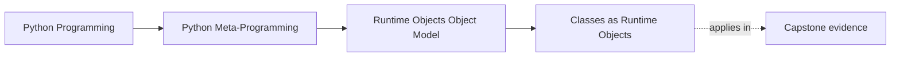
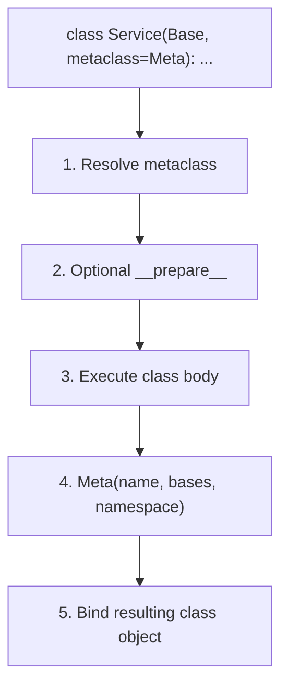

# Classes as Runtime Objects


<!-- page-maps:start -->
## Page Maps




<!-- page-maps:end -->

If Module 01 is going to make later metaprogramming honest, one sentence needs
to become ordinary:

> a class is also a runtime object, created at definition time and then stored, passed,
> inspected, and called like other values.

That sentence matters because decorators, descriptors, `__init_subclass__`, and
metaclasses all act on class objects or on the process that creates them.

## The sentence to keep

When class behavior feels mysterious, ask:

> what happened at class-definition time, what object was created, and what lookup rule is
> deciding this attribute access now?

That question usually separates plain class semantics from higher-power runtime hooks.

## What a class object is

By default, a Python class is an instance of `type`.

That means the class object itself has:

- identity
- attributes
- base classes
- a method resolution order
- a metaclass controlling how it was created

A class statement is executable code that produces this object and then binds it to a
name.

## The class creation pipeline

The creation path is more precise than "Python reads the class and makes a type":

1. resolve the metaclass
2. ask the metaclass for a namespace with `__prepare__` when provided
3. execute the class body in that namespace
4. call the metaclass to construct the class object
5. bind the resulting class object to its surrounding scope



Caption: the class does not exist while the body is executing; the body prepares the data
the metaclass will turn into a class object.

This matters because some designs belong before class creation, some belong after, and
some never needed metaclass power at all.

## The most useful class attributes

For Module 01, keep these close:

- `__bases__`: direct base classes
- `__mro__`: full method resolution order
- `__dict__`: class namespace view
- `__class__`: the metaclass, usually `type`

Two cautions matter immediately:

- `cls.__dict__` is not an invitation to poke blindly at class internals
- mutating `__bases__` is a sharp tool with layout and MRO constraints

Later modules will narrow when stronger hooks are justified. For now, the important habit
is seeing the class object as concrete and inspectable.

## Descriptor precedence is part of ordinary class behavior

The class object does not only store plain values. It can store descriptors that
participate in attribute access.

Effective lookup for `obj.attr` under the default attribute machinery is:

1. data descriptor on the class or one of its bases
2. instance storage (`__dict__` or slot storage)
3. non-data descriptor or plain class attribute
4. `__getattr__` fallback
5. `AttributeError`

```text
Attribute lookup for obj.x

1. Data descriptor in type(obj).__mro__?
2. Instance storage?
3. Non-data descriptor or plain class attribute?
4. __getattr__ fallback?
5. AttributeError
```

This is not advanced trivia. It is the mechanism behind methods, properties, and many
framework-level attribute patterns.

## Data and non-data descriptors behave differently

```python
class Data:
    def __get__(self, obj, typ=None):
        return obj._value

    def __set__(self, obj, value):
        obj._value = value * 2


class NonData:
    def __get__(self, obj, typ=None):
        return 100


class Demo:
    data = Data()
    nondata = NonData()


item = Demo()

item.data = 10
assert item.data == 20

item.__dict__["nondata"] = 999
assert item.nondata == 999
```

The lesson:

- data descriptors beat instance storage
- non-data descriptors lose to instance storage

That distinction becomes essential when later modules explain method binding,
descriptors, and validation systems.

## Methods are functions stored on the class

One of the cleanest ways to demystify classes is to state what a method really is:

```python
class Worker:
    def run(self):
        return "done"


assert Worker.__dict__["run"] is Worker.run
```

The class stores a function object. Access through an instance activates descriptor
behavior and produces a bound method. Nothing supernatural happened; ordinary runtime
objects interacted through lookup rules.

## `__prepare__` shows class bodies are not passive declarations

Most everyday code never needs a custom `__prepare__`, but knowing it exists is useful
because it proves that class creation is a protocol.

```python
class NoRedeclareDict(dict):
    def __setitem__(self, key, value):
        if key in self:
            raise TypeError(f"{key!r} defined twice")
        super().__setitem__(key, value)


class NoRedeclare(type):
    @classmethod
    def __prepare__(mcls, name, bases, **kwargs):
        return NoRedeclareDict()
```

This is not a recommended first move for ordinary code. It is a proof that class bodies
run inside a mapping chosen by the metaclass, which is why later metaclass lessons must
be taught with restraint.

## Layout constraints are real

Two experiments can feel tempting here:

- `cls.__bases__ = ...`
- `obj.__class__ = OtherClass`

Both can fail with `TypeError` because Python has to protect the method resolution order
and object layout.

That is an important governance lesson already visible in Module 01: the runtime is not a
bag of unconstrained rebinding tricks. Some objects carry structural promises that Python
defends.

## Review rules for class-object reasoning

When reviewing class-heavy code, keep these questions close:

- is this behavior just ordinary attribute lookup, or is a descriptor involved?
- did the behavior happen at class-definition time or at instance access time?
- is a metaclass being used where a lower-power tool would have been enough?
- does the code rely on fragile mutation of `__bases__` or `__class__`?
- can I point to the exact class object and namespace that own this behavior?

## What to practice from this page

Try these before moving on:

1. Inspect `SomeClass.__dict__` and identify which entries are plain values and which are
   functions or descriptors.
2. Create one data descriptor and one non-data descriptor, then prove their precedence
   against the instance dictionary.
3. Write down the difference between code that runs during class definition and code that
   runs when an instance attribute is read.

If those feel ordinary, the module can move from class objects to module objects without
losing the thread of runtime identity.

## Continue through Module 01

- Previous: [Functions as Runtime Objects](functions-as-runtime-objects.md)
- Next: [Modules as Runtime Objects](modules-as-runtime-objects.md)
- Practice: [Exercises](exercises.md)
- Terms: [Glossary](glossary.md)
