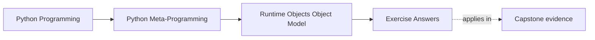
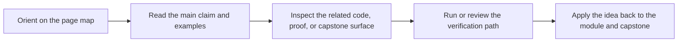

# Exercise Answers


<!-- page-maps:start -->
## Page Maps




<!-- page-maps:end -->

Use this page after you have attempted the exercises yourself. The point is not to match
every example literally. The point is to compare your reasoning against an answer that
names the runtime object, cites evidence, and stays honest about boundaries.

## Answer 1: Tell the truth about one function object

Example answer:

```python
def outer(base):
    def inner(x: int) -> int:
        return x + base
    return inner


fn = outer(5)
```

Strong evidence:

- `fn.__name__ == "inner"`
- `fn.__qualname__` includes `"outer.<locals>.inner"`
- `fn.__module__` names the defining module
- `fn.__code__.co_freevars == ("base",)`
- `fn.__closure__` exists because the function captures an outer binding

Good conclusion:

`fn` is more than "something callable." It is a Python-defined function object carrying
identity, metadata, executable code, and closure state.

## Answer 2: Explain one class without saying "class magic"

Example answer:

```python
class Demo:
    label = "demo"

    def run(self):
        return self.label
```

Strong evidence:

- `type(Demo) is type`
- `Demo.__bases__` shows the direct bases
- `Demo.__dict__["run"] is Demo.run`
- `Demo()` creates an instance whose `__class__` is `Demo`

Good conclusion:

The class statement created a class object, stored a function object under `run`, and
instance access later binds that function into a method. No special "magic" explanation
is required.

If you used a descriptor example, a strong answer also says whether a data descriptor,
instance storage, or non-data descriptor won the lookup.

## Answer 3: Prove module identity and stale imported values

Example answer:

```python
import importlib
import sys
import types

name = "sample_mod"
mod = types.ModuleType(name)
mod.value = "old"
sys.modules[name] = mod

again = importlib.import_module(name)
copied = mod.value

mod.value = "new"
```

Strong evidence:

- `mod is again` proves both names refer to the same module object
- `mod.value == "new"` while `copied == "old"` proves copied-out values can go stale

Good conclusion:

Imports usually return references to a cached module object. Names copied out of the
module do not automatically refresh when the module namespace changes.

## Answer 4: Compare instance storage models honestly

Example answer:

```python
class Regular:
    pass


class Slotted:
    __slots__ = ("x",)


regular = Regular()
regular.x = 1

slotted = Slotted()
slotted.x = 1
```

Strong evidence:

- `regular.__dict__ == {"x": 1}`
- `hasattr(slotted, "__dict__")` is often `False`
- assigning `slotted.y = 2` raises `AttributeError`

Good conclusion:

The regular instance stores dynamic state in a dictionary. The slotted instance uses a
fixed storage layout and rejects undeclared attributes. `__slots__` is justified when the
layout is stable and the memory or constraint tradeoff is intentional, not when it is
added only to make the code look advanced.

## Answer 5: Trace one runtime object chain from module to call

Example answer:

```python
class Processor:
    def process(self, data):
        return len(data)


import sys

module = sys.modules[__name__]
cls = module.Processor
inst = cls()
bound = inst.process
func = bound.__func__
```

Strong evidence:

- `cls is module.Processor`
- `inst.__class__ is cls`
- `bound.__self__ is inst`
- `bound.__func__ is cls.process`
- `func.__globals__ is module.__dict__`

Good conclusion by runtime moment:

- import time: the module object was created and executed
- class-definition time: the class object was built and bound into the module namespace
- instance-creation time: calling the class created `inst`
- call time: instance lookup created `bound`, and calling it invoked `func` with access to module globals

This trace prevents several misunderstandings at once, especially the idea that methods
are stored inside instances or that call behavior can be explained without reference to
the module and class objects involved.

## Answer 6: Review a brittle introspection helper

Example answer:

Suppose the helper tries to recover source with:

- `func.__code__.co_filename`
- `func.__code__.co_firstlineno`
- indentation scanning

Strong classification:

- `__name__`, `__qualname__`, and `inspect.signature()` are supported introspection surfaces
- `__code__`, `co_filename`, and `co_firstlineno` are diagnostic surfaces useful for tools but too weak for guaranteed source recovery
- indentation scanning is a heuristic layered on top of incomplete runtime metadata

Good conclusion:

The rewrite should report supported metadata first and use `inspect.getsource(func)` only
as a best-effort convenience with a clear failure path. The tool should not claim that it
can reconstruct the true source of any callable from code-object fields alone.

## What strong Module 01 answers have in common

Across the whole set, strong answers share the same habits:

- they start from a named runtime object
- they use evidence instead of folklore
- they distinguish supported surfaces from implementation detail
- they explain behavior in terms of import time, class-definition time, instance time, and call time when relevant

If your answer still depends on phrases like "Python just knows" or "class magic," revise
it until you can point to the actual object and relationship doing the work.

## Continue through Module 01

- Previous: [Exercises](exercises.md)
- Return: [Overview](index.md)
- Next module: [Module 02](../module-02-runtime-observation-inspection/index.md)
- Terms: [Glossary](glossary.md)
