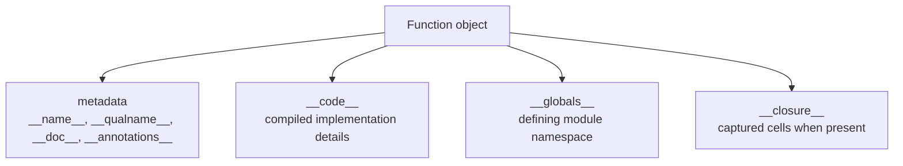

# Functions as Runtime Objects

The first object-model habit to build is simple:

> a Python-defined function is not just callable syntax; it is a runtime object carrying
> identity, metadata, executable code, and an environment.

Once that feels ordinary, decorators, wrappers, registries, and runtime inspection stop
looking like magic layered on top of Python and start looking like operations on visible
objects.

## The sentence to keep

When a function behaves strangely under tooling or wrapping, ask:

> which part of the function object is being used here: metadata, code, globals, closure,
> or the callable protocol itself?

That question usually reveals whether you are still on supported ground or drifting into
diagnostic-only internals.

## What counts as a function object here

In this page, `function object` means a user-defined Python function, typically an
instance of `types.FunctionType`.

That is narrower than `callable`.

- built-in functions such as `len` are callable, but they do not expose the same runtime
  surface
- bound methods are callable wrappers around a function and an instance
- classes are callable because calling a class constructs an instance
- objects with `__call__` are callable even when they are not functions

The point of the distinction is practical: Python-defined functions expose a rich
metadata and introspection surface that later modules rely on.

## The function object surface

These attributes form the most important supported surface:

- `__name__`: unqualified name such as `"demo"`
- `__qualname__`: qualified name including nesting such as `"outer.<locals>.inner"`
- `__doc__`: docstring or `None`
- `__module__`: defining module name
- `__defaults__`: tuple of defaults for positional-or-keyword parameters
- `__kwdefaults__`: dict of defaults for keyword-only parameters
- `__annotations__`: dict of parameter and return annotations
- `__globals__`: live reference to the defining module namespace

These attributes matter too, but they sit closer to the diagnostic boundary:

- `__code__`: compiled code object describing the implementation
- `__closure__`: tuple of closure cells when the function captures outer bindings

Use the first group freely for supported introspection. Treat the second group as
diagnostic surfaces unless you are writing narrowly-scoped tooling with clear
interpreter assumptions.

## One picture of the structure



Caption: a function carries code and environment together; it is never just text with a
name.

## Calling is only one part of the story

Calling a function is the most visible behavior, but it is not the only useful property.

```python
def demo(x: int) -> str:
    """Double input and format it."""
    return f"value={x * 2}"

assert demo(3) == "value=6"
assert demo.__call__(3) == "value=6"
```

The call path matters because later modules will wrap, trace, validate, or register
callables. The object model matters because those tools also need the function's name,
signature, provenance, globals, and sometimes its closure context.

## Built-ins are not the same thing

Built-in functions are callable, but they do not expose the full Python-function surface.

```python
import inspect

print(callable(len))               # True
print(hasattr(len, "__code__"))    # Usually False

try:
    print(inspect.signature(len))
except ValueError as exc:
    print("Some built-ins do not expose signatures:", exc)
```

That difference is why this page keeps the term `function object` precise. Later reviews
need to distinguish "callable" from "Python-defined function with inspectable runtime
state."

## `__globals__` is live, not archival

A function remembers the module namespace it was defined in, and that reference stays
live:

```python
CONFIG = {"debug": False}

def read_config():
    return CONFIG["debug"]

read_config.__globals__["CONFIG"]["debug"] = True
assert read_config() is True
```

This explains an important runtime truth: functions do not carry a frozen copy of module
state. They execute against a live namespace object.

That matters for debugging, reloading, monkeypatching, and any design that pretends a
function's environment is static when it is not.

## Defaults and annotations are mutable metadata

Some function attributes are intentionally writable:

```python
import inspect

def api_call(version=1, debug=False):
    return f"v{version}, debug={debug}"

before = inspect.signature(api_call)
print(before.parameters["version"].default)  # 1

api_call.__defaults__ = (2, True)

after = inspect.signature(api_call)
print(after.parameters["version"].default)   # 2
print(before.parameters["version"].default)  # still 1
```

That stale `Signature` object is the important lesson. Tooling often caches runtime
facts. If you mutate function metadata after another tool already observed it, the world
does not rewind to keep everything synchronized for you.

Use metadata mutation sparingly and never assume every observer will notice.

## `__code__` is powerful and dangerous

The code object records compiled details such as:

- `co_filename`
- `co_firstlineno`
- `co_varnames`
- `co_argcount`
- `co_posonlyargcount`
- `co_kwonlyargcount`
- `co_freevars`
- `co_cellvars`

This is useful for debuggers, profilers, and careful inspection. It is a bad foundation
for ordinary application logic.

Two practical reasons:

- the code object surface is closer to interpreter mechanics than language-level intent
- code-object-based tricks often work in tiny demos and collapse in decorated,
  generated, nested, or non-file-backed code

The worked example for this module pushes on that boundary directly.

## Closures capture bindings through cells

A closure lets an inner function keep using names from an outer scope after the outer
function has returned.

```python
def outer(base):
    def inner(x):
        return x + base
    return inner

add5 = outer(5)
assert add5(10) == 15
```

The captured value is not stored as magical ambient state. Python keeps it available
through closure cells:

```python
print("outer.co_freevars:", outer.__code__.co_freevars)
print("outer.co_cellvars:", outer.__code__.co_cellvars)

print("inner.co_freevars:", add5.__code__.co_freevars)
print("inner.co_cellvars:", add5.__code__.co_cellvars)
```

Typical output looks like this:

```python
outer.co_freevars: ()
outer.co_cellvars: ('base',)
inner.co_freevars: ('base',)
inner.co_cellvars: ()
```

Interpretation:

- `outer` creates the cell because an inner function captures `base`
- `inner` reads `base` as a free variable from that cell

That is a useful mental model. Reaching into `__closure__` and cell contents directly is
usually not.

## Bound methods prove functions participate in larger runtime objects

Functions are also part of class behavior:

```python
import types

class Service:
    def run(self):
        return "ok"

svc = Service()
bound = svc.run

assert isinstance(bound, types.MethodType)
assert bound.__func__ is Service.run
assert bound.__self__ is svc
assert bound() == "ok"
```

This is a preview of the module-wide runtime graph:

- the class stores the function
- instance access creates a bound method
- the bound method pairs the original function with the instance

Later modules build on that chain instead of replacing it.

## Practical review rules

When reviewing code that manipulates functions, keep these rules close:

- use documented metadata and `inspect` for supported introspection
- treat `__code__`, `__closure__`, and cell internals as diagnostic surfaces
- avoid designs that depend on mutating defaults or annotations after observers cached them
- remember that functions execute against live module globals, not frozen snapshots
- distinguish "callable" from "Python-defined function" before making introspection claims

## What to practice from this page

Try these before moving on:

1. Print the metadata of one ordinary function and one built-in, then explain the
   difference without using the word "magic."
2. Mutate a function's defaults and compare a fresh `inspect.signature()` result with a
   cached one.
3. Build one closure and explain which name became a cell provider and which function sees
   it as a free variable.

If those feel ordinary, you are ready to treat classes as runtime objects instead of only
as syntax for inheritance.

## Continue through Module 01

- Previous: [Overview](index.md)
- Next: [Classes as Runtime Objects](classes-as-runtime-objects.md)
- Practice: [Exercises](exercises.md)
- Terms: [Glossary](glossary.md)
