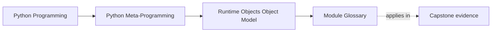
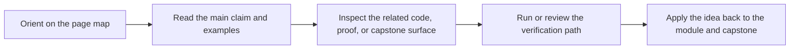

# Module Glossary

<!-- page-maps:start -->
## Page Maps

<!-- page-maps:end -->

This glossary belongs to **Module 01: Runtime Objects and the Python Object Model** in
**Python Metaprogramming**. It keeps the language of this directory stable so the same
ideas keep the same names across lessons, practice, and capstone discussion.

## How to use this glossary

Use the glossary when a page or discussion starts to drift into vague words like "magic,"
"special," or "Python just knows." Module 01 is meant to replace those shortcuts with
explicit object-model language.

## Terms in this directory

| Term | Meaning in this directory |
| --- | --- |
| Bound method | The object returned by `instance.method`, pairing `__self__` with the original function in `__func__`. |
| Callable | Any object that Python allows you to call. This is broader than "Python-defined function." |
| Class object | The runtime object produced by the class-creation process, usually an instance of `type`. |
| Closure | A function plus captured bindings from an enclosing scope that remain available after the outer function returns. |
| Closure cell | The runtime object CPython uses to hold a captured binding for a closure. |
| Code object | The compiled implementation data exposed through `func.__code__`. Useful for diagnostics, but not a general-purpose application contract. |
| Data descriptor | A descriptor defining `__set__` and/or `__delete__`, so it outranks instance storage during attribute lookup. |
| Diagnostic surface | A runtime surface useful for debugging or tooling but too fragile to treat as a core correctness boundary. |
| Function object | A Python-defined function carrying metadata, executable code, and an execution environment. |
| Import time | The runtime moment when a module object is created, executed, and cached. |
| Instance | A runtime object created by calling a class. |
| Instance storage | The place where per-instance state lives, usually `__dict__`, slots, or both. |
| Live globals | The fact that `func.__globals__` points to the current module namespace object rather than to a frozen snapshot. |
| Metaclass | The class of a class object. The default metaclass is `type`. |
| Module object | The runtime object representing an imported module, typically cached in `sys.modules`. |
| MRO | The method resolution order Python uses when searching base classes for an attribute. |
| Non-data descriptor | A descriptor defining only `__get__`, so instance storage can shadow it. |
| Object graph | The network of runtime relationships connecting modules, classes, instances, bound methods, and functions. |
| Runtime cycle | The sequence of import time, class-definition time, instance-creation time, and call time. |
| Slotted instance | An instance whose class declares `__slots__`, changing its storage layout and often removing the default `__dict__`. |
| Spec-level surface | A documented and intended behavior or interface you can reasonably use for supported introspection. |
| Supported introspection | Inspection through documented attributes and tools such as `inspect`, rather than through brittle runtime internals. |
| `__dict__`-backed instance | An instance storing attributes in a mutable dictionary, which most generic tools expect. |
| `__globals__` | The live module namespace dictionary attached to a Python-defined function. |
| `__prepare__` | The metaclass hook that can supply the mapping used while executing a class body. |
| `__slots__` | A class-level declaration that gives instances a fixed storage layout for named attributes. |

## Keep the module connected

- Return to [Module 01 Overview](index.md) for the full learning route.
- Use [Exercises](exercises.md) and [Exercise Answers](exercise-answers.md) to pressure-test the vocabulary.
- Revisit the [Worked Example](worked-example-reviewing-a-brittle-source-recovery-tool.md) when a diagnostic surface starts to look more stable than it really is.
