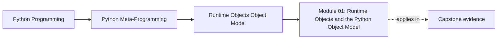
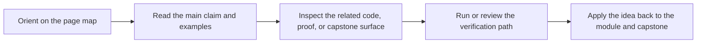

# Module 01: Runtime Objects and the Python Object Model

<!-- page-maps:start -->
## Page Maps

<!-- page-maps:end -->

Module 01 gives the floor the rest of the course stands on: Python functions, classes,
modules, and instances are ordinary runtime objects, and metaprogramming becomes honest
only when that sentence feels mechanically true instead of inspirational.

This module now uses the same ten-file learning surface as the deep-dive series so the
overview, five cores, worked example, practice set, answers, and glossary each have one
clear job.

## What this module is for

By the end of Module 01, you should be able to explain five things cleanly:

- what makes a Python function an object with metadata, globals, and callable behavior
- how classes are created, stored, and used as ordinary runtime values
- why modules are cached objects with a live namespace instead of passive source files
- how instances store state and participate in attribute lookup
- how module, class, instance, method, and function relationships form one runtime graph

## Keep these pages open

- [First-Contact Map](../module-00-orientation/first-contact-map.md)
- [Module Promise Map](../guides/module-promise-map.md)
- [Module Checkpoints](../guides/module-checkpoints.md)
- [Capstone Map](../capstone/capstone-map.md)

## The ten files in this module

1. Overview (`index.md`)
2. [Functions as Runtime Objects](functions-as-runtime-objects.md)
3. [Classes as Runtime Objects](classes-as-runtime-objects.md)
4. [Modules as Runtime Objects](modules-as-runtime-objects.md)
5. [Instances as Runtime Objects](instances-as-runtime-objects.md)
6. [Object Graph and Runtime Cycle](object-graph-and-runtime-cycle.md)
7. [Worked Example: Reviewing a Brittle Source-Recovery Tool](worked-example-reviewing-a-brittle-source-recovery-tool.md)
8. [Exercises](exercises.md)
9. [Exercise Answers](exercise-answers.md)
10. [Glossary](glossary.md)

## How to use the file set

| If you need to... | Start here |
| --- | --- |
| understand what a Python function really carries at runtime | [Functions as Runtime Objects](functions-as-runtime-objects.md) |
| explain class creation, lookup precedence, and descriptor pressure | [Classes as Runtime Objects](classes-as-runtime-objects.md) |
| reason about import identity, caching, and reload behavior | [Modules as Runtime Objects](modules-as-runtime-objects.md) |
| compare `__dict__`-backed and slotted instances | [Instances as Runtime Objects](instances-as-runtime-objects.md) |
| connect functions, modules, classes, instances, and bound methods into one model | [Object Graph and Runtime Cycle](object-graph-and-runtime-cycle.md) |
| watch the boundary between supported introspection and brittle heuristics fail in practice | [Worked Example: Reviewing a Brittle Source-Recovery Tool](worked-example-reviewing-a-brittle-source-recovery-tool.md) |
| test your understanding before moving to Module 02 | [Exercises](exercises.md) |
| compare your reasoning against a reference answer | [Exercise Answers](exercise-answers.md) |
| stabilize the module vocabulary | [Glossary](glossary.md) |

## The running question

Carry this question through every page:

> What runtime object, namespace, or binding is actually doing the work here?

Strong Module 01 answers usually mention one or more of these:

- a function object and the environment it carries
- a class object created at definition time
- a module object cached in `sys.modules`
- an instance storage model and lookup path
- a bound method linking an instance back to a function and module namespace

## Learning outcomes

By the end of this module, you should be able to:

- describe Python runtime behavior without appealing to framework magic
- separate supported introspection from interpreter-specific diagnostic surfaces
- explain what happens at import time, class-definition time, instance time, and call time
- use the capstone runtime as evidence for ordinary object relationships

## Exit standard

Do not move on until all of these are true:

- you can explain why functions, classes, modules, and instances are all ordinary objects
- you can name which runtime facts are stable and which are diagnostic-only
- you can trace one bound method back through instance, class, function, and module state
- you can describe one brittle introspection idea and say exactly why it fails

When those feel ordinary, Module 01 has done its job and Module 02 can focus on safe
observation instead of object-model confusion.
