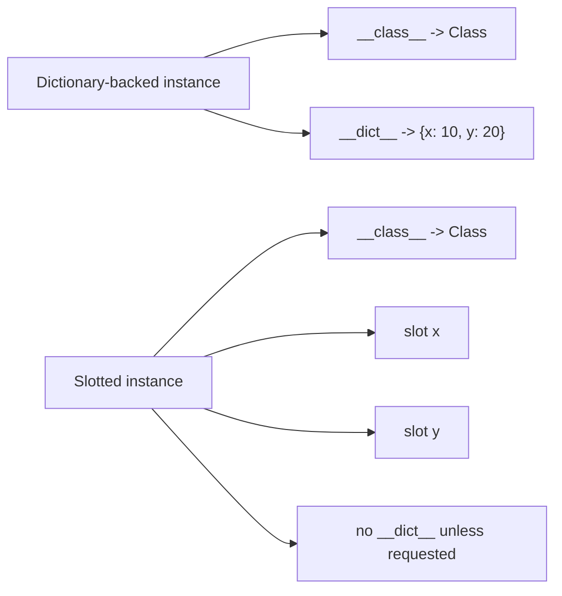

# Instances as Runtime Objects

The first three core pages explain functions, classes, and modules as runtime objects.
This page finishes that floor by making instance behavior equally concrete.

The sentence to keep is:

> an instance is a runtime object with its own storage model, and attribute access works by
> combining that storage with the class lookup rules above it.

Once that sentence feels ordinary, `__dict__`, `__slots__`, method binding, and
descriptor-based frameworks all become easier to review accurately.

## The sentence to keep

When an instance attribute behaves unexpectedly, ask:

> is the value coming from instance storage, slot storage, a descriptor on the class, or a
> fallback lookup hook?

That question narrows most instance-level confusion quickly.

## How instances are created

Instance creation usually happens in two steps:

1. `cls.__new__` creates the instance object
2. `cls.__init__` initializes it

That does not mean every class customizes both methods. It means instance creation is a
runtime protocol, not a single magical operation hidden behind `ClassName()`.

## The default storage model is `__dict__`

For ordinary classes, each instance carries a mutable dictionary of its own attributes:

```python
class Example:
    pass


item = Example()
assert item.__dict__ == {}

item.x = 1
assert item.__dict__ == {"x": 1}
```

This is the default model most tools expect:

- dynamic attributes are allowed
- object state is easy to inspect with `vars(obj)` or `obj.__dict__`
- generic serializers and debuggers often depend on that dictionary being present

That flexibility is useful, but it is not the only storage model Python supports.

## `__slots__` changes where state lives

Declaring `__slots__` tells Python to allocate a fixed layout for named attributes:

```python
class Point:
    __slots__ = ("x", "y")
```

Typical consequences:

- Python does not create a per-instance `__dict__` automatically
- only the named slot attributes are allowed
- instance storage becomes more memory efficient for large numbers of similar objects

That can be helpful, but it also changes the ergonomics and tool compatibility of the
instances you create.

## One picture of dictionary-backed and slotted instances



Caption: descriptor rules still decide semantics; slots only change where instance state
is stored.

## Read lookup combines class rules and instance storage

Instance attribute lookup is not "check the dictionary and stop." Under the default
attribute machinery, the effective order is:

1. data descriptor on the class or one of its bases
2. instance storage
3. non-data descriptor or plain class attribute
4. `__getattr__` fallback
5. `AttributeError`

For this page, the key detail is that step 2 may mean one of two things:

- a value in `obj.__dict__`
- a value stored in a slot field

That is why this page sits after the class-object page. Instance behavior depends on
class-level lookup rules and descriptor precedence.

## Dictionary-backed and slotted instances behave differently

```python
class Regular:
    def __init__(self, a, b):
        self.a = a
        self.b = b


class Slotted:
    __slots__ = ("a", "b")

    def __init__(self, a, b):
        self.a = a
        self.b = b


regular = Regular(1, 2)
slotted = Slotted(1, 2)

assert regular.__dict__ == {"a": 1, "b": 2}
print(hasattr(slotted, "__dict__"))  # Often False
```

The important difference is not only memory. It is also what kinds of runtime inspection
and extension remain possible.

## Pure slots reject dynamic attributes

```python
class Point:
    __slots__ = ("x", "y")


p = Point()
p.x = 1
p.y = 2

try:
    p.z = 3
except AttributeError as exc:
    print("Expected:", exc)
```

That restriction is sometimes exactly what you want. It is also a reason many generic
tools and quick debugging tricks stop working on heavily slotted designs.

## Hybrid classes can bring `__dict__` back

If you need fixed slots and dynamic attributes together, you can explicitly include
`"__dict__"`:

```python
class Hybrid:
    __slots__ = ("x", "y", "__dict__")


h = Hybrid()
h.x = 1
h.note = "ok"

assert h.x == 1
assert h.__dict__ == {"note": "ok"}
```

This is a good reminder that `__slots__` is a storage design choice, not a moral upgrade.
You use it when it buys something concrete.

## Inheritance changes the picture

Slot behavior becomes easier to reason about if you keep one rule in mind:

> if a base class already provides a `__dict__`, subclasses effectively keep dictionary
> storage even when they add their own slots.

That means a deep inheritance chain can quietly regain dynamic attributes even when later
classes declare `__slots__`.

Again, the point is not trivia. The point is to make instance layout a reviewable runtime
fact instead of a half-remembered optimization story.

## Methods connect instances back to class-stored functions

Instances also matter because instance attribute access is how ordinary methods become
bound methods:

```python
class Service:
    def run(self):
        return "ok"


svc = Service()
bound = svc.run

assert bound.__self__ is svc
assert bound.__func__ is Service.run
```

This is another reason Module 01 keeps returning to ordinary object relationships. The
instance does not "contain the method implementation." It participates in a binding step
that links the instance to a function stored on the class.

## Review rules for instance-object reasoning

When reviewing instance-heavy designs, keep these questions close:

- where does instance state actually live: `__dict__`, slots, or both?
- does a descriptor on the class outrank the instance storage you thought you were using?
- is `__slots__` justified by a measured need, or is it adding constraint for style points?
- will generic tooling, debugging, serialization, or monkeypatching break on these instances?
- can you explain one method access as a binding relationship instead of as "class magic"?

## What to practice from this page

Try these before moving on:

1. Build one dictionary-backed class and one slotted class, then compare their ability to
   accept a new ad hoc attribute.
2. Add `"__dict__"` back into a slotted class and explain what changed.
3. Write down the full lookup story for one instance attribute that ends up coming from a
   class descriptor instead of instance storage.

If those feel ordinary, the last core can connect modules, classes, instances, functions,
and bound methods into one runtime graph.
