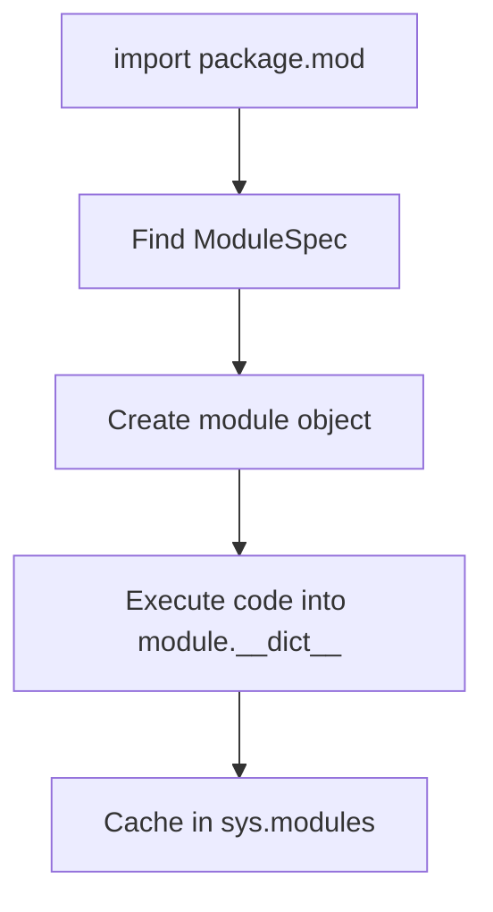

# Modules as Runtime Objects

Learners often talk about modules as if they were just source files on disk. That picture
is too weak for metaprogramming.

The more useful sentence is:

> a module is a runtime object with a live namespace, and import mostly gives you another
> reference to that object.

Once that feels normal, global namespaces, import-time side effects, reload behavior, and
function provenance become much easier to explain accurately.

## The sentence to keep

When import behavior gets confusing, ask:

> which module object exists right now, under which name, and which references still point
> at older values taken from it?

That question usually explains identity bugs faster than staring at source files.

## What a module object is

A Python module is typically an instance of `types.ModuleType`.

What matters for Module 01 is not the concrete constructor but the runtime behavior:

- a module has identity
- a module has a namespace dictionary
- imports are mediated through `sys.modules`
- functions remember the module namespace they were defined in

Treating the module as a first-class object keeps later introspection work anchored to
the actual runtime container instead of to the file alone.

## The import pipeline creates and caches a module object

At a high level, modern import works like this:

1. find a module specification
2. create the module object
3. execute module code into the module namespace
4. cache the module object in `sys.modules`



Caption: the imported module is not source text; it is the resulting namespace-bearing
object cached for later reuse.

That final cache step is why module identity matters so much.

## One module object, many references

```python
import importlib
import sys
import types

name = "example_synthetic"

mod = types.ModuleType(name)
mod.value = 123
sys.modules[name] = mod

again = importlib.import_module(name)

assert mod is again
assert again.value == 123
```

This is the core import-identity lesson:

- `import` usually does not create a fresh module object every time
- it returns another reference to the cached object

That behavior is the reason global registration, import ordering, and import-time side
effects need discipline.

## The namespace is live

A module stores its global state in a namespace dictionary:

```python
import types

mod = types.ModuleType("demo")
mod.answer = 42

assert mod.__dict__["answer"] == 42
```

This matters because functions defined in that module use that same live namespace through
their `__globals__` reference. Module state is not just metadata; it is part of how code
executes.

## Reload re-executes; it does not magically refresh every external name

One of the most important module lessons for runtime reasoning is that reloading a module
does not update every binding that ever came from it.

```python
import sys
import types

mod = types.ModuleType("reload_demo")
sys.modules[mod.__name__] = mod

exec('value = "old"', mod.__dict__)
imported_value = mod.value

exec('value = "new"', mod.__dict__)

assert mod.value == "new"
assert imported_value == "old"
```

The stale value is the lesson.

- re-executing module code updates the module namespace
- names copied out of the module stay bound to whatever they were given earlier

That is why reload-heavy workflows strongly prefer `import mod; mod.name` over `from mod
import name`.

## `__main__` is still a module object

When a file is executed as a script, Python binds it as the `"__main__"` module. That
often creates confusion when the same code is later imported by package name.

The important Module 01 lesson is not every packaging edge case. It is that script
execution and package import can produce different module identities, which in turn can
duplicate registration or global state if the code assumes "this file" and "this module
object" are always the same thing.

## `__all__` shapes star-import export, not module truth

Modules may define `__all__` to control what `from module import *` exports.

That affects export behavior, not direct attribute access:

- `mod.some_name` is still ordinary attribute lookup
- `__all__` does not hide a value from introspection or from explicit access

This is another good example of why modules should be treated as objects with namespace
semantics, not as bags of source-level assumptions.

## Import-time work should be reviewed as runtime behavior

Because modules are created and executed during import, any top-level work is real runtime
behavior:

- registration
- network access
- file I/O
- environment checks
- expensive computation

Sometimes that is justified. Often it is a source of order-dependent bugs and hard-to-test
design.

Seeing the module as a runtime object helps because the question becomes concrete:

> what happens the moment this module object is created and executed?

That is a better review question than "does this file look tidy?"

## Review rules for module-object reasoning

When reviewing import-heavy or introspection-heavy code, keep these rules close:

- distinguish the module object from the file that produced it
- check `sys.modules` identity assumptions before reasoning about reload or singleton behavior
- prefer module-qualified access in reload-sensitive workflows
- review top-level side effects as real runtime behavior, not as harmless declarations
- remember that function globals point back to a live module namespace

## What to practice from this page

Try these before moving on:

1. Create a synthetic module with `types.ModuleType`, register it in `sys.modules`, and
   import it back to prove module identity.
2. Simulate a reload by re-executing code into `module.__dict__`, then compare the module
   value with a copied-out name.
3. Explain why a function's `__globals__` reference makes more sense once you think of the
   module as a runtime object instead of a source file.

If those feel ordinary, the next step is to look at instances as objects with their own
storage and lookup behavior.

## Continue through Module 01

- Previous: [Classes as Runtime Objects](classes-as-runtime-objects.md)
- Next: [Instances as Runtime Objects](instances-as-runtime-objects.md)
- Practice: [Exercises](exercises.md)
- Terms: [Glossary](glossary.md)
