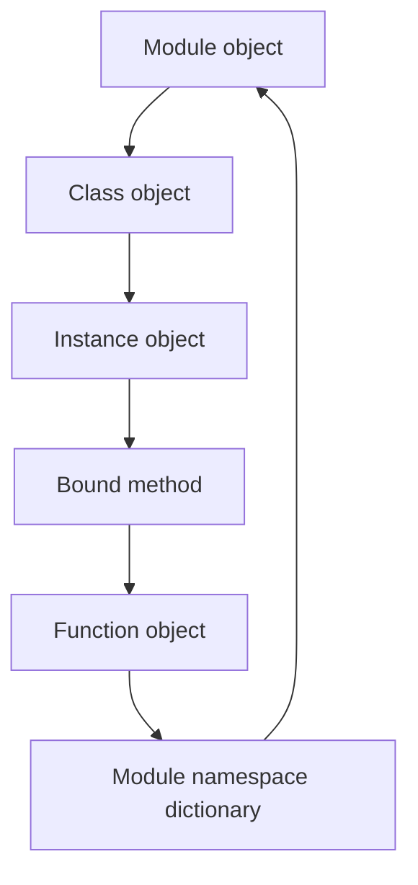

# Object Graph and Runtime Cycle

The first four core pages each explain one major runtime object type. This page matters
because metaprogramming mistakes rarely happen inside only one of those objects.

They usually happen in the connections:

- a function reading a module global you forgot was live
- a class storing a function that becomes a bound method on instance access
- an instance attribute being outranked by a descriptor on the class
- a review that confuses import time, class-definition time, and call time

The sentence to keep is:

> Python metaprogramming stays understandable when you can trace behavior across the
> module, class, instance, method, and function objects involved.

## The sentence to keep

When runtime behavior feels magical, ask:

> which object created this relationship, and at what moment in the runtime cycle did that
> happen?

The "what moment" part matters as much as the "which object" part.

## One concrete chain

Start with a tiny example:

```python
class Processor:
    def process(self, data):
        return f"processed {len(data)}"


import sys

module = sys.modules[__name__]
cls = module.Processor
func = cls.process
inst = cls()
bound = inst.process

assert inst.__class__ is cls
assert bound.__func__ is func
assert bound.__self__ is inst
assert func.__globals__ is module.__dict__
assert bound("abc") == "processed 3"
```

That single example already touches the whole Module 01 floor:

- the module namespace holds the class object
- the class namespace holds the function object
- the instance points back to its class
- instance attribute access produces a bound method
- the function executes using module globals

## One picture of the runtime graph



Caption: the runtime graph is cyclic in useful ways; you can start from a method call and
trace back to the module that owns the globals it will read.

## The runtime cycle has distinct moments

One reason dynamic systems get over-described as "magic" is that people blur together
different runtime moments.

For Module 01, keep four moments separate:

1. import time
2. class-definition time
3. instance-creation time
4. call time

## Import time creates the module context

At import time:

- the module object is created
- module-level code executes
- function objects are created by `def`
- class statements run and eventually bind class objects into the module namespace

This is the moment where import-side effects, registration, and global state begin.

## Class-definition time creates the class object

Inside the module's execution, the class statement:

- executes the class body
- creates function objects for methods
- stores those functions in the class namespace
- calls the metaclass to create the final class object

The result is a class object bound into the module namespace.

This is why later modules can talk precisely about decorators, descriptors,
`__init_subclass__`, and metaclasses. They all operate on or around a class object that
came into existence at a specific point in execution.

## Instance-creation time creates one concrete object

When the class is called:

- `__new__` creates an instance
- `__init__` populates its state
- the instance now participates in class-driven lookup rules

Nothing about the instance erases the class or module relationships above it. The
instance depends on them.

## Call time uses the whole chain

When you evaluate `inst.process("abc")`, several things happen:

1. Python resolves `process` through attribute lookup on the instance and class
2. method binding creates a bound method pairing instance and function
3. calling the bound method invokes the function with `self`
4. the function executes using its module globals and any closure state it carries

That is a long chain, but it is still ordinary runtime behavior. Naming the links is what
makes later metaprogramming review possible.

## Why this page matters for later modules

Every later mechanism in the course sits somewhere on this graph:

- observation tools read object state without triggering the wrong link in the chain
- decorators wrap function objects and change call-time behavior
- descriptors customize class-to-instance lookup
- metaclasses change how the class object is created

If Module 01 leaves these relationships blurry, the rest of the course starts feeling
like a stack of special cases.

## A useful "trace it backward" review habit

When you inherit dynamic code, start from one visible behavior and trace backward:

1. what value was looked up?
2. which instance or class participated?
3. which function object actually ran?
4. which module globals or closure bindings did that function depend on?

This habit turns folklore questions such as "where is the framework magic?" into ordinary
runtime inspection.

## Failure patterns this model helps prevent

This page is meant to stop several common reasoning failures:

- thinking methods live inside instances instead of being class-stored functions
- forgetting that function execution depends on a live module namespace
- treating import time and call time as if they were the same event
- debugging attribute behavior without checking descriptor precedence
- reaching for a metaclass before naming the lower-power object relationship already in play

## Review rules for the whole object graph

When reviewing metaprogramming-heavy code, keep these questions close:

- which runtime object owns this behavior right now?
- when was that object created or rebound?
- is this behavior happening at import time, class-definition time, instance time, or call time?
- can the behavior be explained with the existing graph before introducing a stronger hook?
- what evidence would prove the path from module to function or from class to instance?

## What to practice from this page

Try these before moving on:

1. Start with one bound method in a running program and trace it backward to the class,
   function, and module objects involved.
2. Write the runtime cycle for one class in four lines: import time, class-definition
   time, instance-creation time, and call time.
3. Pick one dynamic behavior from a framework you know and describe which part of the
   Module 01 graph it is really using.

If those feel ordinary, the worked example can pressure-test the boundary between
supported introspection and brittle object-model tricks.

## Continue through Module 01

- Previous: [Instances as Runtime Objects](instances-as-runtime-objects.md)
- Next: [Worked Example: Reviewing a Brittle Source-Recovery Tool](worked-example-reviewing-a-brittle-source-recovery-tool.md)
- Practice: [Exercises](exercises.md)
- Terms: [Glossary](glossary.md)
