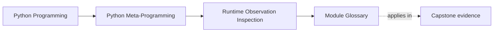

# Module Glossary

<!-- page-maps:start -->
## Page Maps

<!-- page-maps:end -->

This glossary belongs to **Module 02: Safe Runtime Observation and Inspection** in
**Python Metaprogramming**. It keeps the language of this directory stable so the same
ideas keep the same names across lessons, practice, and capstone discussion.

## How to use this glossary

Use the glossary when a discussion starts to blur together discovery, storage, lookup,
and execution. Module 02 is meant to replace vague phrases like "I just inspected it"
with explicit observation language.

## Terms in this directory

| Term | Meaning in this directory |
| --- | --- |
| Attribute protocol | The runtime machinery behind attribute access, including `__getattribute__`, descriptors, and `__getattr__`. |
| Best-effort discovery | The fact that `dir(obj)` is a discovery aid rather than a complete contract about what lookup can resolve. |
| Call protocol | The runtime behavior that makes an object callable. It depends on the object's type-level support for invocation. |
| Callable object | Any object for which `callable(obj)` is true, including functions, classes, bound methods, and callable instances. |
| Diagnostic execution risk | The risk that a debugging or inspection tool runs business behavior while trying to observe runtime structure. |
| Dynamic lookup | Normal attribute resolution through `getattr(obj, name)` or dot syntax, which may execute descriptors and lookup hooks. |
| Exact type check | A check such as `type(obj) is T` that rejects subclasses and asks for one concrete runtime type. |
| Polymorphic type check | A check such as `isinstance(obj, T)` that accepts objects through subclass or ABC relationships. |
| Static lookup | Observation through `inspect.getattr_static`, which inspects the attached attribute object without normal protocol execution. |
| Stored state | The state physically stored on the object, usually through `__dict__` or slot-backed storage. |
| Visible names | Candidate attribute names discovered through a tool like `dir(obj)`. |
| `__dict__`-backed state | Per-object storage represented by an attribute dictionary. |
| `__slots__` | A class declaration that gives instances a fixed storage layout and often removes the default instance dictionary. |
| `dir(obj)` | A best-effort name discovery tool that may draw from instance, class, MRO, and custom `__dir__` behavior. |
| `getattr(obj, name)` | Dynamic attribute access that runs the normal lookup protocol and may execute code. |
| `getattr(obj, name, default)` ambiguity | The fact that a default result can blur together a truly missing attribute and an internal `AttributeError` raised during lookup. |
| `hasattr(obj, name)` | A convenience wrapper around dynamic lookup that treats `AttributeError` as absence and therefore can still execute code. |
| `inspect.getattr_static` | A tooling-oriented lookup function that returns the raw attached attribute object without normal dynamic resolution. |
| `isinstance(obj, T)` | A polymorphic runtime classification check for objects. |
| `issubclass(C, T)` | A polymorphic runtime classification check for class relationships. |
| `mappingproxy` | A read-only view of a class namespace, commonly exposed through `cls.__dict__` on CPython. |
| `type(obj)` | The exact runtime class of an object. |
| Value resolution | The act of asking what ordinary runtime lookup would produce, not just what names or stored state are present. |

## Keep the module connected

- Return to [Module 02 Overview](index.md) for the full learning route.
- Use [Exercises](exercises.md) and [Exercise Answers](exercise-answers.md) to pressure-test the vocabulary.
- Revisit the [Worked Example](worked-example-building-a-safer-debug-printer.md) when an inspection tool starts to blur observation and execution.
