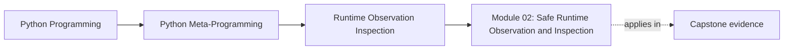

# Module 02: Safe Runtime Observation and Inspection

<!-- page-maps:start -->
## Page Maps

<!-- page-maps:end -->

Module 02 takes the object model from Module 01 and turns it into a review discipline:
how to inspect runtime objects without accidentally executing the very behavior you are
trying to observe.

This module now uses the same ten-file learning surface as the deep-dive series so the
overview, five cores, worked example, practice set, answers, and glossary each have one
clear job.

## What this module is for

By the end of Module 02, you should be able to explain five things clearly:

- why attribute access is a protocol and not automatically passive
- how visible names differ from physically stored state
- why dynamic attribute access is powerful but unsafe as casual inspection
- when exact type checks differ from polymorphic classification
- how static lookup fits into a disciplined observation workflow

## Keep these pages open

- [First-Contact Map](../module-00-orientation/first-contact-map.md)
- [Proof Ladder](../guides/proof-ladder.md)
- [Practice Map](../reference/practice-map.md)
- [Capstone Map](../capstone/capstone-map.md)

## The ten files in this module

1. Overview (`index.md`)
2. [Visible Names and Stored State](visible-names-and-stored-state.md)
3. [Dynamic Attribute Access Is Not Inspection](dynamic-attribute-access-is-not-inspection.md)
4. [Exactness and Polymorphism in Runtime Type Checks](exactness-and-polymorphism-in-runtime-type-checks.md)
5. [Callable Objects and the Call Protocol](callable-objects-and-the-call-protocol.md)
6. [Static Lookup and Disciplined Observation](static-lookup-and-disciplined-observation.md)
7. [Worked Example: Building a Safer Debug Printer](worked-example-building-a-safer-debug-printer.md)
8. [Exercises](exercises.md)
9. [Exercise Answers](exercise-answers.md)
10. [Glossary](glossary.md)

## How to use the file set

| If you need to... | Start here |
| --- | --- |
| separate candidate names from actual stored state | [Visible Names and Stored State](visible-names-and-stored-state.md) |
| inspect attributes without forgetting that lookup can execute code | [Dynamic Attribute Access Is Not Inspection](dynamic-attribute-access-is-not-inspection.md) |
| choose between `type`, `isinstance`, and `issubclass` honestly | [Exactness and Polymorphism in Runtime Type Checks](exactness-and-polymorphism-in-runtime-type-checks.md) |
| decide whether an object can be called and what that claim really means | [Callable Objects and the Call Protocol](callable-objects-and-the-call-protocol.md) |
| keep runtime observation disciplined with static lookup when needed | [Static Lookup and Disciplined Observation](static-lookup-and-disciplined-observation.md) |
| see the safety boundary tested in one realistic debugging tool | [Worked Example: Building a Safer Debug Printer](worked-example-building-a-safer-debug-printer.md) |
| test your understanding before moving to Module 03 | [Exercises](exercises.md) |
| compare your reasoning against a reference answer | [Exercise Answers](exercise-answers.md) |
| stabilize the module vocabulary | [Glossary](glossary.md) |

## The running question

Carry this question through every page:

> Am I discovering structure, reading stored state, or executing runtime behavior?

Strong Module 02 answers usually mention one or more of these:

- a best-effort name list from `dir`
- stored state from `vars(obj)` or `obj.__dict__`
- risky value resolution through `getattr` or `hasattr`
- exact versus polymorphic type checks
- static lookup when tooling must avoid triggering descriptors or fallback hooks

## Learning outcomes

By the end of this module, you should be able to:

- inspect runtime objects without casually triggering business behavior
- explain the safety difference between names, storage, and resolved values
- choose the least risky observation tool that answers the real question
- use capstone inspection surfaces as evidence before reading implementation details

## Exit standard

Do not move on until all of these are true:

- you can explain why attribute access is not automatically passive
- you can separate visible names, stored state, and resolved values
- you can say when `getattr`, `hasattr`, and `inspect.getattr_static` answer different questions
- you can describe one debugging or tooling scenario where static lookup is the safer first move

When those feel ordinary, Module 02 has done its job and Module 03 can deepen the
inspection story with `inspect`, signatures, and provenance.
