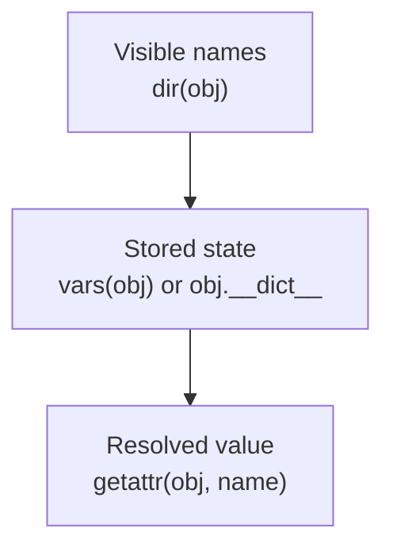

# Visible Names and Stored State

The safest early observation habit in Python is learning not to ask one vague question
about an object.

Instead, separate these questions:

1. what names might be meaningful here?
2. what state is physically stored on this object right now?
3. what value would normal attribute lookup produce?

This page focuses on the first two. That separation prevents a large share of
introspection mistakes before `getattr` even enters the picture.

## The sentence to keep

When you inspect an object, ask:

> am I discovering candidate names, or am I reading stored state?

If you do not separate those questions, you will eventually mistake one for the other and
reach for a riskier tool than you needed.

## The four surfaces that matter first

Module 02 starts with four basic surfaces:

- `dir(obj)` for best-effort name discovery
- `vars(obj)` for attribute dictionaries when they exist
- `obj.__dict__` for direct stored-state access when present
- `__slots__` for classes that replace dictionary-backed instance storage with a fixed layout

These are related, but they are not interchangeable.

## `dir(obj)` discovers names, not truth

`dir(obj)` returns a best-effort list of names that may be meaningful on the object.

That list may draw from:

- the instance
- the class
- base classes in the MRO
- a custom `__dir__` implementation

Two review points matter:

- treat the result like a discovery aid, not a contract
- do not rely on ordering as semantic meaning

CPython often sorts the result, but that is a debugging convenience rather than a promise
the module should teach as truth.

## `vars(obj)` and `obj.__dict__` read stored state when it exists

`vars(obj)` returns the object's attribute dictionary when one exists.

Typical cases:

- instances usually expose a mutable dictionary
- modules expose a mutable dictionary
- classes expose a namespace view

If the object has no attribute dictionary, `vars(obj)` raises `TypeError`.

That matters because `vars(obj)` answers a much narrower and more honest question than
`dir(obj)`:

> what is physically stored on this object right now?

It does not tell you everything lookup could resolve. It tells you what storage is
present.

## `__slots__` changes the storage model

When a class declares `__slots__`, instance storage may move out of a per-instance
dictionary into fixed slot storage.

That means:

- the instance may still expose discoverable names in `dir(obj)`
- `vars(obj)` may fail because no `__dict__` exists
- generic tools that assume dictionaries can break

This is one reason Module 02 keeps names and storage separate. Slots make the difference
visible immediately.

## One picture of discovery versus storage versus resolution



Caption: discovery is not storage, and storage is not normal attribute resolution.

## Example: discoverable names can exceed stored state

```python
class Explorer:
    def __init__(self):
        self.instance_only = "personal"

    def method(self):
        return "ok"


e = Explorer()

assert "instance_only" in vars(e)
assert "method" not in vars(e)
assert "method" in dir(e)
```

The method is discoverable because the class provides it, but it is not physically stored
in the instance dictionary.

That difference is ordinary and important.

## Example: slotted instances are visible without being dict-backed

```python
class Slotted:
    __slots__ = ("x", "y")

    def __init__(self, x, y):
        self.x = x
        self.y = y


s = Slotted(1, 2)

assert "x" in dir(s)

try:
    vars(s)
except TypeError:
    missing_dict = True
else:
    missing_dict = False

assert missing_dict is True
```

This is a good reminder that visibility and storage are different questions.

## `dir()` is not fully passive

Even the safer-looking discovery tool has a boundary:

```python
class Noisy:
    def __dir__(self):
        print("dir called")
        return ["safe"]


dir(Noisy())
```

That is why Module 02 treats `dir()` as lower risk than value resolution, not as
zero-risk. A custom `__dir__` method can still execute code.

## Prefer `vars(obj)` over probing for `__dict__` with `hasattr`

A common anti-pattern is:

```python
if hasattr(obj, "__dict__"):
    state = obj.__dict__
```

That is weaker than it looks because `hasattr` itself performs attribute access and can
run user code.

The safer pattern is:

```python
try:
    state = vars(obj)
except TypeError:
    state = None
```

This is a recurring Module 02 habit:

- ask the narrower question directly
- let the specific tool fail honestly
- avoid general probing that executes more protocol than needed

## Classes expose namespace views, not plain instance-style state

For classes, `vars(cls)` and `cls.__dict__` usually expose a namespace view rather than a
plain mutable instance dictionary.

That view is often a `mappingproxy` on CPython:

- it reflects the class namespace
- it is read-only as a mapping interface
- class assignment still mutates the underlying namespace

This is another reason to keep the storage question narrow. "Stored state" has slightly
different shapes across instances, modules, and classes.

## Review rules for this boundary

When reviewing runtime observation code, keep these questions close:

- is the tool trying to discover candidate names or read actual stored state?
- is `dir()` being treated like a truth source instead of a discovery helper?
- is `hasattr` being used where a direct `vars()` or explicit try/except would be safer?
- does the code handle slotted objects honestly instead of assuming every instance has a dictionary?
- does the review distinguish instance storage from class-provided names?

## What to practice from this page

Try these before moving on:

1. Write `state_view(obj)` that returns `set(dir(obj))` plus `vars(obj)` when available.
2. Run it on a normal instance, a slotted instance, and a builtin such as `list()`.
3. Explain one attribute that appears in `dir(obj)` but not in stored state.

If those feel ordinary, you are ready for the next boundary: dynamic attribute access is
powerful, but it is not passive inspection.

## Continue through Module 02

- Previous: [Overview](index.md)
- Next: [Dynamic Attribute Access Is Not Inspection](dynamic-attribute-access-is-not-inspection.md)
- Practice: [Exercises](exercises.md)
- Terms: [Glossary](glossary.md)
