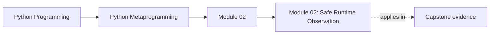
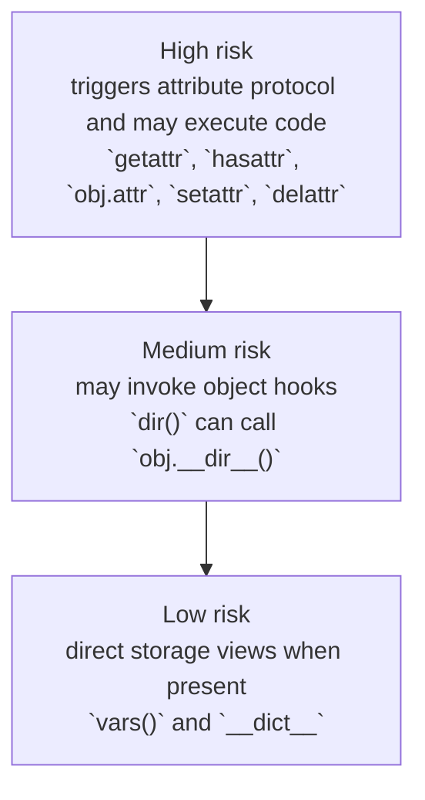

<a id="top"></a>
# Module 02: Safe Runtime Observation


<!-- page-maps:start -->
## Page Maps




<!-- page-maps:end -->

<a id="toc"></a>
## Table of Contents

1. [Introduction](#introduction)
2. [Visual: The Real Risk Boundary](#visual)
3. [Core 1: `dir()`, `vars()`, `__dict__`, `__slots__` — Visible Names vs Stored State](#core6)
4. [Core 2: `getattr`, `setattr`, `delattr`, `hasattr` — Dynamic Access Is Not Inspection](#core7)
5. [Core 3: `type`, `isinstance`, `issubclass` — Exactness vs Polymorphism](#core8)
6. [Core 4: `callable()` and the `__call__` Protocol — “May I Attempt a Call?”](#core9)
7. [Synthesis: A Disciplined Workflow](#synthesis)
8. [Capstone: `DebugMixin.debug_print()` — Debugging Without Accidental Execution](#capstone)
9. [Glossary (Module 2)](#glossary)

<span style="font-size: 1em;">[Back to top](#top)</span>

---

<a id="introduction"></a>
## Introduction

Module 1 established that *everything is an object*. Module 2 is about **looking at those objects without stepping on landmines**.

The core hazard: in Python, “reading an attribute” is not inherently passive. A read like `obj.x` can run arbitrary user code via:

- descriptors (e.g., `@property`, custom descriptors),
- `__getattribute__` / `__getattr__`,
- metaclass hooks (for class attributes),
- proxies and dynamic attribute generators.

So “introspection” here means two things:

1. **Observe without mutating state.**
2. **Avoid unintentionally executing user-defined code** while observing.

We keep to stable primitives:

- **Core 1: Attribute enumeration** — `dir`, `vars`, `__dict__`, `__slots__`
- **Core 2: Dynamic attribute access** — `getattr`, `setattr`, `delattr`, `hasattr`
- **Core 3: Type and instance classification** — `type`, `isinstance`, `issubclass`
- **Core 4: Callability detection** — `callable`, `__call__`

We defer full `inspect` to Module 3, with one deliberate preview: `inspect.getattr_static` (because it demonstrates the key safety boundary clearly).

### Spec vs implementation (used sparingly)

- **Spec-level / supported**: documented builtins (`dir`, `vars`, `getattr`, `type`, …) and the attribute access semantics they invoke.
- **CPython-leaning**: details like `MemberDescriptorType` for slots. Useful for tooling, but not something to build application correctness on.

<span style="font-size: 1em;">[Back to top](#top)</span>

---

<a id="visual"></a>
## Visual: The Real Risk Boundary



Caption: The boundary is value resolution, not whether you used a builtin.

The important takeaway: **“names” are usually cheaper than “values.”** Enumerating candidates is often safe-ish; resolving values can run code.

<span style="font-size: 1em;">[Back to top](#top)</span>

---

<a id="core6"></a>
## Core 1: `dir()`, `vars()`, `__dict__`, `__slots__` — Visible Names vs Stored State

### Canonical definition

**`dir(obj)`**
Returns a best-effort list of attribute **names** that might be valid on `obj`. It draws from:

* instance members,
* class members,
* base classes (MRO),
* and **may call** `obj.__dir__()` if implemented.

**Ordering:** CPython commonly returns a sorted list, but **ordering is not guaranteed**. Treat `dir()` as a set-like tool.

---

**`vars(obj)`**
Returns the object’s attribute dictionary when it exists:

* instances: usually a mutable `dict`,
* modules: a mutable `dict`,
* classes: often a read-only `mappingproxy` view.

If the object has no `__dict__`, it raises `TypeError`.

---

**`obj.__dict__`**
Direct access to stored attributes when present. Absent for many builtins and for “pure slotted” instances.

---

**`__slots__` (class feature)**
A class-level declaration that changes instance storage:

* without slots: instance state is typically stored in `obj.__dict__`,
* with slots: state may live in fixed slot storage and **no `__dict__` exists** unless explicitly requested.

### Pedagogic model: three different questions

When looking at an object, don’t ask one vague question (“what is it?”). Ask three precise ones:

1. **What names might be meaningful?** → `dir(obj)`
2. **What is physically stored on the object right now?** → `vars(obj)` / `obj.__dict__`
3. **What value would attribute lookup produce?** → `getattr(obj, name)` (*risky*)

That separation prevents 90% of debugging/introspection mistakes.

### Diagram: “visible” vs “stored” vs “resolved”

```mermaid
graph TD
  visible["1. Visible<br/>`dir(obj)` returns candidate names from instance, class, MRO, and maybe `__dir__`"]
  stored["2. Stored<br/>`vars(obj)` or `obj.__dict__` shows physical state when present"]
  resolved["3. Resolved<br/>`getattr(obj, \"x\")` runs full attribute lookup and may execute code"]
  visible --> stored --> resolved
```
Caption: Discovery is not storage, and storage is not resolution.

### Examples

#### Stored state vs discoverable names

```python
class Explorer:
    def __init__(self):
        self.instance_only = "personal"

    def method(self):
        return "ok"

e = Explorer()

print("instance_only" in vars(e))     # True (stored)
print("method" in vars(e))            # False (not stored on instance)
print("method" in dir(e))             # True (discoverable via class/MRO)
```

#### Slots: discoverable but not dict-backed

```python
class Slotted:
    __slots__ = ("x", "y")
    def __init__(self, x, y):
        self.x = x
        self.y = y

s = Slotted(1, 2)

print("x" in dir(s))  # True (visible)
# vars(s) -> TypeError (no __dict__)
```

#### `dir()` can execute `__dir__` (so “medium risk”)

```python
class Noisy:
    def __dir__(self):
        print("dir called!")
        return ["safe"]

print(dir(Noisy()))
# prints "dir called!" — this is code execution during introspection
```

### Advanced notes and pitfalls (clean, correct)

* `dir()` is **best-effort**, not a contract: it can omit valid attributes or add virtual ones.
* **Do not** “guard” `vars(obj)` with `hasattr(obj, "__dict__")`.
  `hasattr` executes lookup and can run user code. Safer pattern:

```python
class SlottedDemo:
    __slots__ = ("x",)
    def __init__(self):
        self.x = 42

obj = SlottedDemo()

try:
    d = vars(obj)
except TypeError:
    d = None

print(d is None)  # True
```

* Classes expose `cls.__dict__` as a read-only mapping view (commonly `mappingproxy`). That doesn’t mean the class is immutable—assignment mutates the underlying namespace.

### Exercise (more pedagogic)

Write `state_view(obj)` returning a tuple:

* `names`: a `set(dir(obj))` (don’t imply ordering),
* `stored`: `vars(obj)` if available else `None`.

Test on:

* a normal instance,
* a slotted instance,
* a builtin like `list()`.

<span style="font-size: 1em;">[Back to top](#top)</span>

---

<a id="core7"></a>
## Core 2: `getattr`, `setattr`, `delattr`, `hasattr` — Dynamic Access Is Not Inspection

### Canonical definition

These are programmable versions of dot syntax:

* `getattr(obj, name[, default])` ⇔ `obj.name`
* `setattr(obj, name, value)` ⇔ `obj.name = value`
* `delattr(obj, name)` ⇔ `del obj.name`
* `hasattr(obj, name)` ⇔ “try getattr; treat AttributeError as missing”

### The key pedagogic idea: “attribute access is a protocol”

When you do `getattr(obj, "x")`, Python does **not** simply “look in a dict.”

It runs the attribute access pipeline:

* check descriptors on the type (properties, functions, slots),
* consult instance storage,
* fall back to class attributes,
* maybe call `__getattr__`,
* and any of those steps can run user code.

So these are powerful—but unsafe as “inspection.”

### Diagram: dynamic access participates in the protocol

```text
getattr(obj, "x")
  → obj.__getattribute__("x")
     → may invoke:
        • descriptor.__get__
        • obj.__getattr__
        • proxy logic
        • arbitrary user code

setattr / delattr
  → may invoke:
     • descriptor.__set__ / __delete__
     • obj.__setattr__ / __delattr__
```

### `getattr(..., default)` ambiguity (important in real systems)

`default` is returned if and only if an `AttributeError` is raised.

That means two very different situations look identical:

* truly missing attribute,
* attribute exists but its getter raised `AttributeError` internally.

So in robust code, **avoid default** when ambiguity matters:

```python
class AmbiguityDemo:
    @property
    def value(self):
        # Simulate a getter that internally raises AttributeError
        raise AttributeError("internal error")

obj = AmbiguityDemo()
name = "value"

try:
    v = getattr(obj, name)
except AttributeError:
    print("Caught AttributeError – could be missing or internal")
```

### `hasattr` is *not* safe probing

`hasattr(obj, "x")` calls `getattr(obj, "x")` internally and swallows only `AttributeError`.

So:

* it can run user code,
* it can hide bugs where a property mistakenly raises `AttributeError`.

### Examples

#### `hasattr` can trigger code

```python
class Risky:
    @property
    def x(self):
        print("property executed")
        return 1

r = Risky()
print(hasattr(r, "x"))  # prints "property executed"
```

#### `hasattr` only swallows AttributeError

```python
class Explodes:
    @property
    def x(self):
        raise ValueError("boom")

# hasattr(Explodes(), "x")  # raises ValueError
```

#### Slots: dynamic mutation is constrained

```python
class Slotted:
    __slots__ = ("x",)
    def __init__(self):
        self.x = 1

s = Slotted()
setattr(s, "x", 2)       # OK
# setattr(s, "y", 3)     # AttributeError
```

### Exercise (practical)

Implement:

```python
def try_get(obj, name):
    """
    Returns (found, value_or_exc).
    found == False only when AttributeError indicates missing.
    """
```

Make it *not* swallow other exceptions.

<span style="font-size: 1em;">[Back to top](#top)</span>

---

<a id="core8"></a>
## Core 3: `type`, `isinstance`, `issubclass` — Exactness vs Polymorphism

### Canonical definition

* `type(obj)` gives the **exact** runtime class of `obj`.
* `isinstance(obj, T)` accepts subclasses and may consult ABC protocol machinery.
* `issubclass(C, T)` checks class relationships; raises `TypeError` if `C` isn’t a class.

### Pedagogic rule of thumb

* Use `isinstance` by default (polymorphism is the point of OO).
* Use `type(obj) is T` only when **subclasses must be rejected** (e.g., distinguishing `bool` from `int`).
* Use `issubclass` only when you already have a class object.

### Example: why `type(obj) is T` exists

```python
print(isinstance(True, int))  # True (because bool is a subclass of int)
print(type(True) is int)      # False (exact type differs)
```

### ABCs and protocol checks (disciplined duck typing)

```python
from collections.abc import Iterable

class X:
    def __iter__(self):
        return iter([1, 2])

print(isinstance(X(), Iterable))  # True
```

### Exercise

Write `ensure_iterable(x)` that:

* accepts anything `Iterable`,
* rejects strings specifically,
* returns an iterator.

<span style="font-size: 1em;">[Back to top](#top)</span>

---

<a id="core9"></a>
## Core 4: `callable()` and the `__call__` Protocol — “May I Attempt a Call?”

### Canonical definition

`callable(obj)` is `True` when `obj()` is syntactically valid for the runtime (functions, bound methods, classes, instances of classes that define `__call__`, etc.).

### Pedagogic nuance: `__call__` must be on the *type*, not merely assigned on the instance

This surprises many people:

```python
class A: pass
a = A()
a.__call__ = lambda: 1

print(callable(a))  # False
# a() -> TypeError
```

Callable-ness is not “does it have an attribute named **call**”; it’s whether the type provides the call slot / protocol.

### Exercise

Write `guarded_call(f, *args, **kwargs)` returning `(ok, result_or_exc)`:

* if not callable: `(False, TypeError(...))`
* else: try calling and capture exceptions

<span style="font-size: 1em;">[Back to top](#top)</span>

---

<a id="synthesis"></a>
## Synthesis: A Disciplined Workflow

When you build tooling (debuggers, plugin discovery, config loaders), follow this workflow:

1. **Discover names** (best effort): `dir(obj)`
2. **Inspect stored state** (safe when available): `vars(obj)`
3. **Resolve values** only when necessary: `getattr(obj, name)`
4. When you must avoid execution, use **static resolution** (`inspect.getattr_static`) instead of `getattr`.

Module 3 formalizes “static vs dynamic” with `inspect` properly.

<span style="font-size: 1em;">[Back to top](#top)</span>

---

<a id="capstone"></a>
## Capstone: `DebugMixin.debug_print()` — Debugging Without Accidental Execution

Goal: print object state while minimizing surprise.

Design constraints:

* Avoid executing descriptors (`property`) by default.
* Avoid triggering `__getattr__` / `__getattribute__` by default.
* Support slotted instances where possible.
* Prevent infinite recursion (cycles + depth limit).

### Canonical implementation (patched for correctness and safety)

Key fixes vs common “debug printers”:

* **No `hasattr`** checks (they execute code).
* Only recurse into `DebugMixin` instances (safe, explicit opt-in).
* Use `inspect.getattr_static` for non-executing reads.
* Slots are handled on CPython via `MemberDescriptorType` (best-effort).

```python
import inspect
from types import MemberDescriptorType
from typing import Any


class DebugMixin:
    def debug_print(
        self,
        *,
        max_depth: int = 3,
        _depth: int = 0,
        _visited: set[int] | None = None,
        indent: int = 0,
        eval_properties: bool = False,
        show_dunder: bool = False,
    ) -> None:
        """
        Recursively print object state for debugging.

        Policy:
        - Enumerate names via dir() (may call __dir__ → medium risk).
        - Resolve values via inspect.getattr_static (avoid descriptor execution).
        - If eval_properties=True, properties are explicitly executed.
        - Slots: CPython-leaning via MemberDescriptorType.
        - Recursion: explicit opt-in (DebugMixin only) + cycle detection.
        """
        if _visited is None:
            _visited = set()

        obj_id = id(self)
        if obj_id in _visited:
            print(" " * indent + f"<Revisited id={obj_id}>")
            return
        _visited.add(obj_id)

        t = type(self)
        print(" " * indent + f"{t.__name__}(id={obj_id}) " + "{")

        if _depth >= max_depth:
            print(" " * (indent + 2) + "[Max depth reached]")
            print(" " * indent + "}")
            return

        # Deterministic debug output: we sort for readability.
        # This is a debug choice, not a semantic guarantee.
        for name in sorted(dir(self)):
            if not show_dunder and name.startswith("__"):
                continue

            # Avoid dumping the mixin method itself if un-overridden.
            if name == "debug_print":
                try:
                    raw_dbg = inspect.getattr_static(self, name)
                    if raw_dbg is DebugMixin.debug_print:
                        continue
                except Exception:
                    pass

            try:
                raw = inspect.getattr_static(self, name)
            except AttributeError:
                print(" " * (indent + 2) + f"{name}: <missing>")
                continue

            value: Any

            # Slot descriptor (CPython-leaning)
            if isinstance(raw, MemberDescriptorType):
                try:
                    value = raw.__get__(self, t)
                except Exception as e:
                    value = f"<slot read error {type(e).__name__}: {e}>"

            # Property (descriptor) — execute only if explicitly requested
            elif isinstance(raw, property):
                if eval_properties:
                    try:
                        value = raw.__get__(self, t)
                    except Exception as e:
                        value = f"<property error {type(e).__name__}: {e}>"
                else:
                    value = raw  # show the property object itself

            else:
                value = raw

            is_primitive = isinstance(value, (int, float, str, bool, type(None)))
            rep = repr(value)
            rep = rep if len(rep) <= 80 else rep[:77] + "..."

            prefix = "" if is_primitive else f"{type(value).__name__} "
            print(" " * (indent + 2) + f"{name}: {prefix}{rep}")

            # Controlled recursion: only into DebugMixin instances.
            if (
                not is_primitive
                and not callable(value)
                and isinstance(value, DebugMixin)
            ):
                value.debug_print(
                    max_depth=max_depth,
                    _depth=_depth + 1,
                    _visited=_visited,
                    indent=indent + 4,
                    eval_properties=eval_properties,
                    show_dunder=show_dunder,
                )

        print(" " * indent + "}")
```

### Why `getattr_static` matters (the whole pedagogic point)

```text
Dynamic read (normal semantics):
  getattr(obj, "x") → executes descriptor/__getattr__/proxy logic

Static read (tooling):
  inspect.getattr_static(obj, "x") → returns raw descriptor/value without executing it

Caption: Debugging tools usually want “what is attached?”,
         not “what would running the protocol do?”.
```

### Example usage

```python
class Point(DebugMixin):
    def __init__(self, x, y):
        self.x, self.y = x, y

    @property
    def sum(self):
        return self.x + self.y

p = Point(1, 2)
p.debug_print()                 # sum shown as property object
p.debug_print(eval_properties=True)  # sum evaluated
```

<span style="font-size: 1em;">[Back to top](#top)</span>

---

<a id="glossary"></a>
## Glossary (Module 2)

| Term                                   | Definition                                                                                                                                                                   |
| -------------------------------------- | ---------------------------------------------------------------------------------------------------------------------------------------------------------------------------- |
| **Introspection**                      | Runtime examination of objects with a deliberate focus on *observing* without unintended side effects or protocol execution.                                                 |
| **Risk boundary**                      | The point where you resolve attribute *values* (attribute protocol runs) rather than merely enumerating *names* or reading stored state.                                     |
| **Names vs values**                    | Enumerating candidate attribute names is usually cheaper/safer than resolving their values (which can execute code).                                                         |
| **Attribute protocol**                 | The machinery behind attribute access (`__getattribute__`, descriptors, `__getattr__`, metaclass hooks) that can execute arbitrary code.                                     |
| **Descriptor execution**               | Running `descriptor.__get__` / `__set__` / `__delete__` during access; includes `@property` and custom descriptors.                                                          |
| **`__getattribute__`**                 | Always-called method for attribute reads (`obj.x`); overriding it can make “reads” execute arbitrary logic.                                                                  |
| **`__getattr__`**                      | Fallback hook called only when normal lookup fails; often used for dynamic/virtual attributes.                                                                               |
| **Static vs dynamic lookup**           | Dynamic lookup runs the full attribute protocol; static lookup retrieves the raw attribute/descriptor without invoking it.                                                   |
| **`inspect.getattr_static`**           | Tooling-oriented static lookup that returns raw descriptors/values without executing them (avoids `property`/`__getattr__` side effects).                                    |
| **`dir(obj)`**                         | Best-effort enumeration of attribute names from instance + class + MRO, and may call `obj.__dir__()`; ordering is not guaranteed.                                            |
| **`__dir__` hook**                     | Optional method that `dir()` may call; makes `dir()` “medium risk” because it can execute user code.                                                                         |
| **Best-effort enumeration**            | `dir()` output is not a contract: it can omit valid attributes and include virtual ones; treat it as discovery, not truth.                                                   |
| **`vars(obj)`**                        | Returns the object’s attribute dict when present (`obj.__dict__`), otherwise raises `TypeError` (safe way to detect no-`__dict__` cases).                                    |
| **`obj.__dict__`**                     | Direct mapping of stored instance/module attributes when present; may not exist for pure slotted objects and many builtins.                                                  |
| **Stored state**                       | Attributes physically stored on the object right now (typically `__dict__` or slots), independent of what lookup would resolve.                                              |
| **Resolved attribute**                 | The value produced by full lookup (`getattr(obj, name)` / `obj.name`), which may differ from stored state due to descriptors and hooks.                                      |
| **`mappingproxy`**                     | Read-only view of a class namespace (`cls.__dict__`) in CPython; reflects live changes made via `setattr(cls, ...)`.                                                         |
| **`__slots__`**                        | Class feature that replaces per-instance `__dict__` with a fixed layout; improves memory but reduces dynamism and breaks dict-assuming tools.                                |
| **Slotted instance**                   | Instance without a `__dict__` (pure slots), so `vars(obj)` raises `TypeError` and dynamic attributes are usually disallowed.                                                 |
| **Slot descriptor**                    | Descriptor representing a slot-backed attribute; reading it can still invoke descriptor logic (even though storage isn’t a dict).                                            |
| **`MemberDescriptorType`**             | CPython type used for many slot descriptors; useful for best-effort tooling support, not a portability guarantee.                                                            |
| **`getattr(obj, name[, default])`**    | Dynamic attribute read equivalent to `obj.name`; executes the attribute protocol and may run user code.                                                                      |
| **`setattr(obj, name, value)`**        | Dynamic attribute write equivalent to `obj.name = value`; may invoke `__setattr__` or descriptor `__set__`.                                                                  |
| **`delattr(obj, name)`**               | Dynamic attribute delete equivalent to `del obj.name`; may invoke `__delattr__` or descriptor `__delete__`.                                                                  |
| **`hasattr(obj, name)`**               | Internally performs `getattr`; returns `False` only if an `AttributeError` is raised—can execute code and can mask bugs.                                                     |
| **`getattr` default ambiguity**        | `getattr(obj, name, default)` treats any `AttributeError` as “missing,” conflating true absence with internal `AttributeError` raised by getters.                            |
| **Exact type check**                   | `type(obj) is T`; rejects subclasses (e.g., distinguishes `bool` from `int`), used only when subclassing must be excluded.                                                   |
| **Polymorphic type check**             | `isinstance(obj, T)`; accepts subclasses and may consult ABC machinery (`__instancecheck__`), usually the correct default.                                                   |
| **Subclass check**                     | `issubclass(C, T)` for class objects; may consult ABC machinery (`__subclasscheck__`) and raises `TypeError` if `C` isn’t a class.                                           |
| **ABC-based duck typing**              | `isinstance(x, collections.abc.Iterable)`-style checks that rely on nominal/virtual subclassing rather than exact types.                                                     |
| **`callable(obj)`**                    | Indicates whether `obj()` is supported by the runtime; does not guarantee argument compatibility or absence of side effects.                                                 |
| **`__call__` protocol**                | Invocation mechanism: objects are callable if their *type* provides the call slot (`__call__`), not merely if an instance has a `__call__` attribute assigned.               |
| **Disciplined introspection workflow** | Practical sequence: discover names (`dir`) → inspect stored state (`vars`) → resolve values only if necessary (`getattr`) → use static lookup when you must avoid execution. |

Module 3 expands the “static vs dynamic” story with `inspect` properly: signatures, provenance, static lookup details, and frames—still with the same discipline: **observe vs execute**.

<span style="font-size: 1em;">[Back to top](#top)</span>
