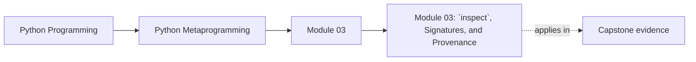
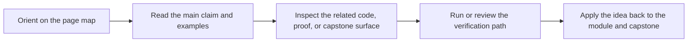

<a id="top"></a>
# Module 03: `inspect`, Signatures, and Provenance


<!-- page-maps:start -->
## Page Maps




<!-- page-maps:end -->

<a id="toc"></a>
## Table of Contents

1. [Introduction](#introduction)
2. [Core 11: `inspect.signature()` — Contracts, Kinds, and Binding](#core11)
3. [Core 12: `getsource`, `getfile`, `getmodule` — Provenance Is Best-Effort](#core12)
4. [Core 13: `getmembers` vs `getattr_static` — Dynamic Values vs Safe Structure](#core13)
5. [Core 14: Frames and Stack Introspection — Diagnostics Only](#core14)
6. [Capstone: A Safe, Signature-Guided `__repr__` Mixin](#capstone)
7. [Glossary (Module 3)](#glossary)

<span style="font-size: 1em;">[Back to top](#top)</span>

---

<a id="introduction"></a>
## Introduction

Modules 1–2 gave you raw building blocks: `__code__`, `dir()`, `getattr`, classification predicates, and static lookup. This module introduces `inspect`: Python’s **structured** introspection layer—the one that tooling, debuggers, documentation generators, and many frameworks build on.

We cover four practical areas:

* **Core 11: Signatures + argument binding** — `inspect.signature`, `Parameter`, `BoundArguments`.
* **Core 12: Source + provenance** — `getsource`, `getfile`, `getmodule` (best-effort).
* **Core 13: Member enumeration** — `getmembers` (dynamic) vs `getattr_static` (safe/static).
* **Core 14: Stack + frames** — `currentframe`, `stack` (diagnostics only).

Risk stance (non-negotiable):

* `inspect.signature` is library-grade **when cached**.
* `getsource/getfile/getmodule` are best-effort—never make correctness depend on them.
* `getmembers` and frame APIs can be **slow** and **side-effectful**—reserve them for debugging/tooling.

Capstone: a safe `__repr__` mixin that orders fields using signatures and reads state without evaluating properties or walking the stack.

<span style="font-size: 1em;">[Back to top](#top)</span>

---

<a id="core11"></a>
## Core 11: `inspect.signature()` — Contracts, Kinds, and Binding

### Canonical definition

`inspect.signature(callable, *, follow_wrapped=True)` returns a `Signature` object describing how the callable should be invoked.

It synthesizes information from (when available):

* `__signature__` (explicit override)
* `__wrapped__` chain (when `follow_wrapped=True`)
* `__code__`, `__defaults__`, `__kwdefaults__`, `__annotations__` (Python functions)
* implementation-specific metadata (many builtins expose enough)

A `Signature` exposes:

* `.parameters`: ordered mapping of name → `Parameter`
* `.return_annotation`
* `.bind(*args, **kwargs)` and `.bind_partial(...)`
* `.replace(...)`

A `Parameter` has:

* `.name`
* `.kind` in:

  * `POSITIONAL_ONLY`
  * `POSITIONAL_OR_KEYWORD`
  * `VAR_POSITIONAL` (`*args`)
  * `KEYWORD_ONLY`
  * `VAR_KEYWORD` (`**kwargs`)
* `.default` (or `Parameter.empty`)
* `.annotation` (or `Parameter.empty`)

Error model (treat as normal, not exceptional):

* `TypeError`: object is not callable, or has a broken custom `__signature__`.
* `ValueError`: signature cannot be provided (some callables implemented in C/extensions).

### Deep dive: why `bind()` matters

If you’re writing a decorator, RPC layer, CLI wrapper, validator, tracer, or adapter: **do not reimplement argument matching**. `sig.bind()` is your “call simulator”: it enforces the same rules as the interpreter, including positional-only and keyword-only behavior.

#### Visual: how `signature()` and `bind()` relate

```mermaid
graph TD
  callable["Source callable<br/>`def f(a, /, b, *, c=False, **kw): ...`"]
  signature["`inspect.signature(f)`<br/>parameters:<br/>`a`: POSITIONAL_ONLY<br/>`b`: POSITIONAL_OR_KEYWORD<br/>`c`: KEYWORD_ONLY, default `False`<br/>`kw`: VAR_KEYWORD"]
  bound["`sig.bind(10, 20, d=1)`<br/>arguments:<br/>`a -> 10`<br/>`b -> 20`<br/>`c -> missing`<br/>`kw -> {\"d\": 1}`"]
  defaults["`ba.apply_defaults()` fills `c -> False`"]
  callable --> signature --> bound --> defaults
```

### Examples (all runnable)

Basic kinds:

```python
import inspect

def demo(a: int, /, b, *, c: bool = False, **kw):
    pass

sig = inspect.signature(demo)
print(sig)  # (a: int, /, b, *, c: bool = False, **kw)

print(sig.parameters["a"].kind)  # POSITIONAL_ONLY
print(sig.parameters["c"].kind)  # KEYWORD_ONLY
```

Binding (including expected-failure handling):

```python
import inspect

def demo(a: int, /, b, *, c: bool = False, **kw):
    pass

sig = inspect.signature(demo)

# OK
ba = sig.bind(10, 20, d=1)
print(ba.arguments)  # {'a': 10, 'b': 20, 'kw': {'d': 1}}

# Defaults are not applied unless you ask
ba.apply_defaults()
print(ba.arguments)  # includes c=False

# Expected failure: positional-only passed as keyword
try:
    sig.bind(a=10, b=20)
except TypeError as e:
    print("Expected:", e)
```

Bound vs unbound methods:

```python
import inspect

class C:
    def meth(self, x: int = 0, *, y):
        pass

print(inspect.signature(C.meth))     # (self, x: int = 0, *, y)
print(inspect.signature(C().meth))   # (x: int = 0, *, y)
```

Wrappers and `__wrapped__` (why `functools.wraps` matters):

```python
import inspect
import functools

def deco(f):
    @functools.wraps(f)
    def wrapper(*args, **kwargs):
        return f(*args, **kwargs)
    return wrapper

@deco
def f(a, /, b, *, c=0): ...
print(inspect.signature(f))  # follows __wrapped__ by default
```

Callables with no signature available (never assume which ones):

```python
import inspect

def safe_signature(obj):
    try:
        return str(inspect.signature(obj))
    except (TypeError, ValueError) as e:
        return f"<no signature: {type(e).__name__}: {e}>"

print(safe_signature(len))        # may succeed on modern CPython; do not rely
print(safe_signature(object()))   # not callable → TypeError
```

### Advanced notes and pitfalls (precise, no myths)

* **Do not claim caching guarantees.** `inspect.signature` can be expensive; cache it yourself (e.g., `functools.lru_cache` keyed by callable identity).
* `follow_wrapped=True` means `inspect.signature` will traverse `__wrapped__` (set by `functools.wraps`) unless you pass `follow_wrapped=False`.
* `Signature.bind()` raises `TypeError` with interpreter-like messages. That’s a feature; surface those messages rather than inventing new ones unless you have a strong reason.

**Use / avoid**

* **Use** whenever you forward, validate, log, or document arguments.
* **Avoid** calling repeatedly in hot paths; cache per callable.

### Exercise

Write `@validate_call` that:

* caches `inspect.signature(func)` once,
* does `ba = sig.bind(*args, **kwargs)` and `ba.apply_defaults()`,
* validates types using your Module 5 `_is_instance` subset,
* raises `TypeError` with clear, minimal messages.

<span style="font-size: 1em;">[Back to top](#top)</span>

---

<a id="core12"></a>
## Core 12: `getsource`, `getfile`, `getmodule` — Provenance Is Best-Effort

### Canonical definition

* `inspect.getsource(obj)` → source text (function/class/module) **or raises**
* `inspect.getfile(obj)` → filename string (or synthetic path) **or raises**
* `inspect.getmodule(obj)` → module object (or `None`)

These are not “introspection truth.” They are “recover what we can.”

### Deep dive: when it fails (and why you must handle it)

These APIs depend on how code was loaded and whether source is available:

* REPL/Jupyter
* `exec/eval` code (`co_filename` like `"<string>"`)
* zipimport
* frozen executables
* coverage/instrumentation/AST transforms (line info may shift)
* stripped-source deployments

#### Visual: provenance success/failure pipeline

```mermaid
graph LR
  object["Object"]
  metadata["Code object or module metadata<br/>may not exist"]
  filename["Filename<br/>may be fake"]
  linecache["`linecache` lookup<br/>may miss"]
  source["Source slice<br/>may raise"]
  object --> metadata --> filename --> linecache --> source
```

Typical failures:
- interactive: filename `"<stdin>"` or transient cells cause `linecache` mismatches and `OSError`
- `exec` or `eval`: filename `"<string>"` has no backing file and raises `OSError`
- frozen or zipimport: file is unavailable and can raise `OSError` or `TypeError`

### Examples (always safe)

```python
import inspect

def demo():
    return 42

print(inspect.getmodule(demo))  # often <module '__main__' ...>

try:
    print(inspect.getfile(demo))
except TypeError as e:
    print("Expected:", e)

try:
    print(inspect.getsource(demo))
except (OSError, TypeError) as e:
    print("Expected:", type(e).__name__, e)
```

A library-grade helper:

```python
import inspect

def safe_getsource(obj, fallback="<<source unavailable>>"):
    try:
        return inspect.getsource(obj)
    except (OSError, TypeError):
        return fallback

print(safe_getsource(lambda x: x))
```

**Use / avoid**

* **Use** in dev tools, debug UI, documentation tooling you control.
* **Avoid** making correctness depend on it in libraries/services.

### Exercise

Implement `where_defined(obj)` returning `(module_name, file_or_none, first_line_or_none)` with best-effort behavior and no exceptions escaping.

<span style="font-size: 1em;">[Back to top](#top)</span>

---

<a id="core13"></a>
## Core 13: `getmembers` vs `getattr_static` — Dynamic Values vs Safe Structure

### Canonical definition

`inspect.getmembers(obj, predicate=None)`:

* uses `dir(obj)` to get names,
* then calls `getattr(obj, name)` for each name,
* optionally filters by predicate,
* returns sorted `(name, value)` pairs.

This is **dynamic lookup** and will execute descriptors and properties.

`inspect.getattr_static(obj, name)` performs **static lookup**:

* bypasses `__getattribute__`, `__getattr__`, and the descriptor protocol,
* returns the raw attribute object (e.g., a `property`) without evaluating it.

### Why this matters

Many codebases accidentally write “introspection” that triggers production side effects:

* properties that lazily connect to a database,
* descriptors that compute/cached-load values,
* `__getattr__` that proxies to remote systems.

If you want *structure*, use static lookup. If you want *values*, accept side effects explicitly.

#### Visual: dynamic vs static attribute resolution

```mermaid
graph TD
  dynamic["Dynamic lookup<br/>`getattr(obj, \"x\")` or `obj.x`"]
  dataDesc["1. data descriptor on `type(obj)`?"]
  dict["2. `obj.__dict__`?"]
  nonData["3. non-data descriptor or class attribute?"]
  fallback["4. `__getattr__` fallback?"]
  sideEffects["May execute<br/>property getter<br/>descriptor `__get__`<br/>custom `__getattribute__` or `__getattr__`"]
  static["Static lookup<br/>`inspect.getattr_static(obj, \"x\")`"]
  raw["Returns raw attribute object without invoking descriptor hooks"]
  dynamic --> dataDesc --> dict --> nonData --> fallback --> sideEffects
  static --> raw
```

### Demonstration: `getmembers` can trigger side effects

```python
import inspect

class Example:
    @property
    def expensive(self):
        print("SIDE EFFECT: property executed")
        return 123

    def meth(self): ...
    x = 10

e = Example()

# Dynamic enumeration: may execute expensive (depending on predicate and order)
_ = inspect.getmembers(e)  # prints side effect

# Static: returns descriptor object, no evaluation
raw = inspect.getattr_static(Example, "expensive")
print(type(raw).__name__)  # property
```

### Safe enumeration pattern for frameworks/tools

```python
import inspect

def static_getmembers(obj, predicate=None):
    for name in dir(obj):
        value = inspect.getattr_static(obj, name)
        if predicate is None or predicate(value):
            yield name, value

class Example:
    @property
    def expensive(self):
        return 123
    def meth(self): ...

print([n for n, v in static_getmembers(Example, inspect.isfunction) if n == "meth"])
```

**Use / avoid**

* **Use** `getmembers` for quick REPL exploration or controlled debugging.
* **Use** `getattr_static` for any library/framework introspection.
* **Avoid** dynamic enumeration on instances with properties/lazy descriptors.

### Exercise

Implement `list_properties(cls)` that returns property names and their docstrings using only `getattr_static` (no evaluation).

<span style="font-size: 1em;">[Back to top](#top)</span>

---

<a id="core14"></a>
## Core 14: Frames and Stack Introspection — Diagnostics Only

### Canonical definition

* `inspect.currentframe()` returns the current frame object or `None`.
* `inspect.stack()` builds a list of `FrameInfo` for the current call stack.

Frames expose:

* `f_code` (code object)
* `f_locals`, `f_globals`
* `f_back` (caller frame)

### Deep dive: cost and memory hazards

* `inspect.stack()` walks the full Python stack and consults `linecache` — **expensive**.
* Frames keep references to locals and back-links; keeping frames alive can retain large object graphs (leak-like behavior).

#### Visual: frames keep things alive

```mermaid
graph TD
  frame["frame"]
  locals["`f_locals` dictionary"]
  objects["local objects"]
  previous["`f_back` previous frame"]
  previousLocals["previous locals"]
  more["..."]
  frame --> locals --> objects
  frame --> previous --> previousLocals --> more
```

If you store `frame` or `traceback` in a long-lived structure, you keep the entire chain alive until those references are released.

### Example: safe top-of-stack inspection without `inspect.stack()`

```python
import inspect

def top_callers(limit=3):
    f = inspect.currentframe()
    if f is None:
        return []
    try:
        out = []
        cur = f.f_back  # skip this helper’s own frame
        while cur is not None and len(out) < limit:
            out.append(cur.f_code.co_name)
            cur = cur.f_back
        return out
    finally:
        del f  # break cycles

def outer():
    def inner():
        print(top_callers(5))
    inner()

outer()
```

### Example: snapshot locals safely

```python
import inspect

def snapshot_locals(limit=2):
    f = inspect.currentframe()
    if f is None:
        return []
    try:
        out = []
        cur = f.f_back
        while cur is not None and len(out) < limit:
            out.append(dict(cur.f_locals))  # snapshot
            cur = cur.f_back
        return out
    finally:
        del f

def foo():
    a = 1
    return snapshot_locals(1)

print(foo()[0].get("a"))  # 1
```

**Use / avoid**

* **Use** in crash reporting, debug assertions, developer tooling.
* **Avoid** as normal control-flow, and avoid in hot paths.

### Exercise

Implement `assert_called_from(allowed_prefixes)` that checks the immediate caller function/module and raises a clear `RuntimeError` in debug mode only.

<span style="font-size: 1em;">[Back to top](#top)</span>

---

<a id="capstone"></a>
## Capstone: A Safe, Signature-Guided `__repr__` Mixin

Goal: produce a good `repr` that is:

* stable across regular and slotted classes,
* ordered by `__init__` signature when possible,
* **does not evaluate properties**,
* avoids `getmembers` and avoids stack/frame inspection.

Key idea: only read state from:

* instance `__dict__` (if present),
* declared `__slots__` names from the MRO,
* use `object.__getattribute__` to avoid custom `__getattribute__` traps.

#### Visual: safe repr data flow (no properties)

```mermaid
graph TD
  instance["instance"]
  dict["`__dict__` when present<br/>safe raw storage"]
  slots["`__slots__` names from the MRO<br/>safe slot descriptors"]
  objectGet["`object.__getattribute__`<br/>avoids custom lookup hooks"]
  order["Order fields with `signature(__init__)` when possible"]
  instance --> dict
  instance --> slots --> objectGet
  instance --> order
```

```python
import inspect

class ReprMixin:
    def __repr__(self):
        cls = type(self)
        state = {}

        # 1) __dict__ (if any), read without invoking custom attribute logic
        try:
            d = object.__getattribute__(self, "__dict__")
        except Exception:
            d = None
        if isinstance(d, dict):
            state.update(d)

        # 2) slots (from MRO), excluding private names and duplicates
        for base in cls.__mro__:
            slots = getattr(base, "__slots__", None)
            if not slots:
                continue
            if isinstance(slots, str):
                slots = (slots,)
            for name in slots:
                if name in ("__dict__", "__weakref__"):
                    continue
                if name.startswith("_") or name in state:
                    continue
                try:
                    state[name] = object.__getattribute__(self, name)
                except AttributeError:
                    pass

        # 3) order using __init__ signature when possible
        ordered_items = None
        try:
            sig = inspect.signature(cls.__init__)
            order = [
                p.name
                for p in sig.parameters.values()
                if p.name != "self"
                and p.kind not in (inspect.Parameter.VAR_POSITIONAL, inspect.Parameter.VAR_KEYWORD)
            ]
            seen = set()
            ordered = []
            for n in order:
                if n in state:
                    ordered.append((n, state[n]))
                    seen.add(n)
            extras = [(n, v) for n, v in state.items() if n not in seen]
            ordered_items = ordered + sorted(extras, key=lambda t: t[0])
        except (TypeError, ValueError):
            pass

        items = ordered_items if ordered_items is not None else sorted(state.items(), key=lambda t: t[0])
        args = ", ".join(f"{k}={v!r}" for k, v in items)

        # Optional doc hint (first line only)
        doc = inspect.getdoc(cls) or ""
        hint = doc.splitlines()[0].strip() if doc else ""
        return f"{cls.__name__}({args})" + (f"  # {hint}" if hint else "")
```

Demo (regular + slotted):

```python
class A(ReprMixin):
    """regular"""
    def __init__(self, x, y=0):
        self.x = x
        self.y = y

class B(ReprMixin):
    """slotted"""
    __slots__ = ("x", "y")
    def __init__(self, x, y=0):
        self.x = x
        self.y = y

print(A(1))  # A(x=1, y=0)  # regular
print(B(2))  # B(x=2, y=0)  # slotted
```

### Exercise

Add an opt-in flag:

* class attribute `_repr_include = ("a", "b", ...)` to include only those names
* default remains “include all discovered state”
* ensure it never evaluates properties (do not call `getattr` on arbitrary names)

<span style="font-size: 1em;">[Back to top](#top)</span>

---

<a id="glossary"></a>
## Glossary (Module 3)

| Term                                       | Definition                                                                                                                                                     |
| ------------------------------------------ | -------------------------------------------------------------------------------------------------------------------------------------------------------------- |
| **`inspect` module**                       | Python’s structured introspection toolkit used by debuggers, doc tools, and frameworks; powerful but not always cheap or side-effect free.                     |
| **Signature**                              | `inspect.Signature` object describing how a callable should be invoked (parameters + return annotation).                                                       |
| **`inspect.signature`**                    | Retrieves a callable’s signature using `__signature__`, `__wrapped__`, or function metadata; can raise `TypeError`/`ValueError` and can be expensive—cache it. |
| **`__signature__` override**               | Explicit signature attached to a callable to control what `inspect.signature` reports (common in wrappers/frameworks).                                         |
| **`__wrapped__` chain**                    | Wrapper linkage used by `functools.wraps`; enables tools to see through decorators when `follow_wrapped=True`.                                                 |
| **`follow_wrapped`**                       | `inspect.signature(..., follow_wrapped=True)` behavior that traverses `__wrapped__` to reach the original callable.                                            |
| **Parameter**                              | `inspect.Parameter`: one formal argument in a signature (name, kind, default, annotation).                                                                     |
| **Parameter kind**                         | One of the five invocation categories: `POSITIONAL_ONLY`, `POSITIONAL_OR_KEYWORD`, `VAR_POSITIONAL`, `KEYWORD_ONLY`, `VAR_KEYWORD`.                            |
| **Positional-only (`/`)**                  | Parameters that must be passed positionally; binding them by keyword is a `TypeError`.                                                                         |
| **Keyword-only (`*`)**                     | Parameters that must be passed by keyword; cannot be supplied positionally.                                                                                    |
| **Defaults application**                   | `BoundArguments.apply_defaults()` populates omitted parameters with defaults; binding alone does not.                                                          |
| **Argument binding**                       | `sig.bind(*args, **kwargs)` (or `bind_partial`) simulates interpreter argument matching; the correct way to validate/forward calls.                            |
| **BoundArguments**                         | Result of binding: ordered mapping from parameter names to passed values (plus captured `*args/**kwargs`).                                                     |
| **`bind` vs `bind_partial`**               | `bind` requires all required parameters; `bind_partial` permits missing required parameters (useful for partial application).                                  |
| **Bound vs unbound method signature**      | `inspect.signature(C.meth)` includes `self`; `inspect.signature(C().meth)` omits it because it’s already bound.                                                |
| **Signature availability**                 | Some C-extension/built-in callables may not provide a signature; `inspect.signature` can raise `ValueError`—never assume uniform support.                      |
| **Provenance**                             | Best-effort “where did this object come from?” recovery via `inspect.getsource`, `getfile`, `getmodule`; not correctness-grade.                                |
| **`inspect.getsource`**                    | Attempts to recover source text; may fail in REPL/Jupyter, `exec`, zipimport, frozen builds, or transformed code—must be exception-safe.                       |
| **`inspect.getfile`**                      | Best-effort filename lookup; may be synthetic (`"<string>"`) or absent, and can raise `TypeError`.                                                             |
| **`inspect.getmodule`**                    | Best-effort mapping from object to module object; may return `None`.                                                                                           |
| **Linecache dependency**                   | Source recovery relies on cached file lines (`linecache`); mismatches or missing sources produce `OSError`/`TypeError`.                                        |
| **Member enumeration**                     | Discovering attributes on an object; can be structural (safe) or value-resolving (side-effectful).                                                             |
| **Dynamic member enumeration**             | `inspect.getmembers(obj)` uses `dir()` + `getattr()` per name; executes descriptors/properties and can trigger heavy side effects.                             |
| **Static lookup**                          | `inspect.getattr_static(obj, name)` returns the raw attribute/descriptor without invoking descriptor protocol or `__getattr__`.                                |
| **Structural introspection**               | Inspecting “what is attached” (raw descriptors/attributes) rather than “what would evaluating it do” (executed values).                                        |
| **Side-effectful introspection**           | Any introspection that calls `getattr`/evaluates properties or triggers proxy logic (common accidental production bug in tooling).                             |
| **Frame**                                  | Execution record object (`f_code`, `f_locals`, `f_globals`, `f_back`) used for diagnostics and debugging.                                                      |
| **`inspect.currentframe`**                 | Returns the current frame or `None`; useful for limited diagnostics but must be handled carefully.                                                             |
| **Stack inspection**                       | `inspect.stack()` walks frames and consults linecache; expensive and can retain object graphs—diagnostics only.                                                |
| **Frame retention hazard**                 | Holding references to frames/tracebacks can keep locals and caller chains alive, causing leak-like memory retention.                                           |
| **Safe repr pattern**                      | Build `__repr__` from raw storage (`__dict__` + slots) and stable ordering (signature), without evaluating properties or walking the stack.                    |
| **`object.__getattribute__` escape hatch** | Bypasses custom `__getattribute__` overrides to read attributes more predictably (still may trigger slot mechanics, but avoids custom traps).                  |

Proceed to **Module 4: Decorators Level 1 — Function Transformation Basics**.

<span style="font-size: 1em;">[Back to top](#top)</span>
