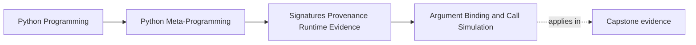
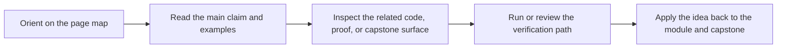

# Argument Binding and Call Simulation


<!-- page-maps:start -->
## Page Maps




<!-- page-maps:end -->

Knowing a callable's signature is useful. Using that signature to simulate real call
matching is where Module 03 starts paying off in wrappers, validators, RPC adapters, and
tooling.

This page focuses on the binding helpers attached to `Signature` objects:

- `.bind()`
- `.bind_partial()`
- `BoundArguments`
- `.apply_defaults()`

## The sentence to keep

When a wrapper, validator, or adapter needs to understand a call, ask:

> can I let `Signature.bind()` do the interpreter-like matching instead of reimplementing
> it myself?

The answer should usually be yes.

## Why binding matters

Decorators and adapters often need to answer questions like:

- did the caller satisfy the required arguments?
- which value ended up bound to which parameter?
- did the caller try to pass a positional-only parameter by keyword?
- which defaults should be filled in before validation or logging?

Those are argument-matching questions, not merely signature-display questions.

`bind()` exists so tools can reuse Python's own call rules instead of inventing partial,
inconsistent copies of them.

## `bind()` versus `bind_partial()`

The two binding helpers answer related but different questions:

- `sig.bind(*args, **kwargs)` requires all required arguments to be present
- `sig.bind_partial(*args, **kwargs)` allows required arguments to remain unbound

That makes the split useful:

- `bind()` is the right default for call validation and forwarding
- `bind_partial()` is useful for staged application, partial wrappers, or progressive configuration

## One picture of binding as call simulation

```mermaid
graph TD
  callable["Callable contract"]
  sig["Signature"]
  call["Incoming args / kwargs"]
  bound["BoundArguments<br/>parameter -> value mapping"]
  defaults["apply_defaults()<br/>fills omitted defaulted parameters"]
  callable --> sig
  call --> bound
  sig --> bound --> defaults
```

Caption: binding turns a call attempt into explicit parameter/value relationships using interpreter-like rules.

## A basic example

```python
import inspect


def demo(a, /, b, *, c=False, **kw):
    pass


sig = inspect.signature(demo)
ba = sig.bind(10, 20, extra=1)

assert ba.arguments == {"a": 10, "b": 20, "kw": {"extra": 1}}
```

The important point is not the dictionary itself. It is that the mapping came from
interpreter-aligned matching rules rather than from hand-written parsing logic.

## Defaults are not applied automatically

Binding and default application are separate steps:

```python
import inspect


def demo(a, /, b, *, c=False):
    pass


sig = inspect.signature(demo)
ba = sig.bind(10, 20)

assert "c" not in ba.arguments

ba.apply_defaults()
assert ba.arguments["c"] is False
```

That separation matters because some tools want only explicitly supplied arguments, while
others want a complete view including defaults before validation, caching, or logging.

## Binding failures are features, not inconveniences

If the call shape is invalid, `bind()` raises `TypeError` with interpreter-like messages.

```python
import inspect


def demo(a, /, b):
    pass


sig = inspect.signature(demo)

try:
    sig.bind(a=10, b=20)
except TypeError as exc:
    print("Expected:", exc)
```

That exception is useful evidence:

- the call shape is wrong
- Python would reject it too
- your wrapper does not need to invent its own slightly different rule

Strong wrapper code usually preserves or lightly adapts these failures rather than
replacing them with vague custom messages.

## Bound arguments are useful beyond validation

Once you have a `BoundArguments` object, you can use it for:

- validation
- tracing and logging
- standardized forwarding
- cache key construction
- documentation or error reporting

This is why binding belongs in Module 03 before decorators. It is one of the cleanest
ways to keep later wrapper behavior honest.

## A small validation pattern

```python
import inspect


def validate_call(func, *args, **kwargs):
    sig = inspect.signature(func)
    ba = sig.bind(*args, **kwargs)
    ba.apply_defaults()
    return ba.arguments
```

This is intentionally small, but the runtime contract is large:

- cache the signature in real code when repeated calls matter
- let binding establish argument truth
- run later validation against that established mapping

## Binding is stronger than manual tuple-and-dict reasoning

Many fragile wrappers do some version of:

- count positional arguments manually
- merge keyword arguments manually
- guess whether a name was required
- miss positional-only or keyword-only edges

That is exactly the kind of low-quality reimplementation Module 03 is meant to prevent.

If the runtime already has a precise call-matching model, use the model.

## Review rules for binding logic

When reviewing call-validation or forwarding code, keep these questions close:

- is the code using `bind()` or reimplementing argument matching by hand?
- does the code distinguish full binding from partial binding?
- are defaults applied only when the downstream logic actually needs them?
- are `TypeError` failures from binding preserved clearly enough to remain useful?
- is signature lookup cached in repeated wrapper paths where cost matters?

## What to practice from this page

Try these before moving on:

1. Write a helper that binds a call, applies defaults, and returns the bound mapping.
2. Compare `bind()` with `bind_partial()` on the same signature and explain the difference.
3. Force one binding failure involving a positional-only or keyword-only parameter and
   explain why the failure is a feature.

If those feel ordinary, the next step is provenance: useful evidence about where code came
from, with honest limits.

## Continue through Module 03

- Previous: [Signature Contracts and Parameter Kinds](signature-contracts-and-parameter-kinds.md)
- Next: [Provenance Helpers and Best-Effort Recovery](provenance-helpers-and-best-effort-recovery.md)
- Practice: [Exercises](exercises.md)
- Terms: [Glossary](glossary.md)
