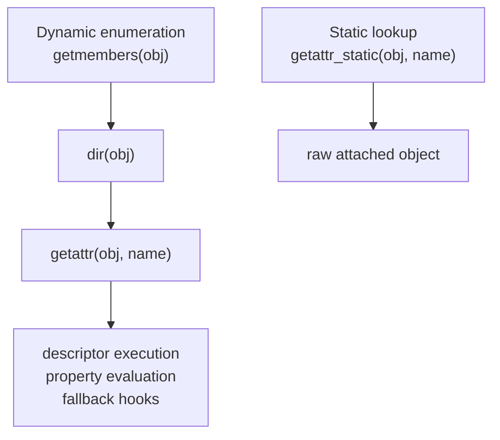

# Dynamic Members and Static Structure

By Module 03, the course has enough pieces to name one of the most important inspection
choices in metaprogramming:

> do you want the value normal lookup would produce, or do you want the raw structure
> attached to the object?

This page puts that choice into concrete tooling terms with:

- `inspect.getmembers`
- `inspect.getattr_static`

## The sentence to keep

When enumerating members, ask:

> am I trying to collect dynamic values, or am I trying to inspect attached structure
> without executing runtime behavior?

That question should drive the tool choice.

## `inspect.getmembers` is dynamic enumeration

`inspect.getmembers(obj, predicate=None)` works roughly like this:

1. discover names with `dir(obj)`
2. call `getattr(obj, name)` for each name
3. optionally filter the resulting values with a predicate
4. return sorted `(name, value)` pairs

That is useful, but it is not passive.

Because it uses dynamic lookup, it can:

- execute properties
- trigger descriptors
- trigger `__getattr__`
- activate proxy behavior

So `getmembers` is a value-oriented tool, not a structural-inspection tool.

## `inspect.getattr_static` is structural inspection

`inspect.getattr_static(obj, name)` tries to retrieve the raw attribute object without
running normal lookup behavior.

That means it can return:

- a property object
- a function stored on the class
- a descriptor object
- a plain attached value

without automatically executing it.

That is why it fits library and framework introspection much better when the goal is
structure rather than behavior.

## One picture of the difference



Caption: one path collects resolved values, the other inspects what is attached before runtime behavior runs.

## A property shows the difference clearly

```python
import inspect


class Example:
    @property
    def expensive(self):
        print("SIDE EFFECT: property executed")
        return 123

    def method(self):
        pass


obj = Example()

_ = inspect.getmembers(obj)
raw = inspect.getattr_static(Example, "expensive")

assert isinstance(raw, property)
```

The printed side effect is the whole lesson:

- `getmembers` resolved the value dynamically
- `getattr_static` revealed the attached structure without evaluation

## Structural enumeration often needs a custom helper

Because `getmembers` is dynamic, framework or tooling code often wants its own structural
enumeration helper:

```python
import inspect


def static_getmembers(obj, predicate=None):
    for name in dir(obj):
        value = inspect.getattr_static(obj, name)
        if predicate is None or predicate(value):
            yield name, value
```

That helper still inherits the lower-risk caveat around `dir(obj)`, but it avoids the
larger mistake of resolving every name dynamically by default.

## Use the tool that matches the question

Good reasons to use `getmembers`:

- quick REPL exploration
- controlled debugging where executing descriptors is acceptable
- value-oriented inspection when you explicitly want runtime semantics

Good reasons to use `getattr_static`:

- framework discovery
- manifest or schema extraction
- class and descriptor inspection
- any tool that should not trigger business behavior while observing structure

The key discipline is not to use the dynamic tool by habit when the question is clearly
structural.

## Static structure is often the stronger review surface

When reviewing framework code, the structural question is often the one that matters most:

- what descriptors are attached?
- what functions are defined on the class?
- what property objects exist?
- what raw members make up the framework contract?

Dynamic values may be interesting later, but they are not the first truth the reviewer
needs.

## Review rules for member inspection

When reviewing member-inspection code, keep these questions close:

- is the code trying to inspect attached structure or resolved runtime values?
- is `getmembers` being used where `getattr_static` would better match the tool's purpose?
- does the enumeration path risk executing properties or proxy behavior unintentionally?
- is a custom structural helper justified instead of broad dynamic enumeration?
- does the code document when it chooses to cross from structure into value resolution?

## What to practice from this page

Try these before moving on:

1. Compare `getmembers(obj)` with a `static_getmembers(obj)` helper on a class that has a property.
2. Use `getattr_static` to list properties on a class without evaluating them.
3. Explain one case where dynamic member values are the right goal and one where raw structure is the right goal.

If those feel ordinary, the final core can close the module with the highest-risk
introspection surface here: frames and stack inspection.
