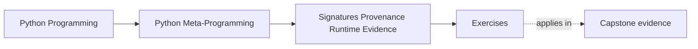
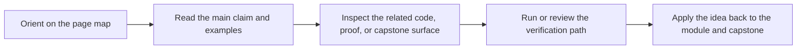

# Exercises

<!-- page-maps:start -->
## Page Maps

<!-- page-maps:end -->

Use these after reading the five core lessons and the worked example. The goal is not to
collect more introspection tricks. The goal is to make your evidence standards visible.

Each exercise asks for three things:

- the runtime claim you are trying to support
- the evidence surface you chose
- the reason that surface is strong enough, best-effort, or diagnostic-only

## Exercise 1: Describe one callable contract precisely

Choose one callable with a non-trivial signature.

What to hand in:

- the string form of the signature
- at least three parameter kinds or fields that matter
- one sentence explaining why the signature is stronger evidence than a hand-written summary

## Exercise 2: Bind one call honestly

Take the same callable or a new one and simulate a call with `bind()` or `bind_partial()`.

What to hand in:

- the call attempt
- the resulting bound arguments or the expected `TypeError`
- one explanation of why binding is better than manual argument matching

## Exercise 3: Recover provenance without overclaiming

Use one function, class, or module and gather provenance context.

What to hand in:

- the result of `getmodule`, `getfile`, or `getsource` as available
- one case where one of those helpers fails or could fail
- one sentence explaining why provenance is best-effort evidence rather than a correctness boundary

## Exercise 4: Compare dynamic members with static structure

Use one class that contains a property, descriptor, or other side-effectful member.

What to hand in:

- what `getmembers` returns or triggers
- what `getattr_static` reveals for the same member
- one explanation of which tool fits framework inspection and why

## Exercise 5: Use frames only as diagnostics

Write one small helper that inspects caller information.

What to hand in:

- the helper implementation
- the limited caller evidence it returns
- one sentence explaining why the helper belongs to diagnostics and not normal application logic

## Exercise 6: Review a runtime-description helper

Use the worked example pattern on a small `__repr__`, logger, or manifest helper.

What to hand in:

- which evidence source it uses for ordering or naming
- which surface it uses for values
- one repair that makes the helper safer or more honest

## Mastery standard for this exercise set

Across all six answers, the module wants the same habits:

- you state the runtime claim before choosing evidence
- you distinguish strong contract evidence from best-effort provenance
- you keep dynamic execution, static structure, and diagnostic stack inspection separate
- you use `inspect` to clarify behavior rather than to make vague claims sound technical

If an answer still says only "I inspected it," keep going.

## Continue through Module 03

- Previous: [Worked Example: Building a Safe Signature-Guided `__repr__`](worked-example-building-a-safe-signature-guided-repr.md)
- Next: [Exercise Answers](exercise-answers.md)
- Return: [Overview](index.md)
- Terms: [Glossary](glossary.md)
