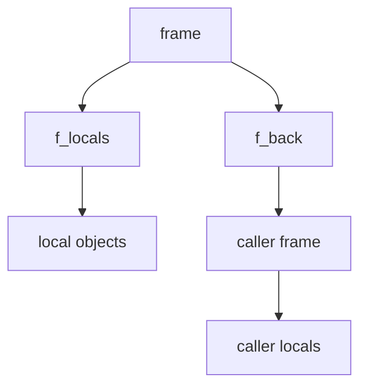

# Frames and Diagnostic-Only Runtime Evidence

Module 03 ends with the sharpest inspection surface in the module:

- `inspect.currentframe()`
- `inspect.stack()`
- frame objects and their links to locals, globals, and callers

These tools can be useful. They can also be expensive, intrusive, and memory-hungry
enough that the module needs a very clear rule:

> frames belong to diagnostics, debugging, and tooling, not to ordinary application
> control flow.

## The sentence to keep

When frame inspection appears in a design, ask:

> is this genuinely diagnostics, or is the code using stack introspection as normal
> program logic?

If it is normal program logic, skepticism should go up immediately.

## What a frame exposes

A frame object represents an execution record.

Useful attributes include:

- `f_code` for the executing code object
- `f_locals` for the local namespace snapshot
- `f_globals` for the global namespace
- `f_back` for the previous frame in the call chain

That is powerful, but it also means frames connect you to large object graphs very
quickly.

## `currentframe()` versus `stack()`

For this module, the key difference is:

- `inspect.currentframe()` gives you a starting frame or `None`
- `inspect.stack()` walks and packages much more of the call stack

That second tool is much heavier.

If you only need a small slice of caller context, building it manually from
`currentframe()` is often the more honest and cheaper choice.

## One picture of frame retention risk



Caption: holding onto one frame can keep much more than one local variable alive.

This is why long-lived frame references can create leak-like retention problems.

## A small and safer caller helper

```python
import inspect


def top_callers(limit=3):
    frame = inspect.currentframe()
    if frame is None:
        return []
    try:
        out = []
        current = frame.f_back
        while current is not None and len(out) < limit:
            out.append(current.f_code.co_name)
            current = current.f_back
        return out
    finally:
        del frame
```

This helper still belongs to diagnostics, but it avoids the heavier full-stack collection
pattern.

The `del frame` matters because it helps break reference cycles sooner.

## Snapshot locals instead of retaining frames

If the real need is a bit of diagnostic state, snapshot the information you need instead
of storing frame objects:

```python
import inspect


def snapshot_locals(limit=2):
    frame = inspect.currentframe()
    if frame is None:
        return []
    try:
        out = []
        current = frame.f_back
        while current is not None and len(out) < limit:
            out.append(dict(current.f_locals))
            current = current.f_back
        return out
    finally:
        del frame
```

That is usually a healthier diagnostic pattern than holding onto frames or tracebacks
themselves.

## Why `inspect.stack()` deserves caution

`inspect.stack()` is easy to reach for because it looks convenient. It also does more work
than many callers really need.

Costs and risks include:

- walking the full Python stack
- consulting source line machinery
- building frame info objects for many levels
- retaining references if the result is stored carelessly

That does not make it forbidden. It makes it a tool for debugging and developer-facing
reporting, not a casual utility inside hot paths.

## Diagnostic-only is a real boundary

This module keeps saying "diagnostic-only" on purpose.

That phrase means:

- acceptable in debugging helpers
- acceptable in crash reporting
- acceptable in explicit developer tooling
- risky in ordinary application logic
- especially risky as hidden control flow or authorization logic

The value here is not just performance. It is also legibility and reviewability.

Code that depends on who called it, as seen through stack inspection, is much harder to
reason about than code with explicit parameters and ownership.

## Review rules for frame inspection

When reviewing frame or stack inspection, keep these questions close:

- is this clearly diagnostic code, or has stack inspection leaked into normal logic?
- could the same information be passed explicitly instead of recovered from frames?
- does the code use `currentframe()` for a small bounded need instead of `inspect.stack()` by habit?
- are frame references released promptly instead of stored in long-lived structures?
- would a snapshot of locals or caller names be enough instead of retaining live frame objects?

## What to practice from this page

Try these before moving on:

1. Write a helper that returns the top few caller names using `currentframe()` and `f_back`.
2. Snapshot caller locals without retaining a frame object after the helper returns.
3. Explain one diagnostic use case for frame inspection and one application-level use case that should be rejected.

If those feel ordinary, the worked example can combine the module's evidence tools inside
a safer `__repr__` helper.

## Continue through Module 03

- Previous: [Dynamic Members and Static Structure](dynamic-members-and-static-structure.md)
- Next: [Worked Example: Building a Safe Signature-Guided `__repr__`](worked-example-building-a-safe-signature-guided-repr.md)
- Practice: [Exercises](exercises.md)
- Terms: [Glossary](glossary.md)
