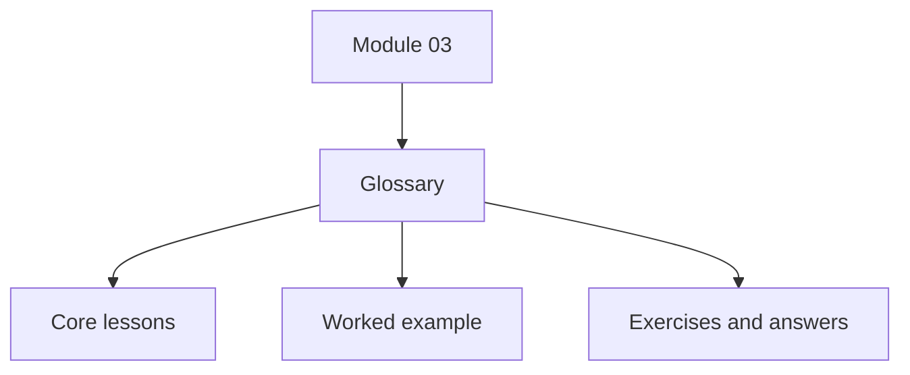
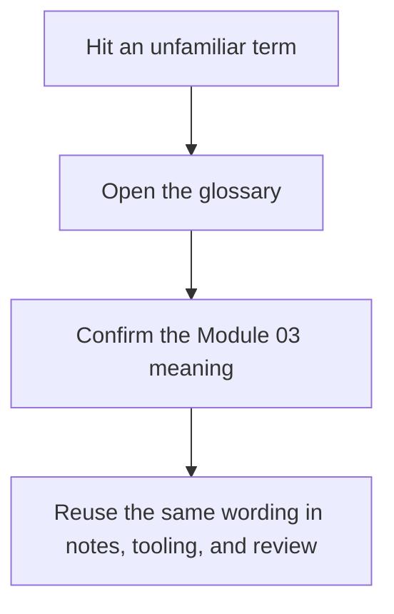

# Module Glossary

<!-- page-maps:start -->
## Glossary Fit

<!-- page-maps:end -->

This glossary belongs to **Module 03: Signatures, Provenance, and Runtime Evidence** in
**Python Metaprogramming**. It keeps the language of this directory stable so the same
ideas keep the same names across lessons, practice, and capstone discussion.

## How to use this glossary

Use the glossary when a page or review discussion starts to blur together contract
evidence, provenance hints, structural inspection, and diagnostic stack data. Module 03
is meant to keep those evidence classes distinct.

## Terms in this directory

| Term | Meaning in this directory |
| --- | --- |
| Argument binding | Using `Signature.bind()` or `bind_partial()` to simulate Python's call matching and produce explicit parameter/value relationships. |
| Best-effort provenance | Context recovered through helpers such as `getsource`, `getfile`, and `getmodule`, useful but not safe to treat as correctness-grade truth. |
| Bound arguments | The `BoundArguments` object produced by binding, mapping parameters to supplied values. |
| Bound method signature | The callable contract visible on an already-bound method, which omits the instance parameter because it is already attached. |
| Contract evidence | Structured runtime evidence about how a callable should be invoked, especially through `inspect.signature`. |
| Diagnostic-only evidence | Runtime evidence that belongs to debugging and tooling, such as frames and stack inspection, rather than ordinary application logic. |
| Dynamic member enumeration | Value-oriented inspection through `inspect.getmembers`, which can execute descriptors and other lookup behavior. |
| Frame retention hazard | The risk that retaining frame or traceback objects keeps locals and caller chains alive longer than intended. |
| Parameter kind | The invocation category attached to a `Parameter`, such as positional-only or keyword-only. |
| Provenance helper | A helper such as `getsource`, `getfile`, or `getmodule` that tries to recover where an object came from. |
| Signature | An `inspect.Signature` object describing a callable's invocation contract. |
| Static structure | The raw attached members or descriptors visible through static lookup rather than through normal dynamic resolution. |
| Static lookup | Inspection through `inspect.getattr_static`, which avoids normal attribute-protocol execution. |
| `bind_partial()` | Partial argument binding that allows required parameters to remain unbound. |
| `getmembers()` | Dynamic enumeration that resolves values for discovered names. |
| `inspect.signature` | Structured callable introspection that exposes parameters, annotations, and binding helpers when available. |
| `inspect.stack()` | High-cost stack inspection that belongs to diagnostics, not routine application control flow. |
| `Parameter` | A single formal argument inside a `Signature`, carrying name, kind, default, and annotation data. |
| `POSITIONAL_ONLY` | A parameter kind that may be supplied only positionally. |
| `KEYWORD_ONLY` | A parameter kind that may be supplied only by keyword. |
| `__signature__` override | An explicit signature surface supplied by a callable or framework. |
| `__wrapped__` chain | Wrapper metadata used by tools such as `inspect.signature` to recover the underlying callable contract. |

## Keep the module connected

- Return to [Module 03 Overview](index.md) for the full learning route.
- Use [Exercises](exercises.md) and [Exercise Answers](exercise-answers.md) to pressure-test the evidence language.
- Revisit the [Worked Example](worked-example-building-a-safe-signature-guided-repr.md) when a helper starts to blur strong evidence, best-effort provenance, and dynamic execution.
