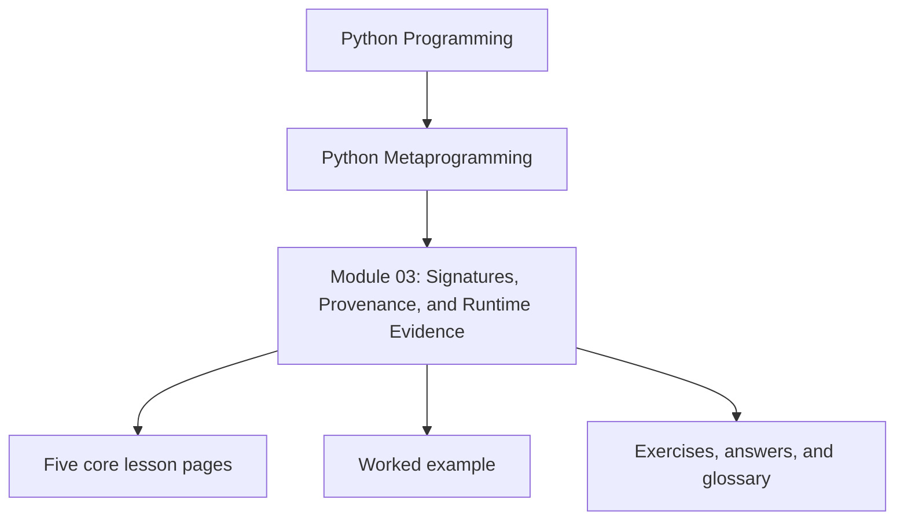
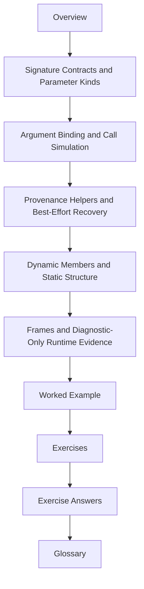

# Module 03: Signatures, Provenance, and Runtime Evidence

<!-- page-maps:start -->
## Module Position

<!-- page-maps:end -->

Module 03 turns raw inspection into stronger evidence. It introduces `inspect` as the
structured introspection layer that documentation tools, debuggers, wrappers, and runtime
frameworks rely on when "it looks inspectable" is no longer a strong enough claim.

This module now uses the same ten-file learning surface as the deep-dive series so the
overview, five cores, worked example, practice set, answers, and glossary each have one
clear job.

## What this module is for

By the end of Module 03, you should be able to explain five things clearly:

- what `inspect.signature` proves about a callable contract
- how `bind()` turns a signature into interpreter-like argument matching
- why provenance helpers are useful but remain best-effort evidence
- how dynamic member enumeration differs from static structural inspection
- why frame and stack introspection belong to diagnostics rather than ordinary control flow

## Keep these pages open

- [First-Contact Map](../module-00-orientation/first-contact-map.md)
- [Proof Matrix](../guides/proof-matrix.md)
- [Proof Ladder](../guides/proof-ladder.md)
- [Capstone Walkthrough](../capstone/capstone-walkthrough.md)

## The ten files in this module

1. Overview (`index.md`)
2. [Signature Contracts and Parameter Kinds](signature-contracts-and-parameter-kinds.md)
3. [Argument Binding and Call Simulation](argument-binding-and-call-simulation.md)
4. [Provenance Helpers and Best-Effort Recovery](provenance-helpers-and-best-effort-recovery.md)
5. [Dynamic Members and Static Structure](dynamic-members-and-static-structure.md)
6. [Frames and Diagnostic-Only Runtime Evidence](frames-and-diagnostic-only-runtime-evidence.md)
7. [Worked Example: Building a Safe Signature-Guided `__repr__`](worked-example-building-a-safe-signature-guided-repr.md)
8. [Exercises](exercises.md)
9. [Exercise Answers](exercise-answers.md)
10. [Glossary](glossary.md)

## How to use the file set

| If you need to... | Start here |
| --- | --- |
| understand what a callable contract really contains | [Signature Contracts and Parameter Kinds](signature-contracts-and-parameter-kinds.md) |
| validate or forward arguments without reimplementing Python's call rules | [Argument Binding and Call Simulation](argument-binding-and-call-simulation.md) |
| recover source or file context without pretending provenance is perfect | [Provenance Helpers and Best-Effort Recovery](provenance-helpers-and-best-effort-recovery.md) |
| separate dynamic value enumeration from safe structural inspection | [Dynamic Members and Static Structure](dynamic-members-and-static-structure.md) |
| keep stack and frame introspection in the diagnostics bucket | [Frames and Diagnostic-Only Runtime Evidence](frames-and-diagnostic-only-runtime-evidence.md) |
| see safe evidence-collection choices inside one realistic helper | [Worked Example: Building a Safe Signature-Guided `__repr__`](worked-example-building-a-safe-signature-guided-repr.md) |
| test your understanding before wrappers and decorators begin | [Exercises](exercises.md) |
| compare your reasoning against a reference answer | [Exercise Answers](exercise-answers.md) |
| stabilize the module vocabulary | [Glossary](glossary.md) |

## The running question

Carry this question through every page:

> What runtime evidence is strong enough to trust, and what evidence stays best-effort or diagnostic-only?

Strong Module 03 answers usually mention one or more of these:

- a `Signature` object describing callable structure
- `bind()` as interpreter-like argument matching
- best-effort provenance from source and file helpers
- static versus dynamic member inspection
- frames and stacks as diagnostic surfaces with cost and retention hazards

## Learning outcomes

By the end of this module, you should be able to:

- use `inspect` to gather runtime facts without overstating what those facts prove
- preserve or validate callable metadata in wrapper-heavy designs
- separate correctness-grade evidence from best-effort provenance and diagnostic tooling
- explain why the capstone exposes callable facts without turning inspection into uncontrolled execution

## Exit standard

Do not move on until all of these are true:

- you can explain what `inspect.signature` proves and what it does not
- you can use `bind()` or `bind_partial()` instead of reimplementing call matching
- you can say why `getsource`, `getfile`, and `getmodule` are useful but not correctness foundations
- you can distinguish structural inspection from dynamic member resolution and diagnostic stack inspection

When those feel ordinary, Module 03 has done its job and the decorator modules can build
on a stronger evidence discipline.
