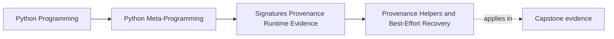
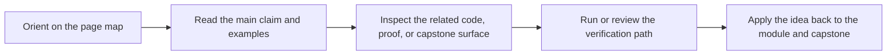
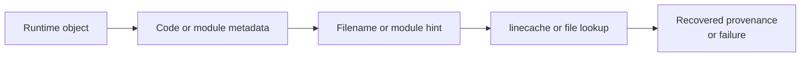

# Provenance Helpers and Best-Effort Recovery


<!-- page-maps:start -->
## Page Maps




<!-- page-maps:end -->

Once a tool knows what a callable looks like, the next question is often:

> where did this object come from?

Python gives you helpers such as:

- `inspect.getsource`
- `inspect.getfile`
- `inspect.getmodule`

They are useful, but Module 03 needs one discipline to stay firm:

> provenance helpers are best-effort evidence, not correctness-grade truth.

## The sentence to keep

When using provenance helpers, ask:

> am I recovering context for humans and tools, or am I making a correctness claim that
> depends on this lookup always succeeding?

The first is healthy. The second is usually not.

## What the helpers try to recover

At a high level:

- `inspect.getsource(obj)` tries to recover source text
- `inspect.getfile(obj)` tries to recover a file path
- `inspect.getmodule(obj)` tries to recover the owning module object

These are helpful because they add context around runtime objects. They are limited
because source layout, loading mode, and runtime environment can all get in the way.

## Why the evidence is best-effort

Provenance helpers depend on conditions that may not hold:

- the code may have come from a REPL or notebook
- it may have been created with `exec` or `eval`
- it may have been loaded from a zip or frozen environment
- source files may be absent, transformed, or shifted by tooling
- file names may be synthetic rather than real paths

That means the helpers answer:

> what source or location context can I recover here?

They do not answer:

> what source or file must exist for correctness?

## One picture of provenance recovery



Caption: provenance recovery passes through metadata and environment details that may be incomplete, synthetic, or unavailable.

## A simple example

```python
import inspect


def demo():
    return 42


print(inspect.getmodule(demo))

try:
    print(inspect.getfile(demo))
except TypeError as exc:
    print("Expected:", exc)

try:
    print(inspect.getsource(demo))
except (OSError, TypeError) as exc:
    print("Expected:", type(exc).__name__, exc)
```

The exact result depends on where the code is running. That variability is part of the
lesson, not a flaw in the lesson.

## Typical failure situations

Some common sources of failure include:

- interactive sessions with transient code cells
- `exec` or `eval` with synthetic filenames such as `"<string>"`
- stripped or transformed deployments where source no longer matches expectations
- frozen, zipped, or otherwise packaged runtime environments

This is why robust helpers around provenance should not let these failures leak as if they
were impossible edge cases.

## `getmodule` is useful but not absolute

`inspect.getmodule(obj)` often gives you the module object that best matches the runtime
object.

That is helpful context, but it can still return `None` or offer less certainty than a
developer might casually assume.

In review language:

- useful: "this appears to come from module X"
- too strong: "this module lookup is guaranteed and safe to build correctness on"

## Wrap provenance lookups in best-effort helpers

A small wrapper keeps the right stance:

```python
import inspect


def where_defined(obj):
    module = inspect.getmodule(obj)
    module_name = module.__name__ if module is not None else None

    try:
        file_name = inspect.getfile(obj)
    except (OSError, TypeError):
        file_name = None

    first_line = None
    try:
        source_lines, first_line = inspect.getsourcelines(obj)
    except (OSError, TypeError):
        pass

    return (module_name, file_name, first_line)
```

The wrapper does not promise too much:

- it returns context when available
- it degrades cleanly when provenance is unavailable

That is exactly the stance Module 03 wants.

## Provenance helps humans and tooling, not core semantics

Good uses of provenance helpers include:

- debug displays
- documentation tooling
- developer-facing trace output
- review aids and source hints

Weak uses include:

- correctness rules that break when source text is unavailable
- production logic that assumes file paths are always stable
- authorization or routing logic tied to source recovery

The line here is straightforward: provenance is context, not a contract.

## Review rules for provenance helpers

When reviewing provenance-aware code, keep these questions close:

- is the code treating provenance as best-effort context or as guaranteed truth?
- are `getsource`, `getfile`, and `getmodule` wrapped with honest failure handling?
- does the tool still behave sensibly in REPL, generated, or packaged environments?
- is a file path being treated as more stable or meaningful than it really is?
- would a simple fallback message be better than surfacing provenance failure as a crash?

## What to practice from this page

Try these before moving on:

1. Write `where_defined(obj)` that returns module name, file path, and first line when available.
2. Run it on one normal function and one object created in a context where source recovery is limited.
3. Explain one reason provenance belongs in tooling and one reason it should not become a correctness dependency.

If those feel ordinary, the next step is member inspection: how to distinguish dynamic
enumeration from safe structural inspection.

## Continue through Module 03

- Previous: [Argument Binding and Call Simulation](argument-binding-and-call-simulation.md)
- Next: [Dynamic Members and Static Structure](dynamic-members-and-static-structure.md)
- Practice: [Exercises](exercises.md)
- Terms: [Glossary](glossary.md)
