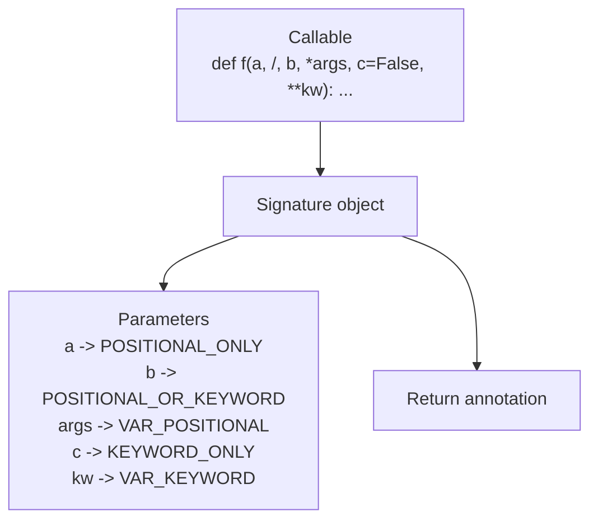

# Signature Contracts and Parameter Kinds

Module 03 becomes useful the moment you stop saying "this callable looks fine" and
starts asking for stronger evidence.

The first strong evidence surface is `inspect.signature`.

It does not tell you everything about behavior, but it does give you a structured,
reviewable description of how a callable presents its invocation contract.

## The sentence to keep

When reviewing a callable, ask:

> what contract does its signature expose, and which parameter kinds make that contract
> precise?

That question is much stronger than "what arguments do I think it takes?"

## What `inspect.signature` returns

`inspect.signature(callable, *, follow_wrapped=True)` returns a `Signature` object that
describes how the callable should be invoked.

That object can expose:

- an ordered mapping of parameters
- a return annotation
- binding helpers such as `.bind()` and `.bind_partial()`
- a `.replace()` method for derived signatures

For this page, the important point is that the signature object turns invocation shape
into something explicit and inspectable.

## Where the signature can come from

`inspect.signature` may synthesize its answer from:

- an explicit `__signature__` override
- a `__wrapped__` chain created by decorators
- Python function metadata such as defaults and annotations
- implementation-specific metadata for some built-ins

That is why the result is strong evidence when available, but not universal evidence for
every possible callable in the runtime.

## The five parameter kinds matter

A `Signature` is not just a pretty string. Its parameters each have a specific kind:

- `POSITIONAL_ONLY`
- `POSITIONAL_OR_KEYWORD`
- `VAR_POSITIONAL`
- `KEYWORD_ONLY`
- `VAR_KEYWORD`

Those kinds matter because they encode real interpreter rules:

- positional-only parameters cannot be supplied by keyword
- keyword-only parameters cannot be supplied positionally
- variadic parameters collect excess positional or keyword arguments

That is the level of precision wrappers and validators need.

## One picture of a callable contract



Caption: a signature is a structured contract surface, not just a formatted string for documentation.

## A basic example

```python
import inspect


def demo(a: int, /, b, *, c: bool = False, **kw):
    pass


sig = inspect.signature(demo)

assert str(sig) == "(a: int, /, b, *, c: bool = False, **kw)"
assert sig.parameters["a"].kind is inspect.Parameter.POSITIONAL_ONLY
assert sig.parameters["b"].kind is inspect.Parameter.POSITIONAL_OR_KEYWORD
assert sig.parameters["c"].kind is inspect.Parameter.KEYWORD_ONLY
assert sig.parameters["kw"].kind is inspect.Parameter.VAR_KEYWORD
```

The printed signature is useful, but the parameter kinds are the stronger runtime fact.

## Parameter objects carry more than names

Each `Parameter` object can also expose:

- `.name`
- `.default`
- `.annotation`
- `.kind`

That matters because signature-aware tooling often needs to distinguish:

- required versus defaulted parameters
- annotated versus unannotated parameters
- keyword-only versus positional-only boundaries

This is why Module 03 treats signatures as evidence, not decoration.

## Bound and unbound methods expose different callable contracts

Method access changes the visible call contract:

```python
import inspect


class Service:
    def run(self, x: int = 0, *, y):
        pass


assert str(inspect.signature(Service.run)) == "(self, x: int = 0, *, y)"
assert str(inspect.signature(Service().run)) == "(x: int = 0, *, y)"
```

That difference is an honest runtime fact:

- the unbound method still includes `self`
- the bound method already has an instance attached

Signature-aware tooling must respect that instead of assuming the same shape everywhere.

## Decorators can preserve or distort signature evidence

Decorators matter here because they often sit between the tool and the original callable.

If a decorator preserves `__wrapped__` correctly, `inspect.signature` can often see
through it:

```python
import functools
import inspect


def deco(func):
    @functools.wraps(func)
    def wrapper(*args, **kwargs):
        return func(*args, **kwargs)
    return wrapper


@deco
def f(a, /, b, *, c=0):
    pass


print(inspect.signature(f))
```

That is one reason later decorator modules will treat `functools.wraps` as a correctness
tool, not as mere style.

## Signature availability is strong but not universal

Some callables still cannot provide a signature, and the failure modes matter:

- `TypeError` when the object is not callable or has a broken custom signature surface
- `ValueError` when a callable exists but the runtime cannot provide a signature for it

That means strong review code should not assume uniform support across every callable it
might see.

```python
import inspect


def safe_signature(obj):
    try:
        return str(inspect.signature(obj))
    except (TypeError, ValueError) as exc:
        return f"<no signature: {type(exc).__name__}: {exc}>"
```

## Review rules for signature contracts

When reviewing signature-aware code, keep these questions close:

- is the code reading the signature as a structured contract or only as a string?
- does the logic respect parameter kinds such as positional-only and keyword-only?
- does the code assume signature availability for all callables when it should handle failure honestly?
- is decorator behavior preserving signature evidence through `__wrapped__` or `__signature__`?
- is a bound method being treated like an unbound method, or vice versa?

## What to practice from this page

Try these before moving on:

1. Inspect one function with positional-only, keyword-only, and variadic parameters.
2. Compare the signature of an unbound method with the signature of its bound form.
3. Write down one reason parameter kinds are stronger evidence than a hand-written docstring summary.

If those feel ordinary, the next step is to turn the contract surface into action with
argument binding.

## Continue through Module 03

- Previous: [Overview](index.md)
- Next: [Argument Binding and Call Simulation](argument-binding-and-call-simulation.md)
- Practice: [Exercises](exercises.md)
- Terms: [Glossary](glossary.md)
