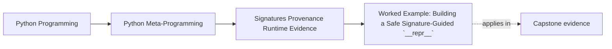
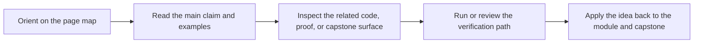

# Worked Example: Building a Safe Signature-Guided `__repr__`


<!-- page-maps:start -->
## Page Maps




<!-- page-maps:end -->

The five core lessons in Module 03 are easiest to trust when they all show up in one
helper that feels practical and easy to get subtly wrong.

A `__repr__` mixin is a good fit because it creates exactly the right pressures:

- it should show useful runtime state
- it should prefer stable ordering
- it should not evaluate properties during representation
- it should not reach for stack inspection just because debugging is involved

That makes it a clean worked example for signatures, structure, and evidence discipline.

## The incident

Assume a team wants a reusable `ReprMixin` that prints instances clearly for debugging and
review.

The first attempts tend to fall into predictable traps:

1. they call `getattr` on arbitrary attribute names and accidentally evaluate properties
2. they only support `__dict__`-backed instances and mishandle slotted classes
3. they order fields arbitrarily instead of using the class's callable contract
4. they overreach into stack or frame inspection because "it's just debugging"

Every one of those is a Module 03 issue:

- which evidence is strong enough?
- which evidence is best-effort?
- which inspection surfaces are safe by default?

## The design goal

The helper should be:

- stable across regular and slotted classes
- ordered by `__init__` signature when that evidence is available
- careful not to evaluate properties
- free from frame or stack inspection

That set of goals already tells you which surfaces to trust:

- `inspect.signature` for ordering
- raw instance storage and slots for state
- `object.__getattribute__` for safer direct reads

## Step 1: choose strong evidence for field order

If the class exposes a useful `__init__` signature, that is stronger ordering evidence
than arbitrary dictionary iteration.

The mixin can inspect the constructor and prefer the parameter order:

```python
import inspect


sig = inspect.signature(cls.__init__)
order = [
    p.name
    for p in sig.parameters.values()
    if p.name != "self"
    and p.kind not in (inspect.Parameter.VAR_POSITIONAL, inspect.Parameter.VAR_KEYWORD)
]
```

That is a good use of signatures:

- the helper is not pretending the signature proves runtime state
- it is using the constructor contract as a strong ordering hint when available

## Step 2: read state from storage, not from arbitrary lookup

If the helper uses `getattr(self, name)` on arbitrary names, it can:

- evaluate properties
- trigger custom `__getattribute__`
- trigger dynamic fallback hooks

That is too eager for a representation helper.

A better path is:

- read `__dict__` directly when present
- read slot-backed names deliberately
- avoid broad dynamic lookup over arbitrary member names

This keeps the helper attached to stored state rather than runtime behavior.

## Step 3: support slotted classes honestly

Regular and slotted classes need different storage reads, so the helper should inspect
both:

- instance `__dict__` when present
- declared `__slots__` through the MRO

That is a stronger approach than assuming all interesting state lives in one dictionary.

## Step 4: keep properties unevaluated

This is one of the most important boundaries in the whole example.

A representation helper should not call arbitrary properties just to look informative.
Doing so changes the contract from:

> show me the object's visible stored state

to:

> run arbitrary runtime behavior while printing a debug string

That is a terrible default.

## A healthier implementation

```python
import inspect


class ReprMixin:
    def __repr__(self):
        cls = type(self)
        state = {}

        try:
            data = object.__getattribute__(self, "__dict__")
        except Exception:
            data = None

        if isinstance(data, dict):
            state.update(data)

        for base in cls.__mro__:
            slots = getattr(base, "__slots__", None)
            if not slots:
                continue
            if isinstance(slots, str):
                slots = (slots,)
            for name in slots:
                if name in ("__dict__", "__weakref__"):
                    continue
                if name.startswith("_") or name in state:
                    continue
                try:
                    state[name] = object.__getattribute__(self, name)
                except AttributeError:
                    pass

        ordered_items = None
        try:
            sig = inspect.signature(cls.__init__)
            order = [
                p.name
                for p in sig.parameters.values()
                if p.name != "self"
                and p.kind not in (
                    inspect.Parameter.VAR_POSITIONAL,
                    inspect.Parameter.VAR_KEYWORD,
                )
            ]
            seen = set()
            ordered = []
            for name in order:
                if name in state:
                    ordered.append((name, state[name]))
                    seen.add(name)
            extras = [(name, value) for name, value in state.items() if name not in seen]
            ordered_items = ordered + sorted(extras, key=lambda item: item[0])
        except (TypeError, ValueError):
            pass

        items = ordered_items if ordered_items is not None else sorted(state.items(), key=lambda item: item[0])
        args = ", ".join(f"{name}={value!r}" for name, value in items)
        return f"{cls.__name__}({args})"
```

## Why this version is better

This helper is stronger because it keeps each evidence source in the right role:

- `inspect.signature` provides ordering when available
- raw storage provides values
- slots are included deliberately
- arbitrary dynamic lookup is avoided
- stack inspection is excluded entirely

The result is still a debugging aid, but it is a disciplined debugging aid.

## Regular and slotted classes both work

```python
class A(ReprMixin):
    def __init__(self, x, y=0):
        self.x = x
        self.y = y


class B(ReprMixin):
    __slots__ = ("x", "y")

    def __init__(self, x, y=0):
        self.x = x
        self.y = y


print(A(1))
print(B(2))
```

This is important because it proves the helper was built around storage evidence rather
than around one narrow storage assumption.

## What this example teaches about Module 03

This worked example ties the module together:

- signatures are strong evidence when used for the right job
- provenance and stack tricks are not needed just because a helper is "developer-facing"
- structural inspection beats eager dynamic evaluation when representation should stay safe
- strong runtime evidence and best-effort context should not be confused

That is the durable takeaway. The `__repr__` helper is just one concrete place where
evidence discipline produces a better design.

## The review loop to keep

When you inherit a runtime-description helper, run this loop:

1. identify which evidence it uses for ordering, value collection, and context
2. remove dynamic reads that are not required for the helper's purpose
3. keep provenance and signatures in the narrow roles they can support honestly
4. reject frame inspection unless the tool is explicitly diagnostic and truly needs it

If you can do that here, Module 03 has done its job and later wrapper modules can build on
stronger inspection habits.

## Continue through Module 03

- Previous: [Frames and Diagnostic-Only Runtime Evidence](frames-and-diagnostic-only-runtime-evidence.md)
- Next: [Exercises](exercises.md)
- Reference: [Exercise Answers](exercise-answers.md)
- Terms: [Glossary](glossary.md)
