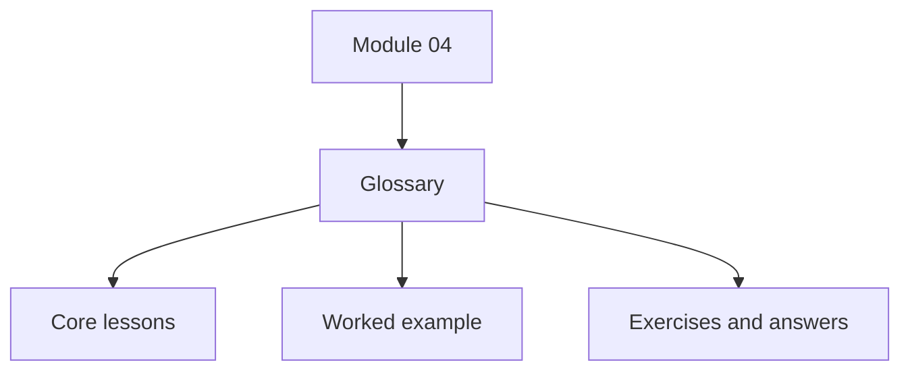
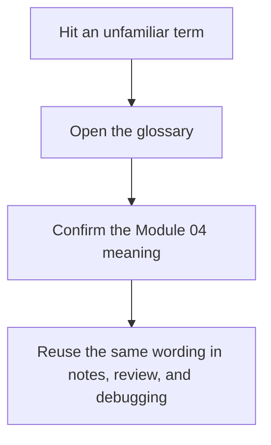

# Module Glossary

<!-- page-maps:start -->
## Glossary Fit

<!-- page-maps:end -->

This glossary belongs to **Module 04: Function Wrappers and Transparent Decorators** in
**Python Metaprogramming**. It keeps the language of this directory stable so the same
ideas keep the same names across lessons, practice, and capstone discussion.

## How to use this glossary

Use the glossary when a wrapper discussion starts to blur together thin transformation,
stateful policy, definition-time rebinding, and call-time behavior. Module 04 is meant to
keep those boundaries explicit.

## Terms in this directory

| Term | Meaning in this directory |
| --- | --- |
| Call-time behavior | Logic that runs on every invocation of the wrapped callable. |
| Closure-held state | State captured by a wrapper from an outer scope, often mutated with `nonlocal`. |
| Decoratee | The original function being wrapped by a decorator. |
| Decoration time | The one-time moment when the decorator expression is applied and the function name is rebound. |
| Decorator | A callable that takes a function and returns another callable. |
| Decorator factory | A callable that returns a decorator, usually used as `@factory(config)`. |
| Definition-time rebinding | The fact that `@decorator` syntax rewrites a function name to the wrapper returned by the decorator. |
| Semantic drift | The point where a decorator stops being a thin transformation and starts changing semantics across calls through state or policy. |
| Stateful wrapper | A wrapper that owns cross-call state such as counters, cached results, or retry policy. |
| Thin wrapper | A wrapper that adds one narrow concern while preserving the original callable's result and error behavior as much as possible. |
| Transparency | The property of keeping wrapped callables inspectable and reviewable after transformation. |
| Wrapper skeleton | The basic nested-function pattern that takes a function and returns a delegating wrapper. |
| `__wrapped__` | The attribute that points from a wrapper back to the original callable for unwrapping and inspection. |
| `functools.wraps` | The standard helper for preserving callable metadata and `__wrapped__` on a wrapper. |
| `nonlocal` | The keyword used to mutate a captured outer-scope variable from inside a wrapper. |

## Keep the module connected

- Return to [Module 04 Overview](index.md) for the full learning route.
- Use [Exercises](exercises.md) and [Exercise Answers](exercise-answers.md) to pressure-test the wrapper vocabulary.
- Revisit the [Worked Example](worked-example-building-a-didactic-cache-decorator.md) when a decorator starts to drift from transparent transformation into policy.
