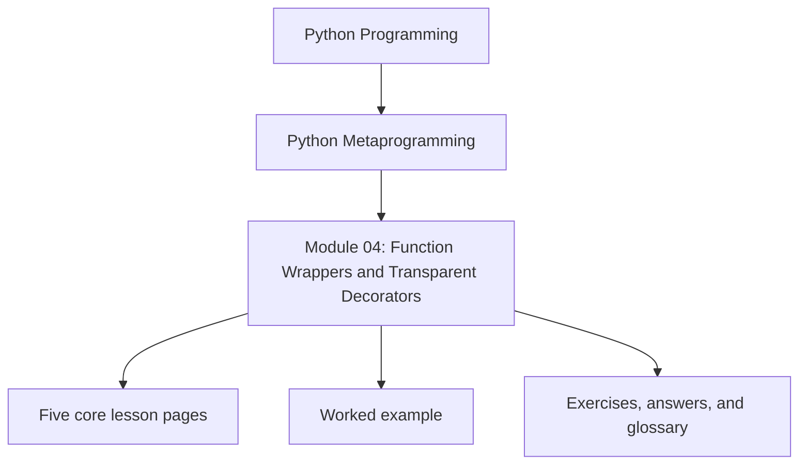
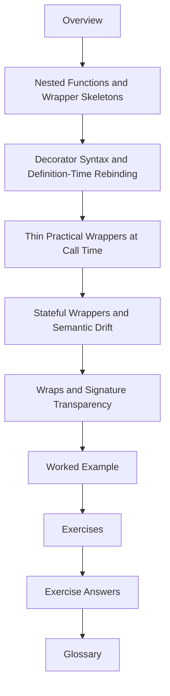

# Module 04: Function Wrappers and Transparent Decorators

<!-- page-maps:start -->
## Module Position

<!-- page-maps:end -->

Module 04 is the first place where the course starts changing behavior instead of only
observing it. That shift makes wrapper discipline matter immediately: a decorator can add
useful behavior, but it can also erase signatures, hide tracebacks, and smuggle policy
behind friendly syntax.

This module now uses the same ten-file learning surface as the deep-dive series so the
overview, five cores, worked example, practice set, answers, and glossary each have one
clear job.

## What this module is for

By the end of Module 04, you should be able to explain five things clearly:

- how nested functions and closures mechanically produce wrappers
- what happens once at decoration time and what repeats at call time
- when a thin practical wrapper stays transparent
- how stateful decorators start changing semantics and review cost
- why `functools.wraps` is a correctness tool rather than a style flourish

## Keep these pages open

- [Mid-Course Map](../module-00-orientation/mid-course-map.md)
- [Pressure Routes](../guides/pressure-routes.md)
- [Capstone Map](../capstone/capstone-map.md)
- [Proof Matrix](../guides/proof-matrix.md)

## The ten files in this module

1. Overview (`index.md`)
2. [Nested Functions and Wrapper Skeletons](nested-functions-and-wrapper-skeletons.md)
3. [Decorator Syntax and Definition-Time Rebinding](decorator-syntax-and-definition-time-rebinding.md)
4. [Thin Practical Wrappers at Call Time](thin-practical-wrappers-at-call-time.md)
5. [Stateful Wrappers and Semantic Drift](stateful-wrappers-and-semantic-drift.md)
6. [Wraps and Signature Transparency](wraps-and-signature-transparency.md)
7. [Worked Example: Building a Bounded Cache Decorator](worked-example-building-a-bounded-cache-decorator.md)
8. [Exercises](exercises.md)
9. [Exercise Answers](exercise-answers.md)
10. [Glossary](glossary.md)

## How to use the file set

| If you need to... | Start here |
| --- | --- |
| understand the mechanical shape of a wrapper before `@` syntax enters | [Nested Functions and Wrapper Skeletons](nested-functions-and-wrapper-skeletons.md) |
| explain what decoration does once at definition time and how stacked wrappers compose | [Decorator Syntax and Definition-Time Rebinding](decorator-syntax-and-definition-time-rebinding.md) |
| study thin practical wrappers such as timing and deprecation without hiding call-time costs | [Thin Practical Wrappers at Call Time](thin-practical-wrappers-at-call-time.md) |
| judge when wrapper state turns a thin decorator into hidden policy | [Stateful Wrappers and Semantic Drift](stateful-wrappers-and-semantic-drift.md) |
| preserve names, docs, signatures, and unwrapping routes honestly | [Wraps and Signature Transparency](wraps-and-signature-transparency.md) |
| stress-test transparency and state inside one deliberately limited cache wrapper | [Worked Example: Building a Bounded Cache Decorator](worked-example-building-a-bounded-cache-decorator.md) |
| test your understanding before moving into heavier decorator policy | [Exercises](exercises.md) |
| compare your reasoning against a reference answer | [Exercise Answers](exercise-answers.md) |
| stabilize the wrapper vocabulary | [Glossary](glossary.md) |

## The running question

Carry this question through every page:

> What changed at the callable boundary, and what must still remain visible for tools and reviewers to trust that change?

Strong Module 04 answers usually mention one or more of these:

- closure-based wrapper structure
- one-time decoration versus per-call behavior
- transparent versus stateful wrapper semantics
- metadata preservation through `functools.wraps`
- a lower-power comparison before the design grows into policy or framework behavior

## Learning outcomes

By the end of this module, you should be able to:

- trace decorator behavior from raw function to wrapped callable without folklore
- explain wrapper behavior at both definition time and call time
- preserve callable identity and introspection surfaces when a wrapper stays thin
- name when stateful decoration changes semantics enough to deserve stronger review

## Exit standard

Do not move on until all of these are true:

- you can explain how a wrapper is built from a nested function and closure
- you can show the exact desugaring of `@decorator` and stacked decorators
- you can distinguish thin wrappers from stateful policy-carrying wrappers
- you can explain why `functools.wraps` and `__wrapped__` preservation are review requirements

When those feel ordinary, Module 04 has done its job and the next decorator module can
focus on policy, typing, and sharper design boundaries.
