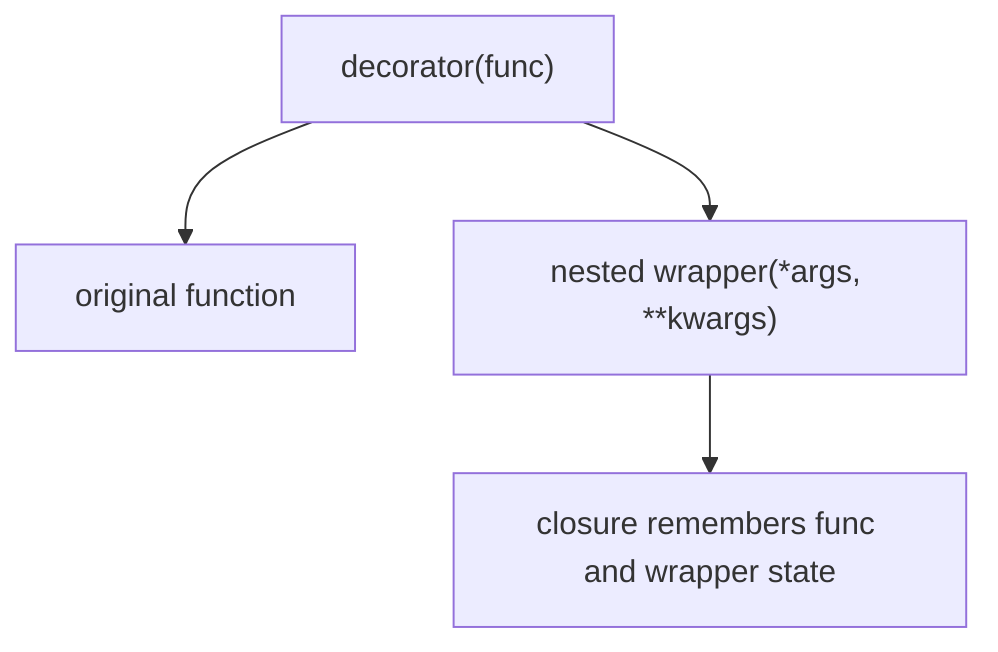

# Nested Functions and Wrapper Skeletons


<!-- page-maps:start -->
## Page Maps


<!-- page-maps:end -->

Module 04 becomes much easier to trust once decorators stop looking like syntax magic and
start looking like ordinary higher-order functions.

The first sentence to make ordinary is:

> a decorator is fundamentally a callable that takes a function and returns another
> callable.

That returned callable is usually built with a nested function that closes over the
original function and any wrapper state.

## The sentence to keep

When you meet a decorator, ask:

> what is the original function, what nested wrapper was built around it, and what state
> does that wrapper close over?

That question keeps the mechanics visible before policy or style enters.

## The wrapper skeleton

At the most basic level, a decorator looks like this:

```python
def decorator(func):
    def wrapper(*args, **kwargs):
        return func(*args, **kwargs)
    return wrapper
```

This is not yet useful, but it shows the whole structure:

- `decorator` receives the original function
- `wrapper` is nested inside it
- `wrapper` delegates to the original function
- `decorator` returns the wrapper

That is the entire mechanical basis of function-wrapping decorators.

## Closures make the wrapper remember the original function

The nested wrapper keeps access to `func` through closure semantics:

- `func` lives in the outer scope
- `wrapper` closes over it
- later calls to `wrapper` still reach the original function through that closure

That is why no global variable is required. The wrapper carries the original callable with
it as runtime state.

## One picture of the structure



Caption: the wrapper is not magic replacement code; it is an ordinary function carrying a closed-over reference to the original callable.

## A simple example

```python
def simple_decorator(func):
    def wrapper(*args, **kwargs):
        print(f"Calling {func.__name__}")
        return func(*args, **kwargs)
    return wrapper


def greet(name):
    return f"Hello, {name}!"


greet_wrapped = simple_decorator(greet)
print(greet_wrapped("Alice"))
```

That example already teaches several important things:

- the wrapper can do work before delegation
- the original return value can still flow through
- the wrapped callable is just another function object

## State can live in the closure too

Wrappers do not only remember the original function. They can also remember wrapper-local
state.

```python
def counter_decorator(func):
    count = 0

    def wrapper(*args, **kwargs):
        nonlocal count
        count += 1
        print(f"Call {count} to {func.__name__}")
        return func(*args, **kwargs)

    return wrapper
```

This is one of the first moments where wrapper design starts changing semantics:

- the wrapper is no longer only forwarding
- the wrapper now owns state across calls

That is why later pages in this module will distinguish thin wrappers from stateful
policy-carrying wrappers.

## Returning the wrapper is not optional

One of the simplest decorator bugs is forgetting to return the nested function:

```python
def broken_decorator(func):
    def wrapper(*args, **kwargs):
        return func(*args, **kwargs)
    # forgot: return wrapper
```

If that function is used as a decorator, the original function name gets rebound to
`None`, and the next call fails immediately.

This is a good reminder that decoration is ordinary rebinding. If the decorator returns
the wrong thing, the name now points at the wrong thing.

## Delegation should target the closed-over original function

Another common bug is accidentally calling a global name that may already have been
rebound instead of calling the closed-over original function.

The safe mental model is:

- the wrapper should delegate to the `func` it closed over
- not to a global name that could now refer to the wrapper itself or another layer

That rule prevents recursion mistakes and keeps the wrapper path explicit.

## `*args, **kwargs` are a forwarding convenience, not a full story

Most simple wrappers start with:

```python
def wrapper(*args, **kwargs):
    return func(*args, **kwargs)
```

That is fine as a forwarding skeleton, but it does not preserve the visible signature by
itself. Later in the module and the next module, that distinction matters a lot.

For now, the important point is mechanical:

- `*args, **kwargs` let the wrapper accept arbitrary calls
- signature transparency is a separate concern

## Let exceptions propagate unless the wrapper advertises a change

Thin wrappers should normally preserve the original error behavior:

- if the original function raises, the wrapper should usually let it raise
- catching or rewriting errors changes semantics and review cost

This is a useful early wrapper rule: if you change exception behavior, that is no longer
"just logging" or "just timing." It becomes policy.

## Review rules for wrapper skeletons

When reviewing a decorator's basic structure, keep these questions close:

- what original callable is being closed over?
- what wrapper-local state is being captured?
- does the wrapper delegate to the closed-over function or to a rebinding-prone name?
- does the decorator actually return a callable wrapper?
- is the wrapper preserving exception behavior unless it explicitly documents a change?

## What to practice from this page

Try these before moving on:

1. Write one bare logging decorator without `@` syntax yet.
2. Add closure-held state with a counter and explain why `nonlocal` is required.
3. Break a decorator by forgetting `return wrapper`, then explain what name rebinding went wrong.

If those feel ordinary, the next step is to make the rebinding explicit through
`@decorator` syntax and stacked decoration.

## Continue through Module 04

- Previous: [Overview](index.md)
- Next: [Decorator Syntax and Definition-Time Rebinding](decorator-syntax-and-definition-time-rebinding.md)
- Practice: [Exercises](exercises.md)
- Terms: [Glossary](glossary.md)
