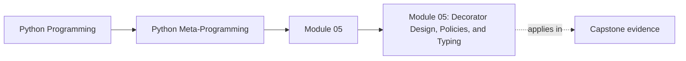
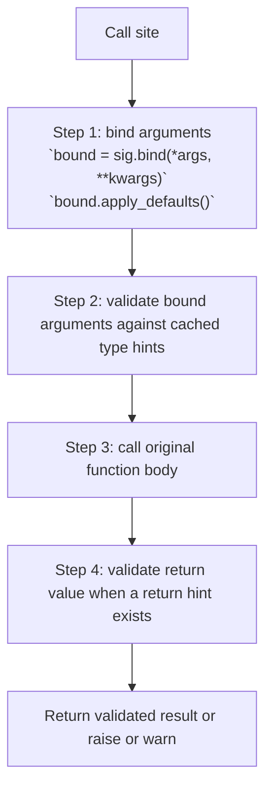

<a id="top"></a>
# Module 05: Decorator Design, Policies, and Typing


<!-- page-maps:start -->
## Page Maps




<!-- page-maps:end -->

<a id="toc"></a>
## Table of Contents

1. [Introduction](#introduction)
2. [Core 21: Decorator Factories (Parameterized Decorators)](#core21)
3. [Core 22: @retry, @timeout, @rate_limited – Patterns from httpx, Celery, etc.](#core22)
4. [Core 23: Preserving and Using Annotations at Runtime (typing.get_type_hints inside Decorators)](#core23)
5. [Core 24: How @lru_cache is Really Implemented Under the Hood](#core24)
6. [Synthesis: Resilient and Typed Decorators on a Single-Threaded Core](#synthesis)
7. [Capstone: @validated - Partial Runtime Type Contract Checker](#capstone)
8. [Glossary (Module 5)](#glossary)

<span style="font-size: 1em;">[Back to top](#top)</span>

---

<a id="introduction"></a>
## Introduction   

Extending the basic decorator mechanics from Module 4—nested functions, `@decorator` syntax, and identity-preserving wrappers—this module moves into *production-shaped* patterns: configurable decorator factories, resilience wrappers (retry, timeout, rate limiting), and annotation-aware validation. All implementations in this module are deliberately **single-threaded, synchronous, and not safe under concurrency or async**; they are didactic patterns, not drop-in production utilities.

(Static typing of these decorators—ParamSpec/Concatenate, protocol-aware decorators, mypy plugins—is postponed to Volume II.)

This module develops the second tier of decorator usage through four pillars:

- **Core 21: Decorator factories** – parameterised decorators via higher-order functions.  
- **Core 22: Resilience patterns** – `@retry`, `@timeout`, `@rate_limited` in a single-threaded, sync setting.  
- **Core 23: Annotation-aware wrappers** – using `typing.get_type_hints` inside decorators.  
- **Core 24: `functools.lru_cache` from the outside** – how real caches behave and what knobs they expose.  

The capstone builds `@validated`: a *partial* runtime type contract checker for common hints (plain classes, `Union`, `Optional`, `Any`) that is explicitly **not** a full runtime type system. Throughout, we emphasise three boundaries:

- **Concurrency:** patterns shown here ignore threading, multiprocessing, and async—Volume II will revisit them with proper locking and async primitives.  
- **Typing:** we only handle a tractable subset of type hints in Volume I; mypy plugins and full static integration live in Volume II.  
- **Introspection:** all decorators continue to cooperate with `inspect` and `functools.wraps`, preserving signatures and metadata wherever possible.

By the conclusion, you will be able to develop resilient, configurable, and type-aware decorators that remain transparent to introspection tools while understanding exactly where their limitations lie.

<span style="font-size: 1em;">[Back to top](#top)</span>

---

<a id="core21"></a>
## Core 21: Decorator Factories (Parameterized Decorators)

### Canonical Definition

A **decorator factory** is a higher-order function that accepts configuration parameters and returns a decorator, enabling parameterized behavior. Formally, `factory(arg)` yields a decorator `d` such that `@factory(arg)` atop `def f(): ...` equates to `f = d(f)`, where `d` incorporates `arg` via closure. The factory's return adheres to the decorator protocol: it accepts a callable (the decoratee) and returns a callable (the wrapper). Factories compose directly with Module 4's nesting: parameters live in the outer closure, the decoratee in the inner closure.

### Deep Dive Explanation

Factories elevate decorators from fixed to tunable, allowing reuse across contexts (e.g., `@retry(times=3)` vs `@retry(times=5)`). This pattern exploits closures for parameter isolation, avoiding global state while supporting composition (e.g., `@factory1(arg1) @factory2(arg2)`). Historically, factories emerged alongside PEP 318 for expressiveness, powering utilities in libraries like Click and FastAPI. They interconnect with Core 17's evaluation timing: `factory(arg)` runs at definition, yielding a tailored decorator. 

Whenever you see `@decorator_name(config, ...)` in this module, read it as: “call a **decorator factory** to produce a decorator, then apply that decorator to the function.” The closure mechanics are exactly the same as in Module 4: outer layer captures configuration, inner layer captures the function.

```text
Diagram: Decorator Factories – Parameterised Decorators
=================================================================

1. Syntax & desugaring
----------------------

Source code:

    @timer(prefix="IO")
    def func(...):
        body

Is exactly:

    def func(...):
        body

    func = timer(prefix="IO")(func)
           # factory(prefix) → decorator
           # decorator(func) → wrapper


2. Canonical structure – three layers
-------------------------------------

    import functools, time

    def timer(prefix):                # 1) factory – config layer
        def decorator(func):          # 2) decorator – binds func once
            @functools.wraps(func)
            def wrapper(*args, **kw): # 3) wrapper – runs on each call
                start = time.perf_counter()
                try:
                    return func(*args, **kw)
                finally:
                    elapsed = time.perf_counter() - start
                    print(f"{prefix}: {func.__name__} took {elapsed:.4f}s")
            return wrapper
        return decorator


3. Timeline & closure capture
-----------------------------

Definition time (module import, runs once):

    timer("IO")        → decorator       # prefix captured here
    decorator(func)    → wrapper         # func captured here
    func = wrapper                       # name now points to wrapper

Closures (what each layer *remembers*):

```mermaid
graph TD
  factory["Factory `timer`<br/>captures `prefix = \"IO\"`"]
  decorator["Decorator<br/>captures `prefix` and `func`"]
  wrapper["Wrapper<br/>captures `prefix` and `func`"]
  caller["Caller"]
  pre["Pre-call logic"]
  invoke["Call original `func(*args, **kw)`"]
  post["Post-call logic<br/>logs prefix, name, elapsed time"]
  result["Return result to caller"]
  factory --> decorator --> wrapper
  caller --> wrapper --> pre --> invoke --> post --> result
```


4. Key points
-------------

• A *decorator factory* is a function that returns a decorator:

      @factory(cfg)     ≡     factory(cfg)(func)

• Three layers:

      factory  → captures configuration (once)
      decorator→ captures target function (once)
      wrapper  → runs per call (has both config + func)

• Always use @functools.wraps on the wrapper to preserve the original
  function’s name, docstring, annotations, and signature.

This is the standard pattern for configurable decorators:
`@retry(retries=3)`, `@cache(maxsize=256)`, `@log(level="DEBUG")`, etc.
```

### Examples

Basic factory for logging level (demo creates per-function logger; production configures handlers at startup):

```python
import logging
import functools

def log_level(level):
    def decorator(func):
        @functools.wraps(func)
        def wrapper(*args, **kwargs):
            logger = logging.getLogger(func.__name__)
            logger.setLevel(level)
            logger.log(level, f"Calling {func.__name__}")
            return func(*args, **kwargs)
        return wrapper
    return decorator

@log_level(logging.DEBUG)
def debug_func(x):
    return x * 2

@log_level(logging.ERROR)
def error_func(x):
    return x + 1

debug_func(3)  # DEBUG:debug_func:Calling debug_func
# Trace: factory(level) returns decorator; @ applies it to func; wrapper uses closed level.
```

Parameterized timer:

```python
import time
import functools

def timer(prefix):
    def decorator(func):
        @functools.wraps(func)
        def wrapper(*args, **kwargs):
            start = time.perf_counter()
            try:
                return func(*args, **kwargs)
            finally:
                elapsed = time.perf_counter() - start
                print(f"{prefix}: {func.__name__} took {elapsed:.4f}s")
        return wrapper
    return decorator

@timer("CPU")
def compute(n):
    return n ** 2

@timer("IO")
def sleep(n):
    time.sleep(n / 10)
    return n

print(compute(5))  # CPU: compute took 0.0000s\n25
print(sleep(5))    # IO: sleep took 0.5001s\n5
# Trace: prefix captured in factory's closure; distinct for each application.
```

### Advanced Notes and Pitfalls

- Factories return callables; `@factory(arg)` evaluates `factory(arg)` once at definition.
- Pitfall: Forgetting `*args, **kwargs` in wrapper breaks variadic functions—always forward.
- Pitfall: Over-parameterization bloats signatures; use defaults in factory for ergonomics.
- Reminder: Even inside a factory-generated decorator, always apply `@functools.wraps` to the inner wrapper so that names, docs, and signatures remain intact for introspection (Core 19).
- Extension: Chain factories: `@timer("Perf") @log_level(logging.INFO)`—outer wraps inner.

### Exercise

Implement `repeat(times)` factory: returns decorator repeating func `times` times, collecting results in list. Test `@repeat(3)` on summing func; verify independence with multiple applications.

<span style="font-size: 1em;">[Back to top](#top)</span>

---

<a id="core22"></a>
## Core 22: @retry, @timeout, @rate_limited – Patterns from httpx, Celery, etc.

### Canonical Definition

Resilient decorators mitigate failures: `@retry(exceptions, delay=1)` retries on specified exceptions with exponential backoff; `@timeout(seconds=30)` aborts after duration via `concurrent.futures`; `@rate_limited(calls=5, period=60)` enforces quotas using timestamp windows. Each wraps the decoratee, injecting recovery or throttling while propagating non-targeted exceptions and preserving returns.

All three decorators in this core are intentionally **single-threaded and synchronous**:

- They are **not safe for async code** (no `asyncio` integration, no cooperative cancellation); async-aware variants belong in Volume II.  
- They are **not safe under multi-threaded or multi-process concurrency** without additional coordination (locks, queues, shared rate-limit backends, etc.).

### Deep Dive Explanation

These patterns operationalise reliability in distributed systems: retry for transient errors (httpx's `Retry`), timeout for blocking calls (Celery's tasks), rate limiting for API compliance (e.g., windowed buckets). They build on Core 18's logic with factories (Core 21) for tuning and `functools.wraps` for introspection. Historically, such utilities proliferated post-2010 with async/microservices, emphasising backoff to avoid thundering herds. Why these? They exemplify stateful wrappers (e.g., retry counters in closure) and external dependencies (time/signal). Pedagogically, trace `@retry`: wrapper catches exceptions, sleeps exponentially, delegates—extend with jitter for realism.

As with the entire volume, **assume a single-threaded, synchronous environment for all examples in this core**. In real systems, production-grade versions of these decorators must add locking and/or async-aware primitives before sharing state (counters, windows, caches) across threads or tasks; that work is deferred explicitly to Volume II.

### Examples

@retry (exponential backoff):

```python
import time
import functools

def retry(exceptions=(Exception,), max_attempts=3, initial_delay=1):
    def decorator(func):
        @functools.wraps(func)
        def wrapper(*args, **kwargs):
            last_exception = None
            delay = initial_delay
            for attempt in range(max_attempts):
                try:
                    return func(*args, **kwargs)
                except exceptions as e:
                    last_exception = e
                    if attempt == max_attempts - 1:
                        raise
                    time.sleep(delay)
                    delay *= 2  # Exponential backoff
            raise last_exception
        return wrapper
    return decorator

@retry(max_attempts=3)
def flaky_api_call(url):
    if flaky_api_call.failure_count < 2:
        flaky_api_call.failure_count += 1
        raise ConnectionError("Transient error")
    return f"Success: {url}"

flaky_api_call.failure_count = 0
print(flaky_api_call("example.com"))  # Success: example.com (after retries)
# Trace: Catches ConnectionError; sleeps 1s, 2s; succeeds on third.
```

@timeout (using concurrent.futures; didactic, heavy for frequent calls):

```python
import concurrent.futures
import time
import functools

def timeout(seconds):
    def decorator(func):
        @functools.wraps(func)
        def wrapper(*args, **kwargs):
            with concurrent.futures.ThreadPoolExecutor() as executor:
                future = executor.submit(func, *args, **kwargs)
                return future.result(timeout=seconds)
        return wrapper
    return decorator

@timeout(2)
def slow_func(n):
    time.sleep(n / 10)
    return n ** 2

try:
    print(slow_func(25))  # concurrent.futures.TimeoutError (after 2s)
except concurrent.futures.TimeoutError as e:
    print("Expected:", e)

print(slow_func(10))  # 100 (within 2s)
# Trace: Submits to thread; awaits with timeout; raises concurrent.futures.TimeoutError on exceed.
```

@rate_limited (timestamp window; single-threaded; uses monotonic time for robustness against clock adjustments):

```python
from collections import deque
import time
import functools

def rate_limited(calls, period):
    def decorator(func):
        calls_window = deque()

        @functools.wraps(func)
        def wrapper(*args, **kwargs):
            now = time.monotonic()
            while calls_window and now - calls_window[0] > period:
                calls_window.popleft()

            if len(calls_window) >= calls:
                sleep_time = period - (now - calls_window[0])
                if sleep_time > 0:
                    time.sleep(sleep_time)
                now = time.monotonic()
                while calls_window and now - calls_window[0] > period:
                    calls_window.popleft()

            calls_window.append(now)
            return func(*args, **kwargs)
        return wrapper
    return decorator

@rate_limited(calls=2, period=1)  # Reduced period for faster demonstration
def api_call(id):
    print(f"Calling API {id}")
    return id * 2

api_call(1)  # Calling API 1
api_call(2)  # Calling API 2
api_call(3)  # Sleeps briefly (scaled down for demo), then Calling API 3
# Trace: Tracks timestamps; enforces <=2 calls/1s; sleeps to window edge.
```

### Advanced Notes and Pitfalls

- @retry: Add jitter (`delay * (1 + random())`) to prevent synchronization.
- @timeout: Async variants use `asyncio.wait_for`; heavy per-call executor for demo—pool globally in production.
- @rate_limited: Token bucket for bursts; add locks for thread-safety. Uses `time.monotonic()` for clock-jump resistance; wall-clock alternatives risk skips on adjustments.
- None of the examples in this core are concurrency-safe: they use plain shared state (closures, deques) without locks. Treat them as patterns to reason about, not copy-paste utilities.
- Async variants (`async def` plus `asyncio.sleep`, `asyncio.wait_for`, distributed rate limiters) and concurrent-safe designs are postponed to Volume II.
- Pitfall: Infinite loops in retry without max_attempts—always cap.
- Extension: Integrate with logging for attempt traces.
- Real-world counterparts: libraries such as `tenacity`, HTTP clients (e.g. `httpx`), and task queues (e.g. Celery) implement industrial-strength versions of these patterns with proper concurrency, cancellation, and configuration. The implementations here are intentionally simplified to expose the underlying mechanics.

### Exercise

Enhance `@retry` with jitter and logging; implement `@circuit_breaker(failure_threshold=5)` opening on failures. Test on simulated flaky service.

<span style="font-size: 1em;">[Back to top](#top)</span>

---

<a id="core23"></a>
## Core 23: Preserving and Using Annotations at Runtime (typing.get_type_hints inside Decorators)

### Canonical Definition

Runtime annotations are accessed via `typing.get_type_hints(func)`, yielding a dict of parameter/return hints from `__annotations__`, resolved against globals/locals. Decorators preserve them via `functools.wraps` (copies `__annotations__`) and use them for basic validation (e.g., `isinstance(arg, hint)` for plain classes/Union/Optional). For complex types, resolve via `get_type_hints` post-signature binding (Module 3); generics like `list[int]` raise NotImplementedError. This core introduces a helper `_is_instance` for robust `Union`/`|` (PEP 604) and `Any` handling, ensuring compatibility across Python 3.10+.

We will **deliberately** support only a small, tractable subset of type hints in Volume I:

- **Supported for runtime checks:**
  - Plain runtime classes (e.g. `int`, `str`, user-defined classes).
  - `Union[...]` and `|` (PEP 604) of supported classes.
  - `Optional[T]` as `Union[T, None]` when `T` itself is supported.
  - `Any` (treated as “always passes”).

- **Explicitly *not* supported in Volume I (i.e. not interpreted by the validator):**
  - Parameterised generics such as `list[int]`, `dict[str, float]`, `tuple[int, ...]`
    – when the validator encounters these it raises `NotImplementedError`.
  - `Annotated[...]` metadata is *not* enforced by the validator; it is treated as
    the underlying base type, though you can still inspect the metadata manually
    (as shown in the examples).
  - Protocols, `TypedDict`, `Literal`, and other advanced typing constructs – the
    validator does not attempt to enforce these and may raise `NotImplementedError`
    if they appear in resolved hints.

This is **intentionally a partial contract checker, not a full runtime type system**. Mapping the full PEP 484+ surface into runtime checks is both expensive and error-prone; that belongs in specialised tools (e.g. typeguard) or in static analysis, not in a general-purpose reference like this.

#### Diagram: Runtime validation pipeline with @validated

```text
Runtime validation pipeline with @validated
==========================================

1. Decoration time (runs once, when the function is defined)
------------------------------------------------------------

    @validated(...)
    def func(...):
        ...

                 │
                 ▼
```mermaid
graph TD
  factory["`validated(...)` factory"]
  receive["Receive original `func`"]
  cache["Compute once and cache<br/>`sig = inspect.signature(func)`<br/>`hints = typing.get_type_hints(func)`"]
  build["Build `wrapper(*args, **kwargs)`"]
  returnWrapper["Return wrapper"]
  factory --> receive --> cache --> build --> returnWrapper
```

    In the module’s namespace:  func  ←  wrapper  (original func is now wrapped)


2. Call time (runs on every invocation)
---------------------------------------



```

### Deep Dive Explanation

Annotations enable self-documenting contracts, but runtime access requires preservation to survive wrapping. `get_type_hints` evaluates strings/forwards (PEP 563 legacy) and integrates with `inspect.signature` for bound values. Historically, PEP 484 (2014) introduced hints, with runtime support via `typing` (3.5+). Factories (Core 21) can leverage hints for dynamic behavior, tying to Module 3's signatures. Why runtime? Enables generic validators without code-gen.  
Pitfall: Forward refs need `__future__.annotations`; use `evaluate=False` for raw. Pedagogically, trace: wraps copies annotations; get_type_hints resolves; check via `_is_instance` in wrapper (handles Union/Any simply).

**Caution on cost and intent.** Calling `typing.get_type_hints` and performing runtime checks on every call carries non-trivial overhead. The patterns in this core are intended for boundaries where that cost is acceptable (validation layers, debugging, or teaching), not as a blanket replacement for static type checking. In production you typically rely on tools like `mypy` or Pyright for most type enforcement, reserving runtime checks for narrow, security- or correctness-critical interfaces.

### Examples

Preservation and basic use (hints and signature cached at decoration for efficiency):

```python
import inspect
from typing import get_type_hints, get_origin, get_args, Union, Any
import types  # For UnionType (PEP 604)
import functools

def _is_instance(value: Any, hint: Any) -> bool:
    if hint is Any:
        return True
    origin = get_origin(hint)
    if origin in (Union, types.UnionType):
        return any(_is_instance(value, arg) for arg in get_args(hint))
    if origin is not None:
        raise NotImplementedError(
            f"runtime type checking for generic types like {hint!r} is not supported in this volume"
        )
    return isinstance(value, hint)

def validate_args(func):
    hints = get_type_hints(func)
    sig = inspect.signature(func)

    @functools.wraps(func)
    def wrapper(*args, **kwargs):
        bound = sig.bind(*args, **kwargs)
        bound.apply_defaults()
        for name, value in bound.arguments.items():
            if name in hints:
                expected = hints[name]
                if not _is_instance(value, expected):
                    raise TypeError(f"{name}={value} is {type(value).__name__}, expected {expected}")
        return func(*args, **kwargs)
    return wrapper

@validate_args
def add(a: int, b: int = 0) -> int:
    return a + b

try:
    add(3, "4")
except TypeError as e:
    print("Expected:", e)

add(3)       # 3 (b defaults to 0: int)
# Trace: wraps preserves __annotations__; get_type_hints yields {'a': int, 'b': int, 'return': int}.
```

With Union/Optional:

```python
from typing import Optional

@validate_args
def process(value: Union[int, str]) -> str:
    return str(value)

process(42)    # "42"
process("hi")  # "hi"
# process([1])   # TypeError (list not int/str)

@validate_args
def safe_div(a: int, b: Optional[int] = None) -> Optional[float]:
    return a / b if b else None

print(safe_div(10, 2))  # 5.0
print(safe_div(10))     # None
# Trace: Optional[int] → Union[int, NoneType]; _is_instance handles.
```

Unsupported generic:

```python
@validate_args
def process_list(items: list[int]) -> list[int]:
    return items

try:
    process_list([1, 2])
except NotImplementedError as e:
    print("Expected:", e)
```

### Advanced Notes and Pitfalls

- `get_type_hints` resolves Union/Optional; parameterised generics (e.g. `list[int]`) cause `_is_instance` to raise `NotImplementedError`. `Annotated[...]` is effectively treated as its base type here because we call `get_type_hints()` without `include_extras=True`.
- Pitfall: Decorators mutating `__annotations__` desync—rely on wraps.
- Pitfall: Forward refs (e.g., 'str') need globals; pass `globals=globals()` to get_type_hints.
- Extension: Combine with Core 22 retry for validation-retry loops.

### Exercise

Extend `@validate_args` to check return: capture result, validate against hints['return'] via `_is_instance`. Test on annotated func with mismatch; handle Any (always passes).

<span style="font-size: 1em;">[Back to top](#top)</span>

---

<a id="core24"></a>
## Core 24: How @lru_cache is Really Implemented Under the Hood

### Canonical Definition

`@functools.lru_cache(maxsize=128, typed=False)` is a factory yielding a wrapper using a dict for O(1) lookups and a doubly-linked list (root sentinel with next/prev pointers) for O(1) LRU eviction (unlink node on hit/miss, reinsert at head). Keys derive from args/kwargs via `_make_key` (flattens primitives, tuples nested); typed=True prepends type tuples. Thread-safe with `RLock`; tracks hits/misses via counters; exposes `cache_info`/`cache_clear`. Eviction: on full, unlink tail, del dict entry.

### Deep Dive Explanation

For Volume I we only care about three aspects of `lru_cache`:

1. **Key structure** – `lru_cache` uses an internal `_make_key(args, kwargs, typed)` helper to turn call arguments into a single hashable key. Conceptually, it flattens positional and keyword arguments into a single hashable structure; the exact internal representation is an implementation detail. With `typed=True`, it also incorporates the *types* of arguments, so `add(1, 2)` and `add(1.0, 2)` do not share cache entries.

2. **Eviction policy** – the cache tracks which entries were used most recently and, once `maxsize` is reached, discards the **least recently used** key when inserting a new one. Conceptually you can think of:
   - a dict `key -> value`, and  
   - a “recency list” where hits and new entries move to the front, and eviction pops from the back.

   The real implementation uses a doubly-linked ring plus a lock to make all of this O(1); the exact pointer gymnastics are interesting but not required for correct use.

3. **Introspection surface** – `lru_cache` deliberately exposes:
   - `cache_info()` → hits, misses, maxsize, current size.
   - `cache_clear()` → drop all entries and reset statistics.

   This makes it easy to debug or tune cache behaviour without touching internals.

The important lesson is *how* `lru_cache` behaves and what guarantees it gives you (pure, hashable arguments, least-recently-used eviction, explicit stats and clearing), not how to manually re-create its internal linked list.

It is worth stressing that the built-in `lru_cache` is **already** engineered for multi-threaded code: its internal `RLock` makes cache operations atomic across threads, and its key construction and eviction strategy are carefully tuned. The didactic caches earlier in this volume (including `@cache` in Module 4 and the OrderedDict-based exercise in this core) are deliberately simpler and **not** thread-safe; they exist to expose the design space, not to compete with the standard library implementation.

### Examples

Basic usage and internals probe:

```python
import functools

@functools.lru_cache(maxsize=2)
def fib(n):
    if n < 2:
        return n
    return fib(n-1) + fib(n-2)

print(fib(5))
print(fib.cache_info())  # CacheInfo(hits=2, misses=11, maxsize=2, currsize=2)
fib.cache_clear()
print(fib(3))  # 2 (recaches)
# Trace: Hits/misses from recursive tree; eviction on >2 (e.g., fib(6) evicts fib(4)).
```

Typed mode:

```python
@functools.lru_cache(maxsize=2, typed=True)
def add(x, y):
    return x + y

print(add(1, 2))  # 3
print(add(1.0, 2))  # 3.0 (distinct key)
print(add.cache_info())  # CacheInfo(hits=0, misses=2, maxsize=2, currsize=2)
# Trace: typed adds type information to key; distinguishes 1 (int) vs 1.0 (float).
```

### Advanced Notes and Pitfalls

- Keys must be hashable; passing unhashable arguments raises `TypeError`. Use `lru_cache` only for pure functions of hashable inputs.
- `typed=True` trades cache locality for semantic clarity (separates `1` vs `1.0` keys).
- `cache_info()` is your primary tuning tool; if you see many misses and frequent evictions, either increase `maxsize` or reconsider whether caching makes sense.
- `cache_clear()` is how you explicitly handle configuration changes or long-lived processes; never rely on CPython’s process lifetime to reset caches.
- CPython: Insertion-order dict (3.7+) aids unbounded; weakref for args possible extension.

### Exercise

Reimplement naive LRU from Core 20 using OrderedDict.move_to_end for O(1); compare perf on fib(30). Probe lru_cache with unhashable—trace TypeError.

<span style="font-size: 1em;">[Back to top](#top)</span>

---

<a id="synthesis"></a>
## Synthesis: Resilient and Typed Decorators on a Single-Threaded Core

Cores 21–24 take the basic decorator machinery from Module 4 and push it toward real-world concerns:

- **Core 21 (decorator factories)** shows how to parameterise decorators cleanly: configuration is captured once at definition time, and the resulting wrapper stays simple.
- **Core 22 (retry/timeout/rate-limit)** demonstrates how much behaviour you can layer on top of a function—retries, cancellation by timeout, quota enforcement—using nothing more than closures, time functions, and disciplined `try`/`except`.
- **Core 23 (annotation-aware wrappers)** connects decorators to the typing world: `get_type_hints` plus `inspect.signature` allow you to introspect both *what* was declared and *what* was actually passed, then enforce simple contracts at runtime.
- **Core 24 (`lru_cache` behaviour)** anchors the didactic cache implementations in a production-grade reference: you see how key construction, eviction, and introspection (`cache_info`, `cache_clear`) fit together in a real API.

Two themes recur:

1. **Single-threaded, sync assumptions** – All patterns here assume a single thread and no async. As soon as you introduce concurrency or event loops, you must revisit every shared state (counters, deques, caches) with locks or async-aware primitives. That work is postponed deliberately to Volume II.

2. **Partial validation, not full dynamism** – The annotation-aware decorators are intentionally limited. They handle the common cases (plain types, `Union`, `Optional`, `Any`) and loudly refuse the rest. This keeps the mental model tractable and avoids pretending that runtime checks can replace a full static type system.

The `@validated` capstone builds directly on this synthesis: a configurable, annotation-driven validator that is honest about what it can and cannot guarantee.

<span style="font-size: 1em;">[Back to top](#top)</span>

---

<a id="capstone"></a>
## Capstone: @validated - Partial Runtime Type Contract Checker

`@validated` is a *didactic, partial* runtime validator: it enforces a limited set of straightforward type hints and raises `NotImplementedError` whenever it encounters hints outside that subset.

### Canonical Implementation

```python
import inspect
import warnings
from typing import get_type_hints, get_origin, get_args, Any, Callable, Optional, Union, Annotated
import types  # For UnionType (PEP 604)
import functools

def _is_instance(value: Any, hint: Any) -> bool:
    if hint is Any:
        return True
    origin = get_origin(hint)
    if origin in (Union, types.UnionType):
        return any(_is_instance(value, arg) for arg in get_args(hint))
    if origin is not None:
        raise NotImplementedError(
            f"runtime type checking for generic types like {hint!r} is not supported in this volume"
        )
    return isinstance(value, hint)

def validated(raise_on_error: bool = True) -> Callable:
    """Factory: raise_on_error=True raises TypeError on mismatch; False warns but proceeds (function may still fail)."""
    def decorator(func: Callable) -> Callable:
        hints = get_type_hints(func)
        sig = inspect.signature(func)

        @functools.wraps(func)
        def wrapper(*args, **kwargs) -> Any:
            bound = sig.bind(*args, **kwargs)
            bound.apply_defaults()

            for name, value in bound.arguments.items():
                if name in hints:
                    expected = hints[name]
                    if not _is_instance(value, expected):
                        msg = f"Argument '{name}={value}' is {type(value).__name__}, expected {expected}"
                        if raise_on_error:
                            raise TypeError(msg)
                        warnings.warn(msg, UserWarning)

            result = func(*args, **kwargs)
            if 'return' in hints:
                expected = hints['return']
                if not _is_instance(result, expected):
                    msg = f"Return '{result}' is {type(result).__name__}, expected {expected}"
                    if raise_on_error:
                        raise TypeError(msg)
                    warnings.warn(msg, UserWarning)
            return result

        return wrapper
    return decorator

# Usage
@validated(raise_on_error=True)
def add(a: int, b: int = 0) -> int:
    return a + b

try:
    add(3, "4")
except TypeError as e:
    print("Expected:", e)

@validated(raise_on_error=False)
def tolerant_add(a: int, b: int) -> int:
    return int(a) + int(b)

print(tolerant_add(5, "3"))  # UserWarning: Argument 'b=3' is str, expected <class 'int'>\n8

# With Annotated (metadata extraction demo)
@validated()
def greet(name: Annotated[str, "max_length=10"]) -> str:
    hints = get_type_hints(greet, include_extras=True)
    ann = hints['name']
    origin = get_origin(ann)
    base, *metadata = get_args(ann)
    print(f"Origin: {origin}, Base: {base}, Metadata: {metadata}")
    return f"Hello, {name}"

greet("World")  # Hello, World
```

### Deep Dive Explanation

`@validated` enforces basic contracts: factory tunes raise_on_error (default True), decorator preserves annotations via wraps, caches hints/sig for efficiency, wrapper binds args, recurses on `Union`/`|` via `get_origin`/`args`, checks via `_is_instance` (plain classes only). Return validated post-call. Ties to Core 23 hints and Module 3 binding; _is_instance handles `Union`/`|` (PEP 604), Optional, Any (passes always), raises for generics/Annotated. Historically, echoes typeguard's runtime checks but function-focused. Pedagogically, trace mismatch: bind applies defaults, _is_instance fails → TypeError (raise_on_error=True) or warn (function may still fail). Extend with Annotated parsing (e.g., inspect metadata for constraints). For production, integrate validators like pydantic.Validator; compose with `@retry` for resilient parsing.

As with Core 23, treat `@validated` as a **surgical tool**, not a global policy. It is best used at well-defined boundaries (e.g. public API surfaces, plugin entry points) where the extra runtime cost and partial nature of the checks are acceptable and clearly documented. The heavy lifting for type correctness should still come from static analysis.

### Examples

Union and Optional:

```python
from typing import Union

@validated()
def process_input(value: Union[int, str]) -> str:
    return str(value)

process_input(42)     # "42"
process_input("hi")   # "hi"
try:
    process_input([1])
except TypeError as e:
    print("Expected:", e)

@validated()
def safe_div(a: int, b: Optional[int] = None) -> Optional[float]:
    return a / b if b else None

print(safe_div(10, 2))  # 5.0
print(safe_div(10))     # None
```

Non-strict mode:

```python
@validated(raise_on_error=False)
def fragile_add(a: int, b: int) -> int:
    return a + b  # TypeError here if b non-int

try:
    fragile_add(5, "3")
except TypeError as e:
    print("Expected internal error after warning:", e)
```

Any passes:

```python
from typing import Any

@validated()
def flexible(x: Any) -> str:
    return str(x)

flexible([1, 2])  # "[1, 2]" (Any passes validation)
```

### Advanced Notes and Pitfalls

- Handles `Union`/`|` (PEP 604), Optional, Any. Parameterised generics cause `NotImplementedError` via `_is_instance`. `Annotated[...]` is accepted but its metadata is ignored by the validator unless you explicitly inspect it with `get_type_hints(..., include_extras=True)`.
- Pitfall: `raise_on_error=False` warns but does not make function safe—internal errors may still occur.
- Pitfall: Annotated metadata requires include_extras=True; parse get_args[1:] for constraints (e.g., max_length).
- CPython: get_type_hints caches; forward refs resolved with globals.

### Exercise

Extend `@validated` for Annotated constraints (e.g., str max_length); raise ValueError on exceed. Test on greet with long name; compose with `@retry` on IO funcs.

Volume II will revisit these patterns with proper support for async/await, concurrency primitives, and deeper static typing integration (mypy plugins, protocol-aware decorators); Volume I intentionally stays on the single-threaded, synchronous, and partially-typed side of that boundary.

You have completed Module 5.

<span style="font-size: 1em;">[Back to top](#top)</span>

---

<a id="glossary"></a>
## Glossary (Module 5)

| Term | Definition |
|---|---|
| **Decorator factory** | Higher-order function that returns a decorator; `@factory(cfg)` desugars to `f = factory(cfg)(f)`. |
| **Configuration closure** | The outer closure layer in a factory that captures parameters once at definition time (e.g., retries, prefix, limits). |
| **Resilience decorator** | Wrapper that adds fault-tolerance or control-flow policies (retry/timeout/rate limit) around a function call. |
| **Retry decorator (`@retry`)** | Re-invokes the decoratee after specified exceptions, using a bounded attempt count and a delay policy (often backoff). |
| **Max attempts** | Upper bound on retry count; prevents infinite retry loops and makes failure behavior deterministic. |
| **Backoff** | Delay strategy for retries where wait time increases after each failure to reduce load and avoid thrashing. |
| **Exponential backoff** | Backoff where delay typically doubles each attempt (e.g., 1s, 2s, 4s, …). |
| **Jitter** | Random perturbation added to retry delays to reduce synchronized retry storms (“thundering herd”). |
| **Retryable exceptions** | Explicit exception set/types that trigger retries; non-matching exceptions must propagate unchanged. |
| **Timeout decorator (`@timeout`)** | Enforces an execution time limit; in sync code often implemented by offloading to a thread and waiting with a timeout. |
| **Cancellation limitation (sync)** | In thread-based timeouts, the caller can stop waiting, but the underlying work may continue unless the function cooperates. |
| **Rate-limiting decorator (`@rate_limited`)** | Enforces a maximum call rate over a time window by delaying (or rejecting) calls once quota is exceeded. |
| **Fixed window** | Rate-limit model counting calls in a window of length `period`; resets as timestamps fall out of the window. |
| **Token bucket** | Rate-limit model allowing controlled bursts by consuming tokens that refill at a steady rate (not implemented here, but the standard alternative). |
| **Monotonic time** | Time source that never goes backward (e.g., `time.monotonic()`), preferred for rate limits/timeouts to avoid clock-change bugs. |
| **Single-threaded assumption** | Didactic constraint: shared decorator state (counters, deques, caches) is unsafe under concurrency without locks/coordination. |
| **Annotation-aware decorator** | Wrapper that reads type hints (via `typing.get_type_hints`) and uses them to validate/coerce/log arguments and/or returns. |
| **`typing.get_type_hints`** | Resolves a callable’s annotations into concrete types (evaluating forward references using globals/locals). |
| **Signature-guided validation** | Pattern: `sig.bind(*args, **kwargs)` + `apply_defaults()` to obtain an interpreter-faithful mapping of parameter names to values before checking. |
| **`_is_instance` helper** | Minimal runtime checker for a subset of typing hints: plain runtime classes, `Union[...]`, `Optional[T]`, and `Any` (including PEP 604 unions). Everything else is refused explicitly. |
| **Supported hints (Module 5 subset)** | Plain runtime classes, `Union[...]`, `Optional[T]`, and `Any` (including PEP 604 unions). |
| **Unsupported hints (Module 5 subset)** | Hints the validator refuses (typically `NotImplementedError`): parameterized generics (`list[int]`), `Protocol`, `TypedDict`, `Literal`, deep `Annotated` enforcement, etc. |
| **Partial runtime contract checker** | Validator that enforces only a limited hint subset at runtime and explicitly declines to model Python’s full typing system. |
| **`@validated`** | Capstone decorator factory that caches signature + resolved hints at decoration time, validates bound args (and optionally return), and raises or warns on mismatch. |
| **Strict vs tolerant mode** | Policy knob for validation: mismatch triggers `TypeError` (strict) or emits warnings and proceeds (tolerant), with no guarantee the function won’t fail later. |
| **`functools.lru_cache`** | Production-grade memoization decorator with LRU eviction, stable keying rules, thread-safety (lock), and control hooks (`cache_info`, `cache_clear`). |
| **Cache key construction** | Process of turning `(args, kwargs)` into a hashable key; correctness depends on hashability and stable semantics of inputs. |
| **Typed cache (`typed=True`)** | `lru_cache` mode that includes argument types in the key, distinguishing calls like `f(1)` and `f(1.0)`. |
| **Cache introspection hooks** | Operational controls exposed by real caches: `cache_info()` for hit/miss stats and `cache_clear()` for deterministic reset/testing. |

Proceed to Module 6: Class Decorators, @property, and the Typing Bridge.

<span style="font-size: 1em;">[Back to top](#top)</span>
