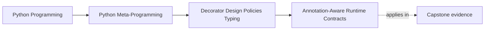
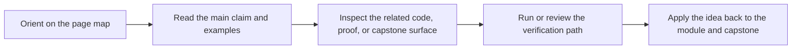
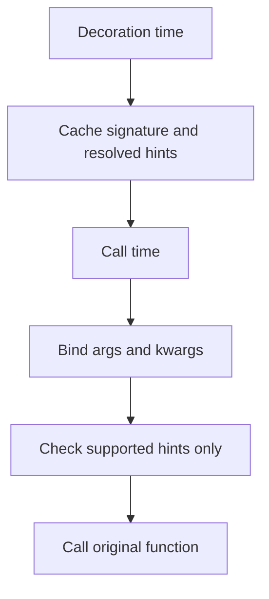

# Annotation-Aware Runtime Contracts


<!-- page-maps:start -->
## Page Maps




<!-- page-maps:end -->

Annotation-aware decorators are one of the easiest places for a course to overpromise.

Type hints can help wrappers make clearer runtime decisions. They do not turn a decorator
into a full type system.

That is the boundary this page keeps explicit.

## The sentence to keep

When a decorator uses type hints at runtime, ask:

> what limited contract is this wrapper checking, and what part of the typing story is it
> deliberately refusing to claim?

That question keeps runtime validation honest.

## The basic runtime pipeline

Annotation-aware wrappers typically combine:

- `typing.get_type_hints(func)` to resolve annotations
- `inspect.signature(func)` to understand the callable contract
- `sig.bind(*args, **kwargs)` to match actual arguments to parameter names

That sequence matters because it avoids guesswork:

- hints describe expected shapes
- signatures describe callable structure
- binding tells you what was actually passed

This is much stronger than trying to inspect raw `args` and `kwargs` ad hoc.

## A partial validator is the right review target

For Volume I, the honest approach is a partial checker.

Good supported cases:

- plain runtime classes such as `int` or `str`
- `Union[...]` and `|` of supported types
- `Optional[T]` when `T` itself is supported
- `Any` as an explicit pass-through case

Cases that should be refused or left alone:

- parameterized generics such as `list[int]`
- protocol-heavy typing features
- the full semantics of `Annotated`, `Literal`, or other advanced typing constructs

This is not a weakness in the module. It is a design choice against pretending runtime
checks are broader than they really are.

## One picture of the validation path



Caption: runtime annotation use is strongest when it stays narrow, explicit, and bound to the real call shape.

## A minimal helper pattern

```python
import functools
import inspect
import types
from typing import Any, Union, get_args, get_origin, get_type_hints


def _is_instance(value: Any, hint: Any) -> bool:
    if hint is Any:
        return True
    origin = get_origin(hint)
    if origin in (Union, types.UnionType):
        return any(_is_instance(value, arg) for arg in get_args(hint))
    if origin is not None:
        raise NotImplementedError(
            f"runtime type checking for generic types like {hint!r} is not supported here"
        )
    return isinstance(value, hint)


def validate_args(func):
    hints = get_type_hints(func)
    sig = inspect.signature(func)

    @functools.wraps(func)
    def wrapper(*args, **kwargs):
        bound = sig.bind(*args, **kwargs)
        bound.apply_defaults()
        for name, value in bound.arguments.items():
            if name in hints and not _is_instance(value, hints[name]):
                raise TypeError(f"{name}={value!r} does not match {hints[name]!r}")
        return func(*args, **kwargs)

    return wrapper
```

This helper is useful because it is honest about its limits. It validates a small subset
of hints and refuses the rest instead of silently faking support.

## Bound arguments matter here too

This page depends directly on Module 03:

- binding gives you the interpreter-faithful mapping of parameter names to values
- defaults can be applied when the validator wants the complete view

Without binding, runtime validation often becomes a brittle mix of tuple indexing and
keyword guessing.

That is exactly the kind of shortcut this course is trying to avoid.

## Runtime type checks are not static typing

This module needs to say this plainly:

- runtime checks happen after code is already running
- they see only the values present at the boundary
- they do not provide the same guarantees as static analysis

So the strongest honest claim is:

> this decorator enforces a limited runtime contract at a narrow boundary.

That is a useful claim. It is not the same claim as "this program is type-safe."

## `Annotated` and advanced hints need restraint

It is tempting to keep escalating:

- `Annotated` metadata as full validation rules
- parameterized generics as deep structural contracts
- richer typing constructs as runtime policy engines

That is exactly where a small validator starts turning into a separate validation
framework. Sometimes that is justified. Often it is a sign the decorator should stop
growing or hand off to a more explicit tool.

## Review rules for annotation-aware decorators

When reviewing annotation-aware wrappers, keep these questions close:

- what exact hint subset does the wrapper support?
- does the wrapper use `get_type_hints` plus signature binding instead of ad hoc argument guessing?
- is unsupported typing surface rejected clearly instead of half-supported?
- does the review describe the result as a partial runtime contract rather than as full typing?
- has the decorator grown large enough that a dedicated validator object or framework would be clearer?

## What to practice from this page

Try these before moving on:

1. Write a validator that supports plain classes, `Union`, `Optional`, and `Any`.
2. Force it to encounter `list[int]` or another unsupported hint and make it fail clearly.
3. Explain one useful runtime boundary where partial validation helps and one case where static analysis should still do the heavy lifting.

If those feel ordinary, the next step is cache policy, where wrapper state becomes visible,
inspectable, and operationally significant.

## Continue through Module 05

- Previous: [Resilience and Control-Flow Wrappers](resilience-and-control-flow-wrappers.md)
- Next: [Cache Policy and lru_cache Behavior](cache-policy-and-lru-cache-behavior.md)
- Practice: [Exercises](exercises.md)
- Terms: [Glossary](glossary.md)
