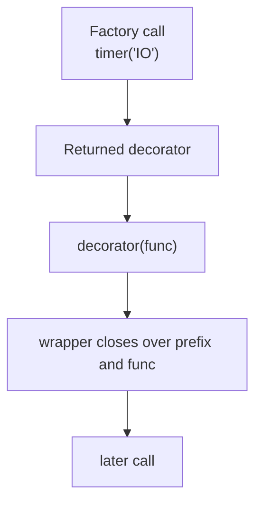

# Decorator Factories and Parameter Capture

Module 05 begins where Module 04 left off: with wrappers that are no longer fixed and
generic, but configurable.

The key sentence is:

> a decorator factory runs once at definition time, captures configuration, and returns the
> real decorator that will wrap the function.

That sentence matters because it keeps configuration timing and wrapper timing separate.

## The sentence to keep

When you see `@decorator_name(config, ...)`, ask:

> what configuration is being captured now, and what wrapper behavior will use it later at
> call time?

That question keeps parameterized decorators grounded in ordinary rebinding instead of
turning them into framework mystique.

## A decorator factory has three layers

The standard shape is:

1. factory
2. decorator
3. wrapper

The factory captures configuration. The decorator captures the function. The wrapper runs
on each call with both available through closures.

```python
import functools
import time


def timer(prefix):
    def decorator(func):
        @functools.wraps(func)
        def wrapper(*args, **kwargs):
            start = time.perf_counter()
            try:
                return func(*args, **kwargs)
            finally:
                elapsed = time.perf_counter() - start
                print(f"{prefix}: {func.__name__} took {elapsed:.4f}s")

        return wrapper

    return decorator
```

That is the full structure. Nothing else is hidden.

## One picture of the timing



Caption: configuration is captured once when the function is defined; the wrapper uses it later on each invocation.

## `@factory(arg)` is just another desugaring

This:

```python
@timer("IO")
def work(...):
    ...
```

means:

```python
decorator = timer("IO")

def work(...):
    ...

work = decorator(work)
```

So the timing is:

- `timer("IO")` runs once
- the resulting decorator wraps `work` once
- later calls run the wrapper many times

That separation becomes important when configuration work is heavy or when the decorator
captures policy that should be visible to review.

## Different applications get independent configuration

```python
import functools
import logging


def log_level(level):
    def decorator(func):
        @functools.wraps(func)
        def wrapper(*args, **kwargs):
            logger = logging.getLogger(func.__name__)
            logger.setLevel(level)
            logger.log(level, f"Calling {func.__name__}")
            return func(*args, **kwargs)

        return wrapper

    return decorator
```

Two uses of `@log_level(...)` do not share the same closed-over configuration by accident.
Each factory call produces a distinct decorator carrying its own settings.

That is one of the big benefits of this pattern: per-use configuration without global
state.

## Factories are already policy surfaces

This is where Module 05 starts raising the review bar.

A decorator factory does not only capture a prefix or logging level. It can also capture:

- retry counts
- timeout durations
- rate limits
- cache sizes
- validation modes

That means the factory boundary is often where a wrapper stops being generic and starts
owning policy.

So the review question is not only "does this work?" It is also:

> should this policy really live in a decorator closure?

## Factories still need wrapper transparency

Even with configuration involved, the usual wrapper rules remain:

- forward `*args, **kwargs` unless the design has a reason not to
- preserve metadata with `functools.wraps`
- keep definition-time and call-time work distinct

If a factory captures complex policy but loses the callable's public identity, the design
is already harder to trust.

## Over-parameterization is a warning sign

Factories can grow unwieldy fast:

- too many boolean flags
- too many interacting knobs
- too much policy branching hidden in wrapper code

When that happens, the decorator may be competing with a small explicit object or service
configuration API. Module 05 will come back to that boundary directly in the final core.

## Review rules for decorator factories

When reviewing a decorator factory, keep these questions close:

- what configuration is captured once at definition time?
- what later wrapper behavior depends on that configuration?
- does each application get independent captured state as intended?
- is the wrapper still transparent enough for tools and reviewers?
- have the parameters grown large enough that an explicit object would be clearer?

## What to practice from this page

Try these before moving on:

1. Write one `repeat(times)` or `timer(prefix)` factory and desugar it by hand.
2. Apply the same factory twice with different arguments and explain why the captured configuration stays independent.
3. Write down one parameterized decorator idea that still feels honest and one that already feels like too much policy for a wrapper.

If those feel ordinary, the next step is to study policy-heavy wrappers that change
control flow and error behavior directly.
