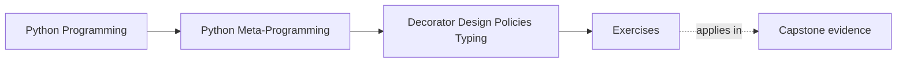

# Exercises

<!-- page-maps:start -->
## Page Maps

<!-- page-maps:end -->

Use these after reading the five core lessons and the worked example. The goal is not to
collect more decorator patterns. The goal is to make policy ownership, typing limits, and
wrapper honesty explicit.

Each exercise asks for three things:

- the policy or contract you are trying to enforce
- the wrapper or explicit boundary you chose
- the reason that choice is honest enough for the problem

## Exercise 1: Build one decorator factory with real configuration

Write a parameterized decorator and apply it twice with different configuration.

What to hand in:

- the factory implementation
- two differently configured uses
- one explanation of what was captured at definition time and what runs on each call

## Exercise 2: Review one resilience wrapper

Implement or inspect a retry, timeout, or rate-limit decorator.

What to hand in:

- the rule it enforces at the call boundary
- one concrete control-flow or failure behavior it changes
- one sentence explaining why this is policy rather than a thin transformation

## Exercise 3: Validate one narrow hint subset

Build a tiny annotation-aware validator for a supported subset of hints.

What to hand in:

- the supported hint subset
- one call that passes and one that fails
- one example of a hint surface you explicitly refuse to support

## Exercise 4: Inspect cache policy instead of only cache speed

Use `functools.lru_cache` or a bounded cache wrapper.

What to hand in:

- the key or typed-mode behavior you are relying on
- one inspection or reset hook such as `cache_info()` or `cache_clear()`
- one explanation of why cache policy is more than "just performance"

## Exercise 5: Reject one decorator that grew too large

Take a wrapper idea that is carrying too much policy and redesign it mentally.

What to hand in:

- the overloaded decorator idea
- the explicit object, service, or later-course mechanism you would move it to
- one explanation of why that new owner is easier to review

## Exercise 6: Review a partial validator honestly

Use the worked example pattern on `@validated` or a similar runtime checker.

What to hand in:

- the exact claim the validator is allowed to make
- one unsupported typing feature it must reject or ignore
- one explanation of why warning mode is not the same as safety

## Mastery standard for this exercise set

Across all six answers, the module wants the same habits:

- you separate thin callable transformation from policy ownership
- you keep runtime typing claims partial and explicit
- you prefer explicit objects or services when decorator policy grows too broad
- you preserve transparency even when wrappers become more powerful

If an answer still sounds like "the decorator just handles it," keep going.

## Continue through Module 05

- Previous: [Worked Example: Building a Partial `@validated` Decorator](worked-example-building-a-partial-validated-decorator.md)
- Next: [Exercise Answers](exercise-answers.md)
- Return: [Overview](index.md)
- Terms: [Glossary](glossary.md)
