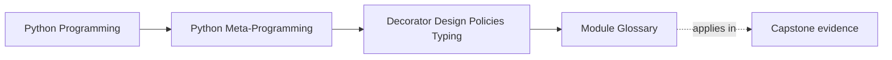
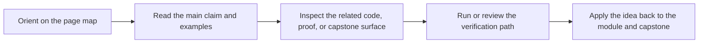

# Module Glossary

<!-- page-maps:start -->
## Page Maps

<!-- page-maps:end -->

This glossary belongs to **Module 05: Decorator Design, Policies, and Typing** in
**Python Metaprogramming**. It keeps the language of this directory stable so the same
ideas keep the same names across lessons, practice, and capstone discussion.

## How to use this glossary

Use the glossary when a wrapper discussion starts to blur together thin transformation,
control-flow policy, runtime validation, and explicit service ownership. Module 05 is
meant to keep those boundaries named and reviewable.

## Terms in this directory

| Term | Meaning in this directory |
| --- | --- |
| Annotation-aware decorator | A wrapper that reads type hints at runtime and uses them for a limited contract or policy decision. |
| Cache policy | The keying, eviction, and reset behavior a cache wrapper owns across calls. |
| Configuration capture | The once-at-definition-time closure capture performed by a decorator factory. |
| Control-flow wrapper | A wrapper that changes how, when, or how often the underlying callable is allowed to run. |
| Decorator factory | A function that returns a decorator after capturing configuration. |
| Operational hook | An explicit control or inspection surface such as `cache_info()` or `cache_clear()` on a stateful wrapper. |
| Partial runtime contract | A limited, explicitly scoped runtime check rather than a claim of full type-system enforcement. |
| Policy-heavy decorator | A wrapper that owns retries, timeouts, validation, caching, or other broader rules beyond thin callable transformation. |
| Resilience wrapper | A decorator that adds retry, timeout, or rate-limit behavior around a call. |
| Wrapper policy boundary | The design point where behavior may be better owned by an explicit object, field, or service instead of another decorator layer. |
| `Any` passthrough | The decision to treat `Any` as always passing in a partial runtime validator. |
| `lru_cache` reference point | The standard-library cache decorator used as the production-grade comparison for custom cache patterns. |

## Keep the module connected

- Return to [Module 05 Overview](index.md) for the full learning route.
- Use [Exercises](exercises.md) and [Exercise Answers](exercise-answers.md) to pressure-test the policy and typing vocabulary.
- Revisit the [Worked Example](worked-example-building-a-partial-validated-decorator.md) when a wrapper starts to overclaim what runtime typing can prove.
