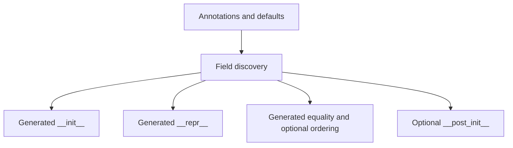

# Dataclass Generation Boundaries

Dataclasses are one of the most important class-customization tools in Python precisely
because they are powerful and easy to overstate.

The key sentence is:

> `@dataclass` generates useful class methods from declarative field information, but it
> does not automatically become a validation framework or a metaclass substitute.

That boundary is what this page keeps clear.

## The sentence to keep

When reviewing a dataclass, ask:

> what boilerplate did `@dataclass` generate for me, and what behavior am I still
> responsible for explicitly?

That question prevents one of the most common class-customization mistakes: treating method
generation as if it were full policy enforcement.

## What `@dataclass` generates

At a high level, `dataclasses.dataclass` can synthesize:

- `__init__`
- `__repr__`
- `__eq__`
- optional ordering support
- `__hash__` under particular rule combinations
- a `__post_init__` hook call when defined

That is already very useful. It is also narrower than many people casually imply.

## One picture of dataclass generation



Caption: dataclasses turn declared fields into generated methods; they do not automatically own every class invariant.

## Dataclasses do not validate types at runtime

This is the most important warning on the page.

Annotations on a dataclass:

- help define fields
- influence generated signatures and reprs
- help static tooling

They do not, by themselves, enforce runtime types.

That means a dataclass is a great generator of boilerplate, not a free runtime contract
checker.

## Defaults and `default_factory` are about instance shape, not policy

```python
from dataclasses import dataclass, field


@dataclass(kw_only=True)
class Employee:
    name: str
    id: int = field(default=0, repr=False)
    dept: str = field(default_factory=lambda: "Unknown")
```

This example shows a few important dataclass features:

- declared fields become constructor parameters
- `repr=False` changes representation policy for one field
- `default_factory` creates fresh defaults per instance

These are strong conveniences, but they are still part of generated class shape, not deep
validation or lifecycle orchestration.

## Frozen and slotted modes change surface area

```python
from dataclasses import dataclass


@dataclass(frozen=True, slots=True)
class Point:
    x: float
    y: float
```

These flags matter because they change what the class promises:

- `frozen=True` changes surface mutability
- `slots=True` changes storage layout and dynamic-attribute behavior

That is a good example of how dataclasses can move beyond convenience into design
constraints. Reviewers should treat those flags as real behavior choices, not as syntax
decoration.

## `__post_init__` is where explicit logic resumes

`__post_init__` is a particularly useful reminder that dataclasses are not magical.

The generated `__init__` can build the instance, then hand control back to an ordinary
method where you can:

- validate relationships between fields
- derive additional values
- normalize state

That design is healthy because it keeps the generated part and the explicit part separate.

## A minimal manual emulation makes the limits clearer

Even a tiny home-grown dataclass-like decorator quickly teaches the right lesson:

- field discovery is one thing
- method generation is another
- runtime validation is still something you must add consciously

That is why this module keeps dataclass generation and descriptor-based validation in
different lessons instead of blurring them together.

## Review rules for dataclass use

When reviewing a dataclass, keep these questions close:

- which methods were generated, and which behaviors remain explicit?
- is anyone assuming the annotations imply runtime validation when they do not?
- do `frozen=True` or `slots=True` change the design in ways the review should call out explicitly?
- is `default_factory` being used where fresh per-instance defaults matter?
- would a plain class or a later lower-level tool be clearer if the dataclass is carrying too much policy?

## What to practice from this page

Try these before moving on:

1. Write one plain class and one equivalent dataclass, then list what the dataclass generated for you.
2. Add `frozen=True` or `slots=True` and explain what surface area changed.
3. Write one sentence explaining why dataclass annotations are not automatic runtime validation.

If those feel ordinary, the next step is the friendly face of descriptor behavior:
properties at the attribute boundary.

## Continue through Module 06

- Previous: [Class Decorators and Post-Construction Transformation](class-decorators-and-post-construction-transformation.md)
- Next: [Properties and Attribute-Boundary Control](properties-and-attribute-boundary-control.md)
- Return: [Overview](index.md)
- Terms: [Glossary](glossary.md)
