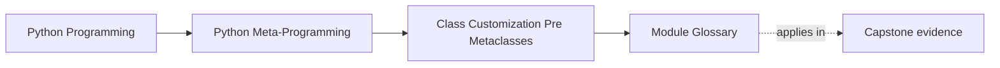
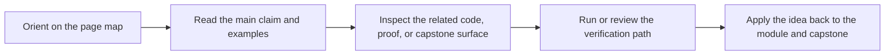

# Module Glossary

<!-- page-maps:start -->
## Page Maps

<!-- page-maps:end -->

This glossary belongs to **Module 06: Class Customization Before Metaclasses** in
**Python Metaprogramming**. It keeps the language of this directory stable so the same
ideas keep the same names across lessons, practice, review, and capstone discussion.

## How to use this glossary

Use the glossary when a class-level discussion starts to blur together generated
convenience, attribute-boundary control, reusable descriptors, and true class-creation
power. Module 06 is meant to keep those boundaries explicit.

## Terms in this directory

| Term | Meaning in this directory |
| --- | --- |
| Attribute boundary | The point where a read, write, or delete operation crosses into class-controlled logic for one attribute. |
| Class customization boundary | The design line where you choose between plain class code, a class decorator, a property, a descriptor, or a metaclass. |
| Class decorator | A callable that takes a class object after creation, modifies or replaces it, and returns the resulting class binding. |
| Data descriptor | A descriptor that defines `__set__`, `__delete__`, or both, and therefore wins over instance-dictionary entries during attribute lookup. |
| Dataclass generation | The automatic creation of methods such as `__init__` and `__repr__` from field declarations. |
| Deep immutability | A stronger claim that nested mutable objects are also made immutable, which this module deliberately does not promise with a minimal `@frozen` decorator. |
| Descriptor-backed validation | Validation owned by a reusable descriptor rather than by repeated property setters or constructor-only checks. |
| Lower-power ladder | The ordered review habit of preferring plain code, then class decorators, then attribute-boundary tools, and only later metaclasses if required. |
| Metaclass escalation | The move from post-construction or attribute-boundary customization into class-creation-time control. |
| Post-construction transformation | A class change that happens after the class object already exists, such as registration or method injection by a class decorator. |
| Property | A built-in descriptor used to control one attribute through managed getter, setter, and deleter methods. |
| Shallow runtime contract | A runtime rule that checks one visible surface, such as assignment to an attribute, without claiming complete semantic enforcement. |
| Surface immutability | The narrower rule that instance attributes cannot be rebound or deleted after initialization, even though nested objects may still mutate. |
| `__delattr__` | The attribute-deletion hook that can be overridden to reject or control deletion on an instance. |
| `__post_init__` | The dataclass hook that runs after generated initialization, often used for explicit validation or normalization. |
| `__setattr__` | The attribute-assignment hook that can intercept writes and enforce post-initialization rules. |

## Keep the module connected

- Return to [Module 06 Overview](index.md) for the full learning route.
- Use [Exercises](exercises.md) and [Exercise Answers](exercise-answers.md) to pressure-test the class-customization vocabulary.
- Revisit the [Worked Example](worked-example-building-a-minimal-frozen-class-decorator.md) when a class decorator starts to carry immutability or policy claims that need review.
