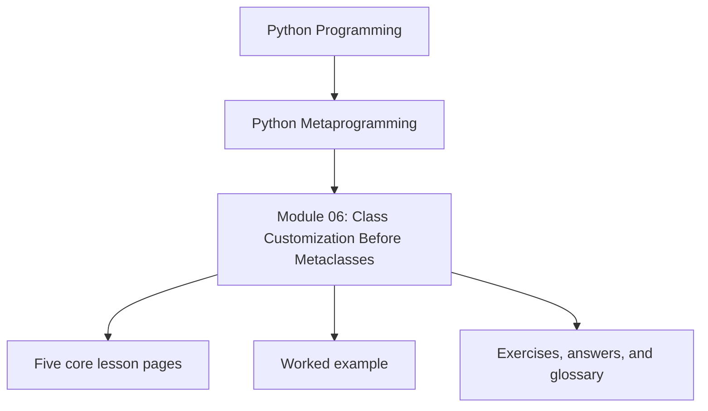
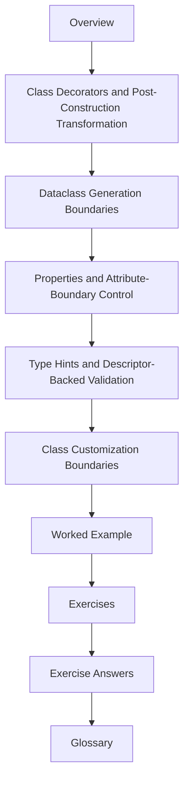

# Module 06: Class Customization Before Metaclasses

<!-- page-maps:start -->
## Module Position

<!-- page-maps:end -->

Module 06 is the bridge from wrapper-heavy metaprogramming into class-level ownership.
The aim is not to collect class tricks. The aim is to learn how much can still stay
explicit, local, and reversible after a class already exists, before the course escalates
into descriptor-heavy or metaclass-controlled designs.

This module now uses the same ten-file learning surface as the deep-dive series so the
overview, five cores, worked example, practice set, answers, and glossary each have one
clear job.

## What this module is for

By the end of Module 06, you should be able to explain five things clearly:

- how class decorators transform classes after creation
- what `@dataclass` generates and what it pointedly does not do
- why `@property` is still descriptor-driven attribute control
- how shallow type-hint validation can live at the attribute boundary
- when class customization should stop before descriptors or metaclasses take over

## Keep these pages open

- [Mid-Course Map](../module-00-orientation/mid-course-map.md)
- [Pressure Routes](../guides/pressure-routes.md)
- [Module Checkpoints](../guides/module-checkpoints.md)
- [Capstone Architecture Guide](../capstone/capstone-architecture-guide.md)

## The ten files in this module

1. Overview (`index.md`)
2. [Class Decorators and Post-Construction Transformation](class-decorators-and-post-construction-transformation.md)
3. [Dataclass Generation Boundaries](dataclass-generation-boundaries.md)
4. [Properties and Attribute-Boundary Control](properties-and-attribute-boundary-control.md)
5. [Type Hints and Descriptor-Backed Validation](type-hints-and-descriptor-backed-validation.md)
6. [Class Customization Boundaries](class-customization-boundaries.md)
7. [Worked Example: Building a Minimal `@frozen` Class Decorator](worked-example-building-a-minimal-frozen-class-decorator.md)
8. [Exercises](exercises.md)
9. [Exercise Answers](exercise-answers.md)
10. [Glossary](glossary.md)

## How to use the file set

| If you need to... | Start here |
| --- | --- |
| understand what can still change after the class object already exists | [Class Decorators and Post-Construction Transformation](class-decorators-and-post-construction-transformation.md) |
| review generated methods and defaults without pretending dataclasses validate everything | [Dataclass Generation Boundaries](dataclass-generation-boundaries.md) |
| keep one invariant at the attribute boundary through a property | [Properties and Attribute-Boundary Control](properties-and-attribute-boundary-control.md) |
| use type hints as declarative aids for shallow runtime validation | [Type Hints and Descriptor-Backed Validation](type-hints-and-descriptor-backed-validation.md) |
| decide whether post-construction tools are still enough or whether the design is drifting upward | [Class Customization Boundaries](class-customization-boundaries.md) |
| see those choices combined inside a minimal frozen class decorator | [Worked Example: Building a Minimal `@frozen` Class Decorator](worked-example-building-a-minimal-frozen-class-decorator.md) |
| test your understanding before the descriptor modules begin | [Exercises](exercises.md) |
| compare your reasoning against a reference answer | [Exercise Answers](exercise-answers.md) |
| stabilize the class-customization vocabulary | [Glossary](glossary.md) |

## The running question

Carry this question through every page:

> What can still be owned honestly after class creation, without taking control of class creation itself?

Strong Module 06 answers usually mention one or more of these:

- post-construction class decorators
- generated dataclass methods with explicit limits
- property-based control at one attribute boundary
- shallow runtime hint enforcement through descriptors
- a lower-power decision that rejects metaclass escalation

## Learning outcomes

By the end of this module, you should be able to:

- compare class decorators, dataclasses, properties, and descriptor-backed validation without conflating their roles
- keep class customization explicit and inspectable after creation
- explain why some invariants belong on the attribute boundary rather than inside global `__setattr__` hacks
- reject metaclass escalation when post-construction tools are still enough

## Exit standard

Do not move on until all of these are true:

- you can explain what a class decorator can and cannot do after the class already exists
- you can say what dataclasses generate and what they still leave to you
- you can distinguish property-driven attribute control from broader descriptor or metaclass ownership
- you can place one class customization requirement honestly on the lower-power side of the ladder

When those feel ordinary, Module 06 has done its job and the descriptor modules can start
from a much cleaner ownership model.
